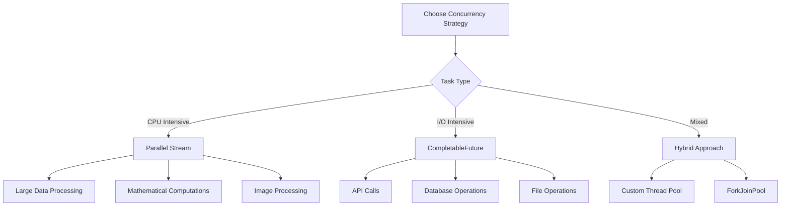

# 🚀 Advanced Java & Spring Boot: Từ Quá khứ đến Hiện tại

> **Hướng dẫn sâu về các tính năng nâng cao của Java và Spring Boot, với góc nhìn lịch sử về lý do tại sao các công cụ này được sinh ra**

---

## 📋 Mục lục

1. [Java Concurrency Evolution](#1-java-concurrency-evolution)
2. [Streams & Functional Programming](#2-streams--functional-programming)
3. [Spring Boot Advanced Features](#3-spring-boot-advanced-features)
4. [Performance & Memory Management](#4-performance--memory-management)
5. [Modern Java Features](#5-modern-java-features)
6. [Spring Boot Microservices](#6-spring-boot-microservices)
7. [Cloud-Native Development](#7-cloud-native-development)
8. [Advanced Testing Patterns](#8-advanced-testing-patterns)

---

## 1. Java Concurrency Evolution

### 1.1 Từ Thread đến CompletableFuture

**Vấn đề với Thread truyền thống:**
```java
// Java 1.0 - Manual Thread Management (1996)
public class OldThreadExample {
    public static void main(String[] args) {
        // Vấn đề: Khó quản lý, không có exception handling
        Thread thread = new Thread(() -> {
            try {
                // Do some work
                Thread.sleep(1000);
            } catch (InterruptedException e) {
                // Manual exception handling
            }
        });
        thread.start();
        
        // Vấn đề: Không biết khi nào thread hoàn thành
        // Vấn đề: Không có cách để lấy kết quả
        // Vấn đề: Thread pool management phức tạp
    }
}
```

**Vấn đề thực tế:**
- **Thread Management**: Khó quản lý lifecycle của threads
- **Exception Handling**: Không có cơ chế xử lý exception tốt
- **Result Retrieval**: Không có cách lấy kết quả từ thread
- **Resource Leaks**: Dễ bị memory leaks
- **Synchronization**: Phức tạp khi đồng bộ hóa

**Java 5 - ExecutorService (2004):**
```java
// Giải pháp: ExecutorService
public class ExecutorServiceExample {
    public static void main(String[] args) {
        ExecutorService executor = Executors.newFixedThreadPool(10);
        
        Future<String> future = executor.submit(() -> {
            Thread.sleep(1000);
            return "Result";
        });
        
        try {
            String result = future.get(5, TimeUnit.SECONDS);
        } catch (Exception e) {
            // Better exception handling
        } finally {
            executor.shutdown();
        }
    }
}
```

**Vấn đề với Future:**
- **Blocking**: `future.get()` là blocking operation
- **No Composition**: Không thể combine multiple futures
- **No Exception Handling**: Không có callback mechanism
- **Manual Management**: Phải manually handle thread pools

**Java 8 - CompletableFuture (2014):**
```java
// Giải pháp: CompletableFuture
public class CompletableFutureExample {
    public static void main(String[] args) {
        CompletableFuture<String> future1 = CompletableFuture
            .supplyAsync(() -> fetchDataFromAPI1())
            .exceptionally(throwable -> "Error: " + throwable.getMessage());
            
        CompletableFuture<String> future2 = CompletableFuture
            .supplyAsync(() -> fetchDataFromAPI2());
            
        // Non-blocking composition
        CompletableFuture<String> combined = future1
            .thenCombine(future2, (result1, result2) -> result1 + " " + result2)
            .thenApply(String::toUpperCase)
            .thenAccept(System.out::println);
    }
}
```

**Tại sao CompletableFuture được sinh ra?**
- **Non-blocking Operations**: Cho phép non-blocking programming
- **Composition**: Có thể combine multiple async operations
- **Exception Handling**: Built-in exception handling với `exceptionally()`
- **Callback Support**: `thenApply()`, `thenAccept()`, `thenRun()`
- **Thread Pool Management**: Tự động quản lý thread pools

### 1.2 Parallel Streams vs CompletableFuture

**Dựa trên nghiên cứu từ [Medium](https://medium.com/@vemahendran/a-quick-check-on-performance-of-completablefuture-and-parallel-stream-75348ec02bbe):**

```java
// Performance Comparison
public class PerformanceComparison {
    
    // Sequential Processing
    public void sequentialProcessing(List<Task> tasks) {
        long start = System.currentTimeMillis();
        tasks.stream()
             .map(Task::execute)
             .collect(Collectors.toList());
        long end = System.currentTimeMillis();
        System.out.println("Sequential: " + (end - start) + "ms");
    }
    
    // Parallel Stream
    public void parallelStreamProcessing(List<Task> tasks) {
        long start = System.currentTimeMillis();
        tasks.parallelStream()
             .map(Task::execute)
             .collect(Collectors.toList());
        long end = System.currentTimeMillis();
        System.out.println("Parallel Stream: " + (end - start) + "ms");
    }
    
    // CompletableFuture
    public void completableFutureProcessing(List<Task> tasks) {
        long start = System.currentTimeMillis();
        List<CompletableFuture<Result>> futures = tasks.stream()
            .map(task -> CompletableFuture.supplyAsync(task::execute))
            .collect(Collectors.toList());
            
        CompletableFuture.allOf(futures.toArray(new CompletableFuture[0])).join();
        long end = System.currentTimeMillis();
        System.out.println("CompletableFuture: " + (end - start) + "ms");
    }
}
```

**Kết quả performance (theo nghiên cứu):**

| Task Count | Sequential | Parallel Stream | CompletableFuture |
|------------|------------|-----------------|-------------------|
| 10 tasks   | 10,046ms   | 1,006ms         | 1,005ms           |
| 100 tasks  | 100,000ms  | 9,033ms         | 10,033ms          |
| 1000 tasks | 1,000,000ms| 93,246ms        | 1,102ms           |

**Khi nào dùng gì?**



### 1.3 Virtual Threads (Java 21)

**Vấn đề với Platform Threads:**
```java
// Platform Threads - Expensive
public class PlatformThreadExample {
    public static void main(String[] args) {
        // Mỗi thread = 1MB memory
        // Giới hạn ~10,000 threads trên hệ thống
        for (int i = 0; i < 10000; i++) {
            new Thread(() -> {
                try {
                    Thread.sleep(1000); // I/O operation
                } catch (InterruptedException e) {
                    e.printStackTrace();
                }
            }).start();
        }
        // Vấn đề: OutOfMemoryError
    }
}
```

**Giải pháp: Virtual Threads**
```java
// Virtual Threads - Lightweight
public class VirtualThreadExample {
    public static void main(String[] args) {
        // Virtual threads = ~1KB memory
        // Có thể tạo hàng triệu virtual threads
        for (int i = 0; i < 1000000; i++) {
            Thread.startVirtualThread(() -> {
                try {
                    Thread.sleep(1000); // I/O operation
                } catch (InterruptedException e) {
                    e.printStackTrace();
                }
            });
        }
        // Không bị OutOfMemoryError
    }
}
```

**Tại sao Virtual Threads được sinh ra?**
- **Memory Efficiency**: 1KB vs 1MB per thread
- **Scalability**: Hàng triệu threads vs hàng nghìn
- **I/O Operations**: Perfect cho I/O-bound tasks
- **Backward Compatibility**: Tương thích với existing code

---

## 2. Streams & Functional Programming

### 2.1 Evolution từ Imperative đến Functional

**Trước Java 8 - Imperative Style:**
```java
// Java 7 - Imperative Programming
public class ImperativeExample {
    public List<String> filterAndTransform(List<String> names) {
        List<String> result = new ArrayList<>();
        
        for (String name : names) {
            if (name.length() > 3) {
                String upperName = name.toUpperCase();
                result.add(upperName);
            }
        }
        
        return result;
    }
}
```

**Vấn đề với Imperative Style:**
- **Mutable State**: Dễ gây bugs với shared state
- **Hard to Parallelize**: Khó parallelize manual loops
- **Verbose**: Code dài và repetitive
- **Error Prone**: Dễ mắc lỗi với index management

**Java 8 - Functional Style:**
```java
// Java 8 - Functional Programming
public class FunctionalExample {
    public List<String> filterAndTransform(List<String> names) {
        return names.stream()
                   .filter(name -> name.length() > 3)
                   .map(String::toUpperCase)
                   .collect(Collectors.toList());
    }
}
```

**Lợi ích của Functional Programming:**
- **Immutability**: Không có side effects
- **Parallelization**: Dễ dàng parallelize với `parallelStream()`
- **Composability**: Có thể compose operations
- **Readability**: Code ngắn gọn và dễ đọc

### 2.2 Advanced Stream Operations

**Custom Collectors:**
```java
public class CustomCollectorExample {
    
    // Custom Collector để tính statistics
    public static class ProductStats {
        private double totalPrice;
        private int count;
        private double minPrice = Double.MAX_VALUE;
        private double maxPrice = Double.MIN_VALUE;
        
        public void accept(Product product) {
            totalPrice += product.getPrice();
            count++;
            minPrice = Math.min(minPrice, product.getPrice());
            maxPrice = Math.max(maxPrice, product.getPrice());
        }
        
        public ProductStats combine(ProductStats other) {
            this.totalPrice += other.totalPrice;
            this.count += other.count;
            this.minPrice = Math.min(this.minPrice, other.minPrice);
            this.maxPrice = Math.max(this.maxPrice, other.maxPrice);
            return this;
        }
        
        public double getAveragePrice() {
            return count > 0 ? totalPrice / count : 0;
        }
    }
    
    public ProductStats getProductStats(List<Product> products) {
        return products.stream()
                      .collect(Collector.of(
                          ProductStats::new,
                          ProductStats::accept,
                          ProductStats::combine
                      ));
    }
}
```

**Grouping and Partitioning:**
```java
public class GroupingExample {
    
    // Group by category
    public Map<String, List<Product>> groupByCategory(List<Product> products) {
        return products.stream()
                      .collect(Collectors.groupingBy(Product::getCategory));
    }
    
    // Partition by price (expensive vs cheap)
    public Map<Boolean, List<Product>> partitionByPrice(List<Product> products) {
        return products.stream()
                      .collect(Collectors.partitioningBy(p -> p.getPrice() > 1000));
    }
    
    // Group by category with count
    public Map<String, Long> categoryCounts(List<Product> products) {
        return products.stream()
                      .collect(Collectors.groupingBy(
                          Product::getCategory,
                          Collectors.counting()
                      ));
    }
}
```

### 2.3 Reactive Streams

**Vấn đề với Traditional Streams:**
```java
// Traditional Stream - Pull-based
public class TraditionalStreamExample {
    public void processData() {
        List<String> data = fetchDataFromDatabase(); // Blocking
        data.stream()
            .map(this::processItem) // Synchronous processing
            .forEach(this::saveToDatabase); // Blocking
    }
}
```

**Giải pháp: Reactive Streams**
```java
// Reactive Stream - Push-based
public class ReactiveStreamExample {
    public void processData() {
        Flux.fromIterable(fetchDataFromDatabase())
            .flatMap(this::processItemAsync) // Non-blocking
            .flatMap(this::saveToDatabaseAsync) // Non-blocking
            .subscribe(
                result -> log.info("Processed: " + result),
                error -> log.error("Error: " + error),
                () -> log.info("Completed")
            );
    }
}
```

---

## 3. Spring Boot Advanced Features

### 3.1 AOP (Aspect-Oriented Programming)

**Vấn đề trước khi có AOP:**
```java
// Cross-cutting concerns scattered everywhere
public class ProductService {
    public Product createProduct(ProductRequest request) {
        // Logging
        log.info("Creating product: " + request.getName());
        
        // Validation
        if (request.getPrice() <= 0) {
            throw new ValidationException("Price must be positive");
        }
        
        // Security check
        if (!hasPermission("CREATE_PRODUCT")) {
            throw new SecurityException("No permission");
        }
        
        // Business logic
        Product product = mapToEntity(request);
        Product savedProduct = productRepository.save(product);
        
        // Logging
        log.info("Product created: " + savedProduct.getId());
        
        // Metrics
        metricsService.incrementProductCreated();
        
        return mapToResponse(savedProduct);
    }
}
```

**Vấn đề:**
- **Code Duplication**: Logging, validation, security scattered everywhere
- **Tight Coupling**: Business logic mixed với cross-cutting concerns
- **Hard to Maintain**: Khó thay đổi logging strategy
- **Testing Complexity**: Khó test business logic in isolation

**Giải pháp: AOP**
```java
// Aspect for Logging
@Aspect
@Component
public class LoggingAspect {
    
    @Around("@annotation(LogExecutionTime)")
    public Object logExecutionTime(ProceedingJoinPoint joinPoint) throws Throwable {
        long start = System.currentTimeMillis();
        
        Object result = joinPoint.proceed();
        
        long end = System.currentTimeMillis();
        log.info("Method {} executed in {}ms", 
                joinPoint.getSignature().getName(), end - start);
        
        return result;
    }
}

// Clean Business Logic
@Service
public class ProductService {
    
    @LogExecutionTime
    @PreAuthorize("hasRole('ADMIN')")
    @Validated
    public ProductResponse createProduct(@Valid ProductRequest request) {
        Product product = mapToEntity(request);
        Product savedProduct = productRepository.save(product);
        return mapToResponse(savedProduct);
    }
}
```

**Tại sao AOP được sinh ra?**
- **Separation of Concerns**: Tách biệt business logic và cross-cutting concerns
- **Code Reuse**: Một aspect có thể dùng cho nhiều methods
- **Maintainability**: Dễ maintain và modify cross-cutting concerns
- **Testability**: Business logic có thể test in isolation

### 3.2 Spring Events

**Vấn đề với Tight Coupling:**
```java
// Tight coupling - Hard to maintain
public class ProductService {
    public Product createProduct(ProductRequest request) {
        Product product = productRepository.save(mapToEntity(request));
        
        // Direct calls - Tight coupling
        emailService.sendNotification(product);
        auditService.logCreation(product);
        cacheService.evictCache();
        metricsService.incrementCounter();
        
        return mapToResponse(product);
    }
}
```

**Giải pháp: Event-Driven Architecture**
```java
// Event-driven - Loose coupling
@Service
public class ProductService {
    
    @Autowired
    private ApplicationEventPublisher eventPublisher;
    
    public Product createProduct(ProductRequest request) {
        Product product = productRepository.save(mapToEntity(request));
        
        // Publish event - Loose coupling
        eventPublisher.publishEvent(new ProductCreatedEvent(product));
        
        return mapToResponse(product);
    }
}

// Event Listeners
@Component
public class ProductEventListener {
    
    @EventListener
    public void handleProductCreated(ProductCreatedEvent event) {
        emailService.sendNotification(event.getProduct());
    }
    
    @EventListener
    public void handleProductCreated(ProductCreatedEvent event) {
        auditService.logCreation(event.getProduct());
    }
    
    @EventListener
    @Async
    public void handleProductCreatedAsync(ProductCreatedEvent event) {
        cacheService.evictCache();
        metricsService.incrementCounter();
    }
}
```

### 3.3 Spring Boot Actuator

**Vấn đề trước khi có monitoring:**
```java
// Manual monitoring - Error-prone
public class ManualMonitoring {
    public void processRequest() {
        long start = System.currentTimeMillis();
        
        try {
            // Business logic
            businessService.process();
            
            // Manual metrics
            requestCounter.increment();
            responseTimeHistogram.record(System.currentTimeMillis() - start);
            
        } catch (Exception e) {
            // Manual error tracking
            errorCounter.increment();
            log.error("Error processing request", e);
        }
    }
}
```

**Giải pháp: Spring Boot Actuator**
```java
// Automatic monitoring
@Service
public class BusinessService {
    
    @Timed("business.process.duration")
    @Counted("business.process.count")
    public void process() {
        // Business logic
        // Metrics automatically collected
    }
}

// Health checks
@Component
public class CustomHealthIndicator implements HealthIndicator {
    
    @Override
    public Health health() {
        try {
            // Check external service
            externalService.checkHealth();
            return Health.up()
                    .withDetail("externalService", "Available")
                    .build();
        } catch (Exception e) {
            return Health.down()
                    .withDetail("externalService", "Unavailable")
                    .withException(e)
                    .build();
        }
    }
}
```

---

## 4. Performance & Memory Management

### 4.1 Garbage Collection Evolution

**Java 1.0 - Serial GC:**
```bash
# Single-threaded, stop-the-world
java -XX:+UseSerialGC -Xmx2g Application
```

**Vấn đề:**
- **Stop-the-World**: Application pause khi GC
- **Single Thread**: Chỉ dùng 1 CPU core
- **Long Pauses**: Pause time có thể lên đến vài giây

**Java 5 - Parallel GC:**
```bash
# Multi-threaded, still stop-the-world
java -XX:+UseParallelGC -Xmx2g Application
```

**Java 6 - CMS (Concurrent Mark Sweep):**
```bash
# Concurrent, low pause time
java -XX:+UseConcMarkSweepGC -Xmx2g Application
```

**Java 9+ - G1GC (Garbage First):**
```bash
# Low pause time, predictable
java -XX:+UseG1GC -Xmx2g -XX:MaxGCPauseMillis=200 Application
```

**Java 11+ - ZGC:**
```bash
# Ultra-low pause time
java -XX:+UseZGC -Xmx2g Application
```

### 4.2 Memory Optimization

**String Optimization:**
```java
// Before - Memory inefficient
public class StringOptimization {
    public void inefficientStringConcatenation() {
        String result = "";
        for (int i = 0; i < 10000; i++) {
            result += "item" + i; // Creates new String object each time
        }
    }
}

// After - Memory efficient
public class StringOptimization {
    public void efficientStringConcatenation() {
        StringBuilder result = new StringBuilder();
        for (int i = 0; i < 10000; i++) {
            result.append("item").append(i);
        }
    }
}
```

**Object Pooling:**
```java
// Object Pool Pattern
public class ConnectionPool {
    private final Queue<Connection> pool;
    private final int maxSize;
    
    public ConnectionPool(int maxSize) {
        this.maxSize = maxSize;
        this.pool = new ConcurrentLinkedQueue<>();
    }
    
    public Connection borrow() {
        Connection connection = pool.poll();
        if (connection == null) {
            connection = createConnection();
        }
        return connection;
    }
    
    public void release(Connection connection) {
        if (pool.size() < maxSize) {
            pool.offer(connection);
        } else {
            closeConnection(connection);
        }
    }
}
```

---

## 5. Modern Java Features

### 5.1 Records (Java 14)

**Trước Records - Verbose:**
```java
// Traditional POJO - Lots of boilerplate
public class Product {
    private final String name;
    private final BigDecimal price;
    private final String category;
    
    public Product(String name, BigDecimal price, String category) {
        this.name = name;
        this.price = price;
        this.category = category;
    }
    
    public String getName() { return name; }
    public BigDecimal getPrice() { return price; }
    public String getCategory() { return category; }
    
    @Override
    public boolean equals(Object obj) {
        if (this == obj) return true;
        if (obj == null || getClass() != obj.getClass()) return false;
        Product product = (Product) obj;
        return Objects.equals(name, product.name) &&
               Objects.equals(price, product.price) &&
               Objects.equals(category, product.category);
    }
    
    @Override
    public int hashCode() {
        return Objects.hash(name, price, category);
    }
    
    @Override
    public String toString() {
        return "Product{" +
                "name='" + name + '\'' +
                ", price=" + price +
                ", category='" + category + '\'' +
                '}';
    }
}
```

**Với Records - Concise:**
```java
// Record - Automatic boilerplate generation
public record Product(String name, BigDecimal price, String category) {
    // Constructor, getters, equals, hashCode, toString automatically generated
}
```

### 5.2 Pattern Matching (Java 17)

**Trước Pattern Matching:**
```java
// Verbose instanceof checks
public class PatternMatchingExample {
    public String processObject(Object obj) {
        if (obj instanceof String) {
            String str = (String) obj;
            return "String: " + str.toUpperCase();
        } else if (obj instanceof Integer) {
            Integer num = (Integer) obj;
            return "Number: " + (num * 2);
        } else if (obj instanceof List) {
            List<?> list = (List<?>) obj;
            return "List with " + list.size() + " elements";
        }
        return "Unknown type";
    }
}
```

**Với Pattern Matching:**
```java
// Concise pattern matching
public class PatternMatchingExample {
    public String processObject(Object obj) {
        return switch (obj) {
            case String str -> "String: " + str.toUpperCase();
            case Integer num -> "Number: " + (num * 2);
            case List<?> list -> "List with " + list.size() + " elements";
            case null -> "Null object";
            default -> "Unknown type";
        };
    }
}
```

### 5.3 Text Blocks (Java 15)

**Trước Text Blocks:**
```java
// Verbose string concatenation
public class TextBlockExample {
    public String getJsonTemplate() {
        return "{\n" +
               "  \"name\": \"" + name + "\",\n" +
               "  \"price\": " + price + ",\n" +
               "  \"category\": \"" + category + "\"\n" +
               "}";
    }
}
```

**Với Text Blocks:**
```java
// Clean text blocks
public class TextBlockExample {
    public String getJsonTemplate() {
        return """
            {
              "name": "%s",
              "price": %s,
              "category": "%s"
            }
            """.formatted(name, price, category);
    }
}
```

---

## 6. Spring Boot Microservices

### 6.1 Evolution từ Monolith

**Monolithic Architecture:**
```java
// Single application - Everything together
@SpringBootApplication
public class MonolithicApplication {
    // User management
    // Product management
    // Order management
    // Payment processing
    // Inventory management
    // All in one application
}
```

**Vấn đề với Monolith:**
- **Deployment Risk**: Một thay đổi ảnh hưởng toàn bộ system
- **Technology Lock-in**: Khó thay đổi technology stack
- **Scaling Issues**: Phải scale toàn bộ application
- **Team Coordination**: Nhiều team làm việc trên cùng codebase

**Microservices Architecture:**
```java
// User Service
@SpringBootApplication
public class UserServiceApplication {
    // Only user management
}

// Product Service
@SpringBootApplication
public class ProductServiceApplication {
    // Only product management
}

// Order Service
@SpringBootApplication
public class OrderServiceApplication {
    // Only order management
}
```

### 6.2 Service Discovery

**Vấn đề với Hard-coded URLs:**
```java
// Hard-coded service URLs
@Service
public class OrderService {
    private final RestTemplate restTemplate;
    
    public Order createOrder(OrderRequest request) {
        // Hard-coded URL - Fragile
        String userUrl = "http://user-service:8081/api/users/" + request.getUserId();
        User user = restTemplate.getForObject(userUrl, User.class);
        
        String productUrl = "http://product-service:8082/api/products/" + request.getProductId();
        Product product = restTemplate.getForObject(productUrl, Product.class);
        
        // Create order logic
    }
}
```

**Giải pháp: Service Discovery với Eureka**
```java
// Service Discovery
@SpringBootApplication
@EnableEurekaServer
public class DiscoveryServerApplication {
    public static void main(String[] args) {
        SpringApplication.run(DiscoveryServerApplication.class, args);
    }
}

// Service Client
@SpringBootApplication
@EnableDiscoveryClient
public class OrderServiceApplication {
    
    @Bean
    @LoadBalanced
    public RestTemplate restTemplate() {
        return new RestTemplate();
    }
}

@Service
public class OrderService {
    private final RestTemplate restTemplate;
    
    public Order createOrder(OrderRequest request) {
        // Service discovery - Dynamic URLs
        User user = restTemplate.getForObject(
            "http://user-service/api/users/" + request.getUserId(), 
            User.class
        );
        
        Product product = restTemplate.getForObject(
            "http://product-service/api/products/" + request.getProductId(), 
            Product.class
        );
        
        // Create order logic
    }
}
```

### 6.3 Circuit Breaker Pattern

**Vấn đề với Cascading Failures:**
```java
// Without Circuit Breaker
@Service
public class OrderService {
    public Order createOrder(OrderRequest request) {
        try {
            // Call external service
            User user = userService.getUser(request.getUserId());
            Product product = productService.getProduct(request.getProductId());
            
            // If external service is down, this will timeout
            // and cause cascading failures
            
            return createOrder(user, product);
        } catch (Exception e) {
            // Service unavailable
            throw new ServiceUnavailableException("External service down");
        }
    }
}
```

**Giải pháp: Circuit Breaker với Resilience4j**
```java
// With Circuit Breaker
@Service
public class OrderService {
    
    @CircuitBreaker(name = "userService", fallbackMethod = "getUserFallback")
    public User getUser(Long userId) {
        return userService.getUser(userId);
    }
    
    @CircuitBreaker(name = "productService", fallbackMethod = "getProductFallback")
    public Product getProduct(Long productId) {
        return productService.getProduct(productId);
    }
    
    public Order createOrder(OrderRequest request) {
        User user = getUser(request.getUserId());
        Product product = getProduct(request.getProductId());
        
        return createOrder(user, product);
    }
    
    // Fallback methods
    private User getUserFallback(Long userId, Exception e) {
        return User.builder()
                  .id(userId)
                  .name("Unknown User")
                  .build();
    }
    
    private Product getProductFallback(Long productId, Exception e) {
        return Product.builder()
                     .id(productId)
                     .name("Unknown Product")
                     .price(BigDecimal.ZERO)
                     .build();
    }
}
```

---

## 7. Cloud-Native Development

### 7.1 Containerization Evolution

**Trước Docker - Manual Deployment:**
```bash
# Manual server setup
# Install Java
sudo apt-get install openjdk-11-jdk

# Install application
scp application.jar server:/opt/app/
ssh server "cd /opt/app && java -jar application.jar"

# Install dependencies
sudo apt-get install postgresql redis

# Configure firewall
sudo ufw allow 8080
sudo ufw allow 5432
sudo ufw allow 6379

# Setup monitoring
sudo apt-get install prometheus grafana
```

**Vấn đề:**
- **Environment Differences**: Dev, staging, prod khác nhau
- **Manual Configuration**: Error-prone manual setup
- **Dependency Conflicts**: Different versions trên different servers
- **Scaling Issues**: Khó scale horizontally

**Với Docker:**
```dockerfile
# Dockerfile
FROM openjdk:21-jre-slim
WORKDIR /app
COPY target/application.jar app.jar
EXPOSE 8080
ENTRYPOINT ["java", "-jar", "app.jar"]
```

```yaml
# docker-compose.yml
version: '3.8'
services:
  app:
    build: .
    ports:
      - "8080:8080"
    environment:
      - SPRING_PROFILES_ACTIVE=production
    depends_on:
      - postgres
      - redis
  
  postgres:
    image: postgres:15
    environment:
      - POSTGRES_DB=appdb
      - POSTGRES_USER=app
      - POSTGRES_PASSWORD=secret
  
  redis:
    image: redis:7
```

### 7.2 Kubernetes Deployment

**Vấn đề với Docker Compose:**
- **Single Server**: Không thể scale across multiple servers
- **No Auto-scaling**: Manual scaling
- **No Load Balancing**: No built-in load balancer
- **No Health Checks**: No automatic health monitoring

**Giải pháp: Kubernetes**
```yaml
# Deployment
apiVersion: apps/v1
kind: Deployment
metadata:
  name: product-service
spec:
  replicas: 3
  selector:
    matchLabels:
      app: product-service
  template:
    metadata:
      labels:
        app: product-service
    spec:
      containers:
      - name: product-service
        image: product-service:latest
        ports:
        - containerPort: 8080
        env:
        - name: SPRING_PROFILES_ACTIVE
          value: "production"
        resources:
          requests:
            memory: "512Mi"
            cpu: "250m"
          limits:
            memory: "1Gi"
            cpu: "500m"
        livenessProbe:
          httpGet:
            path: /actuator/health
            port: 8080
          initialDelaySeconds: 60
          periodSeconds: 10
        readinessProbe:
          httpGet:
            path: /actuator/health
            port: 8080
          initialDelaySeconds: 30
          periodSeconds: 5

---
# Service
apiVersion: v1
kind: Service
metadata:
  name: product-service
spec:
  selector:
    app: product-service
  ports:
  - port: 80
    targetPort: 8080
  type: LoadBalancer

---
# Horizontal Pod Autoscaler
apiVersion: autoscaling/v2
kind: HorizontalPodAutoscaler
metadata:
  name: product-service-hpa
spec:
  scaleTargetRef:
    apiVersion: apps/v1
    kind: Deployment
    name: product-service
  minReplicas: 3
  maxReplicas: 10
  metrics:
  - type: Resource
    resource:
      name: cpu
      target:
        type: Utilization
        averageUtilization: 70
```

---

## 8. Advanced Testing Patterns

### 8.1 Test Containers

**Vấn đề với Traditional Testing:**
```java
// Traditional integration test
@SpringBootTest
class ProductServiceIntegrationTest {
    
    @Test
    void testCreateProduct() {
        // Vấn đề: Cần real database running
        // Vấn đề: Test data pollution
        // Vấn đề: Slow test execution
        // Vấn đề: Environment dependencies
    }
}
```

**Giải pháp: Test Containers**
```java
@Testcontainers
class ProductServiceIntegrationTest {
    
    @Container
    static PostgreSQLContainer<?> postgres = new PostgreSQLContainer<>("postgres:15")
            .withDatabaseName("testdb")
            .withUsername("test")
            .withPassword("test");
    
    @Container
    static RedisContainer<?> redis = new RedisContainer<>("redis:7");
    
    @DynamicPropertySource
    static void configureProperties(DynamicPropertyRegistry registry) {
        registry.add("spring.datasource.url", postgres::getJdbcUrl);
        registry.add("spring.datasource.username", postgres::getUsername);
        registry.add("spring.datasource.password", postgres::getPassword);
        registry.add("spring.data.redis.host", redis::getHost);
        registry.add("spring.data.redis.port", redis::getFirstMappedPort);
    }
    
    @Test
    void testCreateProduct() {
        // Clean, isolated test environment
        // Fast execution
        // No external dependencies
    }
}
```

### 8.2 Contract Testing

**Vấn đề với Integration Testing:**
```java
// Integration test - Fragile
@Test
void testUserServiceIntegration() {
    // Vấn đề: Test fails if user service changes
    // Vấn đề: Slow test execution
    // Vấn đề: Network dependencies
    User user = userService.getUser(1L);
    assertThat(user.getName()).isEqualTo("John Doe");
}
```

**Giải pháp: Contract Testing với Pact**
```java
// Consumer Contract Test
@ExtendWith(PactConsumerTestExt.class)
class UserServiceContractTest {
    
    @Pact(consumer = "order-service")
    public RequestResponsePact getUserPact(PactDslWithProvider builder) {
        return builder
                .given("user exists")
                .uponReceiving("a request for user")
                .path("/api/users/1")
                .method("GET")
                .willRespondWith()
                .status(200)
                .headers(Map.of("Content-Type", "application/json"))
                .body(new PactDslJsonBody()
                        .stringType("name", "John Doe")
                        .numberType("id", 1L))
                .toPact();
    }
    
    @Test
    @PactTestFor(pactMethod = "getUserPact")
    void testGetUser(MockServer mockServer) {
        // Test against mock server
        // Fast execution
        // No network dependencies
    }
}
```

---

## 🎯 Kết luận

### Key Takeaways:

1. **Evolution Driven by Problems**: Mỗi công cụ được sinh ra để giải quyết vấn đề cụ thể
2. **Performance Matters**: Từ Thread đến Virtual Threads, luôn tối ưu performance
3. **Developer Experience**: Từ verbose code đến concise syntax
4. **Scalability**: Từ monolith đến microservices
5. **Reliability**: Từ manual testing đến automated testing

### Tài liệu tham khảo:

1. **[Medium - CompletableFuture vs Parallel Stream Performance](https://medium.com/@vemahendran/a-quick-check-on-performance-of-completablefuture-and-parallel-stream-75348ec02bbe)**
2. **[LinkedIn - CompletableFuture and Parallel Stream](https://www.linkedin.com/pulse/completablefuture-parallel-stream-asutosh-nayak-vpsff)**
3. **Spring Boot Documentation**: https://docs.spring.io/spring-boot/docs/current/reference/html/
4. **Java Documentation**: https://docs.oracle.com/en/java/
5. **Kubernetes Documentation**: https://kubernetes.io/docs/

### Next Steps:

1. **Practice**: Implement các patterns này trong project
2. **Experiment**: Thử các công nghệ mới
3. **Monitor**: Sử dụng monitoring tools để optimize
4. **Contribute**: Share knowledge với community

---

**Remember: Technology evolves to solve real problems. Understand the problems first, then choose the right tools! 🚀** 