# 🚀 Enterprise Development với Spring Boot: Từ Junior đến Senior

> **Hướng dẫn chi tiết về cách xây dựng ứng dụng enterprise-grade với Spring Boot, bao gồm các best practices, patterns, và giải pháp cho các vấn đề thực tế trong công ty.**

---

## 📋 Mục lục

1. [Giới thiệu về Enterprise Development](#1-giới-thiệu-về-enterprise-development)
2. [Kiến trúc tổng quan](#2-kiến-trúc-tổng-quan)
3. [Security & Authentication](#3-security--authentication)
4. [Database Design & Migrations](#4-database-design--migrations)
5. [Caching Strategy](#5-caching-strategy)
6. [Monitoring & Observability](#6-monitoring--observability)
7. [Testing Strategy](#7-testing-strategy)
8. [Performance Optimization](#8-performance-optimization)
9. [Deployment & DevOps](#9-deployment--devops)
10. [Best Practices & Lessons Learned](#10-best-practices--lessons-learned)

---

## 1. Giới thiệu về Enterprise Development

### 1.1 Enterprise vs Simple Applications

**Simple Application (Cơ bản):**
```java
@RestController
public class ProductController {
    @GetMapping("/products")
    public List<Product> getProducts() {
        return productRepository.findAll(); // Không có validation, security, caching
    }
}
```

**Enterprise Application (Nâng cao):**
```java
@RestController
@RequestMapping("/api/v1/products")
@Validated
@Slf4j
public class ProductController {
    
    @GetMapping
    @PreAuthorize("hasAnyRole('USER', 'ADMIN')")
    @Cacheable("products")
    public ResponseEntity<ApiResponse<Page<ProductResponse>>> getProducts(
            @Valid @ModelAttribute ProductSearchRequest request) {
        log.info("Fetching products with filters: {}", request);
        Page<ProductResponse> products = productService.getProductsPaginated(request);
        return ResponseEntity.ok(ApiResponse.success(products));
    }
}
```

### 1.2 Tại sao cần Enterprise Development?

```mermaid
graph TD
    A[Simple App] --> B[Vấn đề khi scale]
    B --> C[Performance Issues]
    B --> D[Security Vulnerabilities]
    B --> E[Maintenance Nightmare]
    B --> F[No Monitoring]
    
    G[Enterprise App] --> H[Scalable Architecture]
    H --> I[High Performance]
    H --> J[Secure by Design]
    H --> K[Easy Maintenance]
    H --> L[Full Observability]
```



**Các vấn đề thực tế trong công ty:**

1. **Performance Issues**: Ứng dụng chậm khi có nhiều user
2. **Security Breaches**: Bị hack, data leak
3. **Maintenance Nightmare**: Khó maintain, debug
4. **No Monitoring**: Không biết app có vấn đề gì
5. **Scalability Problems**: Không thể handle traffic tăng

---

## 2. Kiến trúc tổng quan

### 2.1 Layered Architecture


### 2.2 Microservices vs Monolithic

**Trước khi dùng Microservices:**


**Khi cần Microservices:**


**Khi nào dùng gì?**

| Scenario | Monolithic | Microservices |
|----------|------------|---------------|
| **Team size** | 1-5 developers | 10+ developers |
| **Application size** | Small to medium | Large, complex |
| **Deployment frequency** | Weekly/Monthly | Daily/Hourly |
| **Technology diversity** | Single tech stack | Multiple tech stacks |
| **Scalability needs** | Vertical scaling | Horizontal scaling |

---

## 3. Security & Authentication

### 3.1 Evolution of Authentication

**Trước khi có JWT:**
```java
// Session-based authentication
@RestController
public class LoginController {
    @PostMapping("/login")
    public String login(HttpSession session) {
        session.setAttribute("user", user);
        return "logged in";
    }
}
```

**Vấn đề với Session-based:**
- Không scalable (session stored in server memory)
- Không work với multiple servers
- Không suitable cho mobile apps

**JWT Solution:**
```java
@Service
public class JwtService {
    public String generateToken(UserDetails userDetails) {
        return Jwts.builder()
                .setSubject(userDetails.getUsername())
                .setIssuedAt(new Date())
                .setExpiration(new Date(System.currentTimeMillis() + jwtExpiration))
                .signWith(getSignInKey(), SignatureAlgorithm.HS256)
                .compact();
    }
}
```

### 3.2 Security Implementation

**JWT Filter:**
```java
@Component
public class JwtAuthenticationFilter extends OncePerRequestFilter {
    @Override
    protected void doFilterInternal(HttpServletRequest request, 
                                  HttpServletResponse response, 
                                  FilterChain filterChain) {
        String authHeader = request.getHeader("Authorization");
        
        if (authHeader != null && authHeader.startsWith("Bearer ")) {
            String jwt = authHeader.substring(7);
            String username = jwtService.extractUsername(jwt);
            
            if (username != null && SecurityContextHolder.getContext().getAuthentication() == null) {
                UserDetails userDetails = userDetailsService.loadUserByUsername(username);
                
                if (jwtService.isTokenValid(jwt, userDetails)) {
                    UsernamePasswordAuthenticationToken authToken = 
                        new UsernamePasswordAuthenticationToken(userDetails, null, userDetails.getAuthorities());
                    SecurityContextHolder.getContext().setAuthentication(authToken);
                }
            }
        }
        filterChain.doFilter(request, response);
    }
}
```

**Security Configuration:**
```java
@Configuration
@EnableWebSecurity
public class SecurityConfig {
    @Bean
    public SecurityFilterChain filterChain(HttpSecurity http) throws Exception {
        http
            .csrf(csrf -> csrf.disable())
            .authorizeHttpRequests(auth -> auth
                .requestMatchers("/api/v1/auth/**").permitAll()
                .requestMatchers("/api/v1/products/**").hasAnyRole("USER", "ADMIN")
                .anyRequest().authenticated()
            )
            .sessionManagement(session -> session
                .sessionCreationPolicy(SessionCreationPolicy.STATELESS)
            )
            .addFilterBefore(jwtAuthFilter, UsernamePasswordAuthenticationFilter.class);
        
        return http.build();
    }
}
```

### 3.3 Password Security

**Trước khi có BCrypt:**
```java
// Plain text password (DANGEROUS!)
user.setPassword("password123");
```

**Với BCrypt:**
```java
@Bean
public PasswordEncoder passwordEncoder() {
    return new BCryptPasswordEncoder();
}

@Service
public class AuthService {
    public void register(RegisterRequest request) {
        String encodedPassword = passwordEncoder.encode(request.getPassword());
        user.setPassword(encodedPassword);
    }
}
```

**Tại sao dùng BCrypt?**
- **Salt**: Tự động thêm salt để tránh rainbow table attacks
- **Adaptive**: Có thể điều chỉnh độ khó (work factor)
- **Industry Standard**: Được sử dụng rộng rãi và trusted

---

## 4. Database Design & Migrations

### 4.1 Database Evolution

**Trước khi có Migrations:**
```sql
-- Manual SQL execution
CREATE TABLE products (
    id SERIAL PRIMARY KEY,
    name VARCHAR(255),
    price DECIMAL
);

-- Later, manually add column
ALTER TABLE products ADD COLUMN description TEXT;
```

**Vấn đề:**
- Không track được changes
- Khó rollback
- Không consistent giữa environments
- Manual process error-prone

**Với Flyway Migrations:**
```sql
-- V1__Create_products_table.sql
CREATE TABLE products (
    id BIGSERIAL PRIMARY KEY,
    name VARCHAR(255) NOT NULL,
    description TEXT,
    price DECIMAL(10,2) NOT NULL,
    created_at TIMESTAMP NOT NULL DEFAULT CURRENT_TIMESTAMP,
    updated_at TIMESTAMP,
    is_active BOOLEAN NOT NULL DEFAULT TRUE
);

-- V2__Add_product_category.sql
ALTER TABLE products ADD COLUMN category VARCHAR(100);
CREATE INDEX idx_products_category ON products(category);
```

### 4.2 JPA Best Practices

**Entity Design:**
```java
@Entity
@Table(name = "products")
@EntityListeners(AuditingEntityListener.class)
public class Product {
    @Id
    @GeneratedValue(strategy = GenerationType.IDENTITY)
    private Long id;
    
    @NotBlank(message = "Product name is required")
    @Column(nullable = false)
    private String name;
    
    @Positive(message = "Price must be positive")
    @Column(nullable = false)
    private BigDecimal price;
    
    @CreatedDate
    @Column(name = "created_at", nullable = false, updatable = false)
    private LocalDateTime createdAt;
    
    @LastModifiedDate
    @Column(name = "updated_at")
    private LocalDateTime updatedAt;
    
    @Column(name = "is_active", nullable = false)
    private Boolean isActive = true;
}
```

**Repository Pattern:**
```java
@Repository
public interface ProductRepository extends JpaRepository<Product, Long> {
    
    // Custom queries
    List<Product> findByIsActiveTrue();
    
    Page<Product> findByIsActiveTrue(Pageable pageable);
    
    @Query("SELECT p FROM Product p WHERE p.isActive = true AND LOWER(p.name) LIKE LOWER(CONCAT('%', ?1, '%'))")
    List<Product> findActiveProductsByNameContainingIgnoreCase(String name);
    
    @Query("SELECT p FROM Product p WHERE p.isActive = true AND p.price BETWEEN ?1 AND ?2")
    List<Product> findActiveProductsByPriceRange(BigDecimal minPrice, BigDecimal maxPrice);
}
```

### 4.3 Connection Pool Optimization

**Trước khi có connection pooling:**
```java
// Create new connection for each request (SLOW!)
Connection conn = DriverManager.getConnection(url, username, password);
// Use connection
conn.close();
```

**Với HikariCP:**
```yaml
spring:
  datasource:
    hikari:
      maximum-pool-size: 20
      minimum-idle: 5
      connection-timeout: 30000
      idle-timeout: 600000
      max-lifetime: 1800000
```

**Tại sao cần connection pooling?**
- **Performance**: Reuse connections thay vì tạo mới
- **Resource Management**: Giới hạn số connections
- **Reliability**: Handle connection failures gracefully

---

## 5. Caching Strategy

### 5.1 Caching Evolution

**Trước khi có caching:**
```java
@Service
public class ProductService {
    public List<Product> getAllProducts() {
        // Always hit database (SLOW!)
        return productRepository.findAll();
    }
}
```

**Vấn đề:**
- Database overload
- Slow response times
- High costs

**Với Redis Caching:**
```java
@Service
public class ProductService {
    
    @Cacheable(value = "products")
    public List<ProductResponse> getAllProducts() {
        log.info("Cache miss - fetching from database");
        List<Product> products = productRepository.findByIsActiveTrue();
        return products.stream()
                .map(this::mapToResponse)
                .collect(Collectors.toList());
    }
    
    @Cacheable(value = "product", key = "#id")
    public ProductResponse getProductById(Long id) {
        Product product = productRepository.findByIdAndIsActiveTrue(id)
                .orElseThrow(() -> new ResourceNotFoundException("Product", "id", id));
        return mapToResponse(product);
    }
    
    @CacheEvict(value = {"products", "product"}, allEntries = true)
    public ProductResponse createProduct(ProductRequest request) {
        // Create product logic
        // Cache will be cleared automatically
    }
}
```

### 5.2 Cache Patterns

**Cache-Aside Pattern:**


**Write-Through Pattern:**
```java
@CachePut(value = "product", key = "#result.id")
public ProductResponse updateProduct(Long id, ProductRequest request) {
    // Update logic
    return updatedProduct;
}
```

### 5.3 Cache Configuration

```java
@Configuration
@EnableCaching
public class CacheConfig {
    
    @Bean
    public RedisCacheConfiguration cacheConfiguration() {
        return RedisCacheConfiguration.defaultCacheConfig()
                .entryTtl(Duration.ofMinutes(60))
                .serializeKeysWith(RedisSerializationContext.SerializationPair
                        .fromSerializer(new StringRedisSerializer()))
                .serializeValuesWith(RedisSerializationContext.SerializationPair
                        .fromSerializer(new GenericJackson2JsonRedisSerializer()));
    }
}
```

---

## 6. Monitoring & Observability

### 6.1 Monitoring Evolution

**Trước khi có monitoring:**
```java
// No monitoring - blind to issues
public void processOrder() {
    // Business logic
    // No metrics, no logging, no tracing
}
```

**Vấn đề:**
- Không biết app có vấn đề gì
- Khó debug production issues
- Không có performance insights

**Với Comprehensive Monitoring:**
```java
@Service
@Slf4j
public class ProductService {
    
    private final MeterRegistry meterRegistry;
    private final Counter productCreatedCounter;
    private final Timer productOperationTimer;
    
    public ProductService(MeterRegistry meterRegistry) {
        this.meterRegistry = meterRegistry;
        this.productCreatedCounter = Counter.builder("product.created")
                .description("Number of products created")
                .register(meterRegistry);
        this.productOperationTimer = Timer.builder("product.operation.duration")
                .description("Time taken for product operations")
                .register(meterRegistry);
    }
    
    public ProductResponse createProduct(ProductRequest request) {
        Timer.Sample sample = Timer.start(meterRegistry);
        
        try {
            log.info("Creating product: {}", request.getName());
            
            Product product = mapToEntity(request);
            Product savedProduct = productRepository.save(product);
            
            productCreatedCounter.increment();
            log.info("Product created successfully: {}", savedProduct.getId());
            
            return mapToResponse(savedProduct);
        } finally {
            sample.stop(productOperationTimer);
        }
    }
}
```

### 6.2 Three Pillars of Observability


**1. Metrics (Micrometer + Prometheus):**
```java
@RestController
public class MetricsController {
    
    @GetMapping("/metrics")
    public ResponseEntity<String> getMetrics() {
        // Expose metrics for Prometheus
        return ResponseEntity.ok(meterRegistry.scrape());
    }
}
```

**2. Logging (Structured Logging):**
```java
@Slf4j
public class ProductController {
    
    @GetMapping("/products")
    public ResponseEntity<ApiResponse<List<ProductResponse>>> getProducts() {
        String traceId = MDC.get("traceId");
        log.info("Fetching products - traceId: {}", traceId);
        
        try {
            List<ProductResponse> products = productService.getAllProducts();
            log.info("Successfully fetched {} products", products.size());
            return ResponseEntity.ok(ApiResponse.success(products));
        } catch (Exception e) {
            log.error("Error fetching products - traceId: {}", traceId, e);
            throw e;
        }
    }
}
```

**3. Tracing (Distributed Tracing):**
```java
@Component
public class TracingFilter implements Filter {
    
    @Override
    public void doFilter(ServletRequest request, ServletResponse response, FilterChain chain) {
        String traceId = UUID.randomUUID().toString();
        MDC.put("traceId", traceId);
        
        try {
            chain.doFilter(request, response);
        } finally {
            MDC.clear();
        }
    }
}
```

### 6.3 Health Checks

```java
@Component
public class DatabaseHealthIndicator implements HealthIndicator {
    
    private final DataSource dataSource;
    
    @Override
    public Health health() {
        try (Connection connection = dataSource.getConnection()) {
            if (connection.isValid(1000)) {
                return Health.up()
                        .withDetail("database", "PostgreSQL")
                        .withDetail("status", "Connected")
                        .build();
            } else {
                return Health.down()
                        .withDetail("database", "PostgreSQL")
                        .withDetail("status", "Connection invalid")
                        .build();
            }
        } catch (Exception e) {
            return Health.down()
                    .withDetail("database", "PostgreSQL")
                    .withDetail("error", e.getMessage())
                    .build();
        }
    }
}
```

---

## 7. Testing Strategy

### 7.1 Testing Pyramid


### 7.2 Unit Testing

**Trước khi có proper testing:**
```java
// No tests - dangerous!
public class ProductService {
    public Product createProduct(ProductRequest request) {
        // Business logic without tests
        return productRepository.save(new Product());
    }
}
```

**Với Comprehensive Unit Tests:**
```java
@ExtendWith(MockitoExtension.class)
class ProductServiceTest {
    
    @Mock
    private ProductRepository productRepository;
    
    @Mock
    private MetricsService metricsService;
    
    @InjectMocks
    private ProductService productService;
    
    @Test
    void createProduct_WithValidRequest_ShouldCreateProduct() {
        // Given
        ProductRequest request = new ProductRequest("Test Product", "Description", 99.99);
        Product savedProduct = new Product(1L, "Test Product", "Description", 99.99, true);
        
        when(productRepository.save(any(Product.class))).thenReturn(savedProduct);
        
        // When
        ProductResponse result = productService.createProduct(request);
        
        // Then
        assertNotNull(result);
        assertEquals("Test Product", result.getName());
        assertEquals(99.99, result.getPrice());
        
        verify(productRepository).save(any(Product.class));
        verify(metricsService).incrementProductCreated();
    }
    
    @Test
    void createProduct_WithInvalidPrice_ShouldThrowException() {
        // Given
        ProductRequest request = new ProductRequest("Test Product", "Description", -10.0);
        
        // When & Then
        assertThrows(ValidationException.class, () -> productService.createProduct(request));
        verify(productRepository, never()).save(any(Product.class));
    }
}
```

### 7.3 Integration Testing

```java
@SpringBootTest
@AutoConfigureTestDatabase(replace = AutoConfigureTestDatabase.Replace.NONE)
@Transactional
class ProductControllerIntegrationTest {
    
    @Autowired
    private TestRestTemplate restTemplate;
    
    @Autowired
    private ProductRepository productRepository;
    
    @Test
    void getProducts_ShouldReturnProducts() {
        // Given
        Product product = new Product("Test Product", "Description", 99.99);
        productRepository.save(product);
        
        // When
        ResponseEntity<ApiResponse> response = restTemplate
                .withBasicAuth("user", "user123")
                .getForEntity("/api/v1/products", ApiResponse.class);
        
        // Then
        assertEquals(HttpStatus.OK, response.getStatusCode());
        assertNotNull(response.getBody());
        assertEquals("success", response.getBody().getStatus());
    }
}
```

### 7.4 Test Containers

```java
@Testcontainers
class ProductRepositoryTest {
    
    @Container
    static PostgreSQLContainer<?> postgres = new PostgreSQLContainer<>("postgres:15")
            .withDatabaseName("testdb")
            .withUsername("test")
            .withPassword("test");
    
    @DynamicPropertySource
    static void configureProperties(DynamicPropertyRegistry registry) {
        registry.add("spring.datasource.url", postgres::getJdbcUrl);
        registry.add("spring.datasource.username", postgres::getUsername);
        registry.add("spring.datasource.password", postgres::getPassword);
    }
    
    @Test
    void saveProduct_ShouldPersistToDatabase() {
        // Test with real database
    }
}
```

---

## 8. Performance Optimization

### 8.1 Performance Issues in Real World

**Common Performance Problems:**


### 8.2 N+1 Query Problem

**Problem:**
```java
// N+1 Query Problem
@Service
public class ProductService {
    public List<ProductWithCategoryResponse> getProductsWithCategories() {
        List<Product> products = productRepository.findAll(); // 1 query
        
        return products.stream()
                .map(product -> {
                    Category category = categoryRepository.findById(product.getCategoryId()); // N queries
                    return new ProductWithCategoryResponse(product, category);
                })
                .collect(Collectors.toList());
    }
}
```

**Solution - Eager Loading:**
```java
@Repository
public interface ProductRepository extends JpaRepository<Product, Long> {
    
    @Query("SELECT p FROM Product p JOIN FETCH p.category WHERE p.isActive = true")
    List<Product> findAllWithCategory();
}

@Service
public class ProductService {
    public List<ProductWithCategoryResponse> getProductsWithCategories() {
        List<Product> products = productRepository.findAllWithCategory(); // 1 query with JOIN
        return products.stream()
                .map(ProductWithCategoryResponse::new)
                .collect(Collectors.toList());
    }
}
```

### 8.3 Connection Pool Optimization

```yaml
spring:
  datasource:
    hikari:
      maximum-pool-size: 20          # Based on CPU cores * 2
      minimum-idle: 5                # Keep minimum connections ready
      connection-timeout: 30000      # 30 seconds
      idle-timeout: 600000           # 10 minutes
      max-lifetime: 1800000          # 30 minutes
      leak-detection-threshold: 60000 # 1 minute
```

### 8.4 JVM Optimization

```bash
# Production JVM flags
java -Xms2g -Xmx4g \
     -XX:+UseG1GC \
     -XX:MaxGCPauseMillis=200 \
     -XX:+UseStringDeduplication \
     -XX:+HeapDumpOnOutOfMemoryError \
     -XX:HeapDumpPath=/logs/heapdump.hprof \
     -jar application.jar
```

---

## 9. Deployment & DevOps

### 9.1 Deployment Evolution

**Trước khi có Docker:**
```bash
# Manual deployment (error-prone)
scp application.jar server:/app/
ssh server "cd /app && java -jar application.jar"
```

**Vấn đề:**
- Environment differences
- Manual configuration
- Hard to reproduce issues
- No version control for environment

**Với Docker:**
```dockerfile
# Multi-stage build
FROM maven:3.8-openjdk-21 AS build
WORKDIR /app
COPY pom.xml .
RUN mvn dependency:go-offline

COPY src ./src
RUN mvn clean package -DskipTests

FROM openjdk:21-jre-slim
WORKDIR /app
COPY --from=build /app/target/*.jar app.jar

EXPOSE 8080
ENTRYPOINT ["java", "-jar", "app.jar"]
```

### 9.2 Docker Compose for Development

```yaml
version: '3.8'
services:
  app:
    build: .
    ports:
      - "8080:8080"
    environment:
      - SPRING_PROFILES_ACTIVE=development
      - SPRING_DATASOURCE_URL=jdbc:postgresql://postgres:5432/productdb
      - SPRING_DATA_REDIS_HOST=redis
    depends_on:
      - postgres
      - redis
    volumes:
      - ./logs:/app/logs

  postgres:
    image: postgres:15-alpine
    environment:
      - POSTGRES_DB=productdb
      - POSTGRES_USER=postgres
      - POSTGRES_PASSWORD=postgres
    volumes:
      - postgres_data:/var/lib/postgresql/data
    ports:
      - "5432:5432"

  redis:
    image: redis:7-alpine
    ports:
      - "6379:6379"
    volumes:
      - redis_data:/data

volumes:
  postgres_data:
  redis_data:
```

### 9.3 CI/CD Pipeline

```yaml
# GitHub Actions
name: CI/CD Pipeline

on:
  push:
    branches: [ main ]
  pull_request:
    branches: [ main ]

jobs:
  test:
    runs-on: ubuntu-latest
    steps:
    - uses: actions/checkout@v3
    
    - name: Set up JDK 21
      uses: actions/setup-java@v3
      with:
        java-version: '21'
        distribution: 'temurin'
    
    - name: Run tests
      run: mvn clean test
    
    - name: Generate coverage report
      run: mvn jacoco:report
    
    - name: Upload coverage to Codecov
      uses: codecov/codecov-action@v3

  build:
    needs: test
    runs-on: ubuntu-latest
    steps:
    - uses: actions/checkout@v3
    
    - name: Build Docker image
      run: docker build -t product-api .
    
    - name: Push to registry
      run: |
        docker tag product-api ${{ secrets.REGISTRY }}/product-api:${{ github.sha }}
        docker push ${{ secrets.REGISTRY }}/product-api:${{ github.sha }}
```

### 9.4 Kubernetes Deployment

```yaml
apiVersion: apps/v1
kind: Deployment
metadata:
  name: product-api
spec:
  replicas: 3
  selector:
    matchLabels:
      app: product-api
  template:
    metadata:
      labels:
        app: product-api
    spec:
      containers:
      - name: product-api
        image: product-api:latest
        ports:
        - containerPort: 8080
        env:
        - name: SPRING_PROFILES_ACTIVE
          value: "production"
        - name: SPRING_DATASOURCE_URL
          valueFrom:
            secretKeyRef:
              name: db-secret
              key: url
        resources:
          requests:
            memory: "512Mi"
            cpu: "250m"
          limits:
            memory: "1Gi"
            cpu: "500m"
        livenessProbe:
          httpGet:
            path: /actuator/health
            port: 8080
          initialDelaySeconds: 60
          periodSeconds: 10
        readinessProbe:
          httpGet:
            path: /actuator/health
            port: 8080
          initialDelaySeconds: 30
          periodSeconds: 5
```

---

## 10. Best Practices & Lessons Learned

### 10.1 Code Organization

**Package Structure:**
```
com.example.springboot/
├── config/          # Configuration classes
├── controller/      # REST controllers
├── dto/            # Data Transfer Objects
├── entity/         # JPA entities
├── exception/      # Custom exceptions
├── repository/     # Data repositories
├── security/       # Security configuration
└── service/        # Business logic
```

**Naming Conventions:**
```java
// Controllers
@RestController
@RequestMapping("/api/v1/products")
public class ProductController { }

// Services
@Service
public class ProductService { }

// Repositories
@Repository
public interface ProductRepository extends JpaRepository<Product, Long> { }

// DTOs
public class ProductRequest { }
public class ProductResponse { }

// Exceptions
public class ProductNotFoundException extends RuntimeException { }
```

### 10.2 Error Handling

**Global Exception Handler:**
```java
@RestControllerAdvice
public class GlobalExceptionHandler {
    
    @ExceptionHandler(ResourceNotFoundException.class)
    public ResponseEntity<ErrorResponse> handleResourceNotFoundException(
            ResourceNotFoundException ex, WebRequest request) {
        ErrorResponse errorResponse = ErrorResponse.builder()
                .timestamp(LocalDateTime.now())
                .status(HttpStatus.NOT_FOUND.value())
                .error("Not Found")
                .message(ex.getMessage())
                .path(request.getDescription(false))
                .build();
        return ResponseEntity.status(HttpStatus.NOT_FOUND).body(errorResponse);
    }
    
    @ExceptionHandler(MethodArgumentNotValidException.class)
    public ResponseEntity<ErrorResponse> handleValidationExceptions(
            MethodArgumentNotValidException ex, WebRequest request) {
        Map<String, String> errors = new HashMap<>();
        ex.getBindingResult().getAllErrors().forEach((error) -> {
            String fieldName = ((FieldError) error).getField();
            String errorMessage = error.getDefaultMessage();
            errors.put(fieldName, errorMessage);
        });
        
        ErrorResponse errorResponse = ErrorResponse.builder()
                .timestamp(LocalDateTime.now())
                .status(HttpStatus.BAD_REQUEST.value())
                .error("Validation Failed")
                .message("Invalid input data")
                .details(errors)
                .path(request.getDescription(false))
                .build();
        return ResponseEntity.status(HttpStatus.BAD_REQUEST).body(errorResponse);
    }
}
```

### 10.3 Configuration Management

**Environment-specific Configuration:**
```yaml
# application.yml
spring:
  profiles:
    active: development

---
spring:
  config:
    activate:
      on-profile: development
  datasource:
    url: jdbc:postgresql://localhost:5432/productdb_dev
  logging:
    level:
      com.example.springboot: DEBUG

---
spring:
  config:
    activate:
      on-profile: production
  datasource:
    url: jdbc:postgresql://prod-db:5432/productdb_prod
  logging:
    level:
      com.example.springboot: INFO
```

### 10.4 Common Pitfalls & Solutions

| Problem | Cause | Solution |
|---------|-------|----------|
| **Memory Leaks** | Unclosed resources, large collections | Use try-with-resources, monitor heap usage |
| **Slow Queries** | Missing indexes, N+1 queries | Add indexes, use JOIN FETCH |
| **Connection Pool Exhaustion** | Long-running transactions | Use @Transactional properly |
| **Cache Inconsistency** | Wrong cache keys, no eviction | Design cache strategy carefully |
| **Security Vulnerabilities** | No input validation, SQL injection | Use validation, prepared statements |

### 10.5 Performance Monitoring

**Key Metrics to Monitor:**
```java
// Application Metrics
- Response time (p50, p95, p99)
- Throughput (requests/second)
- Error rate
- Memory usage
- CPU usage

// Database Metrics
- Connection pool usage
- Query execution time
- Lock wait time
- Cache hit ratio

// Business Metrics
- User registrations
- Product creations
- Order completions
- Revenue per day
```

---

## 🎯 Kết luận

Enterprise development không chỉ là viết code, mà là xây dựng một hệ thống **scalable**, **maintainable**, **secure**, và **observable**. 

### Key Takeaways:

1. **Security First**: Luôn implement security từ đầu, không phải sau
2. **Monitoring is Essential**: Không thể optimize cái không measure được
3. **Testing is Investment**: Test coverage cao = ít bugs = ít maintenance
4. **Performance Matters**: Users expect fast responses
5. **Documentation is Code**: Code không documented = legacy code

### Next Steps:

1. **Practice**: Implement các patterns này trong project của bạn
2. **Learn**: Đọc thêm về Spring Boot best practices
3. **Experiment**: Thử các công nghệ mới (Kafka, Elasticsearch, etc.)
4. **Contribute**: Share knowledge với team

---

**Remember: Enterprise development is a journey, not a destination. Keep learning, keep improving! 🚀**

---

*This guide is based on real-world experience and industry best practices. Feel free to adapt and improve based on your specific needs.* 