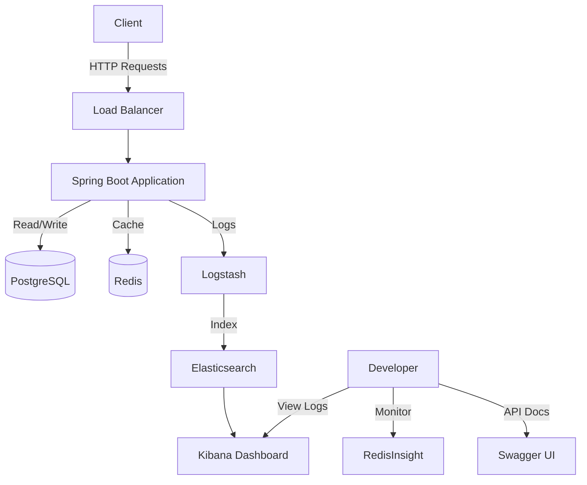
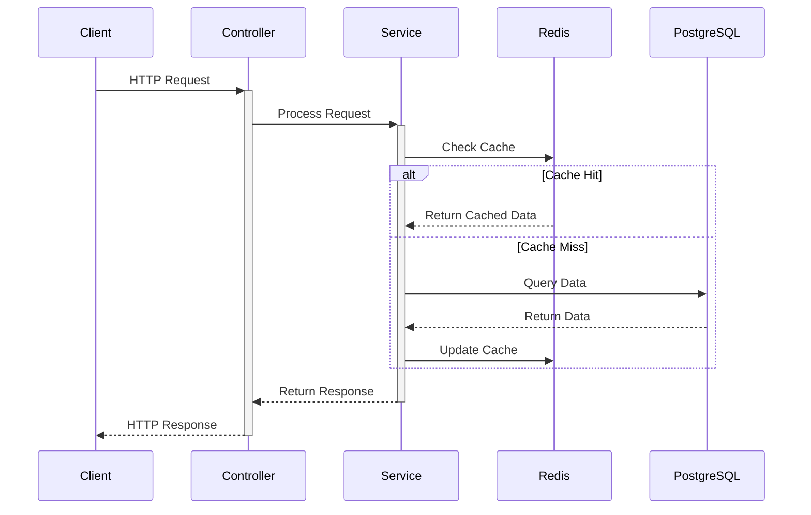

# Spring Boot Product Management System

A complete product management system built with Spring Boot, featuring CRUD operations, caching with Redis, and ELK stack for logging.

## 🏗️ Architecture


## 🚀 Features

- **Product Management**
  - Create, Read, Update, Delete (CRUD) operations
  - Data persistence with PostgreSQL
  - Redis caching for improved performance
  
- **Monitoring & Logging**
  - ELK Stack integration (Elasticsearch, Logstash, Kibana)
  - RedisInsight for cache monitoring
  - Distributed tracing with trace IDs

- **Documentation**
  - OpenAPI 3.0 (Swagger) documentation
  - Interactive API testing interface
  - Detailed API specifications

- **Docker Integration**
  - Containerized application and services
  - Docker Compose for easy deployment
  - Volume management for data persistence

## 🛠️ Technology Stack

- **Backend**: Spring Boot 3.5.0
- **Database**: PostgreSQL 15
- **Cache**: Redis 7
- **Logging**: ELK Stack 8.11.1
- **Documentation**: OpenAPI 3.0 (Swagger)
- **Build Tool**: Maven
- **Container**: Docker

## 📦 Project Structure

```
springboot/
├── src/
│   └── main/
│       ├── java/com/example/springboot/
│       │   ├── controller/
│       │   │   └── ProductController.java
│       │   ├── entity/
│       │   │   └── Product.java
│       │   ├── repository/
│       │   │   └── ProductRepository.java
│       │   └── service/
│       │       └── ProductService.java
│       └── resources/
│           ├── application.yml
│           └── logback-spring.xml
├── docker-compose.yml
├── Dockerfile
├── pom.xml
└── README.md
```

## 🚀 Getting Started

### Prerequisites
- Docker Desktop
- Git

### Installation & Running

1. Clone the repository:
```bash
git clone <repository-url>
cd springboot
```

2. Start all services using Docker Compose:
```bash
docker-compose up -d
```

3. Verify all services are running:
```bash
docker-compose ps
```

## 🔄 Application Flow

1. **API Endpoints**



### Available Endpoints

- **GET** `/api/products` - List all products
  ```bash
  curl http://localhost:8080/api/products
  ```

- **GET** `/api/products/{id}` - Get a specific product
  ```bash
  curl http://localhost:8080/api/products/1
  ```

- **POST** `/api/products` - Create a new product
  ```bash
  curl -X POST http://localhost:8080/api/products \
  -H "Content-Type: application/json" \
  -d '{"name":"iPhone 15","description":"Latest iPhone","price":999.99}'
  ```

- **PUT** `/api/products/{id}` - Update a product
  ```bash
  curl -X PUT http://localhost:8080/api/products/1 \
  -H "Content-Type: application/json" \
  -d '{"name":"iPhone 15 Pro","description":"Pro Model","price":1199.99}'
  ```

- **DELETE** `/api/products/{id}` - Delete a product
  ```bash
  curl -X DELETE http://localhost:8080/api/products/1
  ```

## 📊 Monitoring & Documentation

### API Documentation (Swagger UI)
1. Access Swagger UI: http://localhost:8080/swagger-ui.html
2. Features:
   - Interactive API documentation
   - Try out API endpoints directly
   - Detailed request/response schemas
   - API specifications download (OpenAPI 3.0)

### Redis Monitoring (RedisInsight)
1. Access RedisInsight: http://localhost:8001
2. First-time setup:
   - Click "I already have a database"
   - Add Redis database:
     - Host: redis
     - Port: 6379
     - Name: ProductCache

### Log Monitoring (Kibana)
1. Access Kibana: http://localhost:5601
2. Setup:
   - Go to Stack Management → Data Views
   - Create data view:
     - Name: springboot-logs
     - Index pattern: springboot-logs-*
     - Timestamp field: @timestamp

## 🗄️ Data Storage

### PostgreSQL
- Database: productdb
- Default credentials:
  - Username: postgres
  - Password: postgres
- Port: 5432

### Redis
- Port: 6379
- No authentication required (development setup)
- Cached data:
  - Product list: key "products"
  - Individual products: key "product::id"

## 📝 Logging

Logs are stored in multiple locations:
1. Container logs (accessible via `docker-compose logs`)
2. ELK Stack (searchable via Kibana)
3. Application logs (in container at /app/logs)

## 🛑 Stopping the Application

To stop all services:
```bash
docker-compose down
```

To stop and remove all data (including volumes):
```bash
docker-compose down -v
```

## 🔧 Troubleshooting

1. **Services not starting**
   ```bash
   # Check service status
   docker-compose ps
   
   # View logs
   docker-compose logs
   ```

2. **Cannot connect to Redis/PostgreSQL**
   ```bash
   # Restart specific service
   docker-compose restart redis
   docker-compose restart postgres
   ```

3. **Logs not appearing in Kibana**
   ```bash
   # Check Logstash logs
   docker-compose logs logstash
   
   # Check Elasticsearch logs
   docker-compose logs elasticsearch
   ```

## 🔄 Development Workflow

### Rebuilding After Code Changes

1. **Quick Rebuild (Only Application)**
   ```bash
   # Rebuild and restart only the application container
   docker-compose up -d --build app
   
   # View application logs
   docker-compose logs -f app
   ```

2. **Rebuild Specific Service**
   ```bash
   # Rebuild and restart a specific service (replace SERVICE_NAME with: app, redis, postgres, etc.)
   docker-compose up -d --build SERVICE_NAME
   ```

3. **View Changes**
   ```bash
   # Check application status
   docker-compose ps app
   
   # Test the API
   curl http://localhost:8080/api/products
   ```

4. **Common Development Commands**
   ```bash
   # Stop only the application (keeps other services running)
   docker-compose stop app
   
   # Start only the application
   docker-compose start app
   
   # Restart only the application
   docker-compose restart app
   
   # View real-time logs
   docker-compose logs -f app
   ```

### Tips for Fast Development
- Only the `app` service needs to be rebuilt when you change Java code
- Other services (Redis, PostgreSQL, ELK) can keep running
- Use `docker-compose logs -f app` to monitor application startup and errors
- Check Swagger UI (http://localhost:8080/swagger-ui.html) to test API changes
- Monitor Redis cache changes in RedisInsight (http://localhost:8001)

## 🔒 Security Notes

This is a development setup. For production:
1. Change default passwords
2. Enable Redis authentication
3. Configure proper SSL/TLS
4. Set up proper network security
5. Configure backup strategies

## 📚 Additional Resources

- [Spring Boot Documentation](https://docs.spring.io/spring-boot/docs/current/reference/html/)
- [Redis Documentation](https://redis.io/documentation)
- [ELK Stack Documentation](https://www.elastic.co/guide/index.html) 