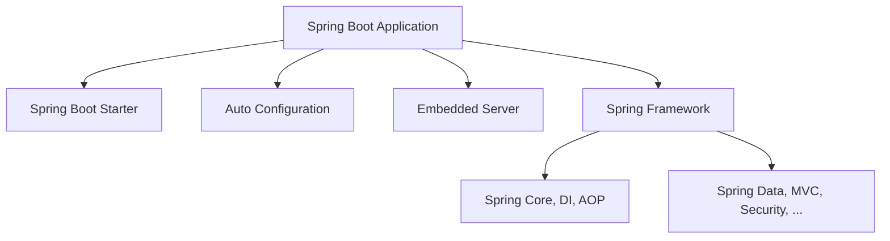

# 🌱 Spring Boot Deep Dive: Lịch sử, Kiến trúc, Thành phần, Tính năng & Best Practices

---

## 1. Lịch sử & Lý do ra đời

### 1.1 Lịch sử
- **Spring Framework** ra mắt năm 2003, giải quyết vấn đề phức tạp của Java EE (J2EE): cấu hình XML, boilerplate code, khó kiểm thử.
- **Spring Boot** ra mắt năm 2014 bởi Pivotal, nhằm đơn giản hóa việc phát triển ứng dụng Spring:
  - "Convention over Configuration"
  - Tự động cấu hình (auto-configuration)
  - Embedded server (Tomcat, Jetty, Undertow)
  - Không cần XML, chỉ cần Java config

### 1.2 Lý do ra đời
- **Java EE** quá nặng nề, khó phát triển nhanh, khó deploy, khó kiểm thử.
- **Spring Framework** giúp đơn giản hóa, nhưng vẫn cần nhiều cấu hình.
- **Spring Boot** giúp "Just run!":
  - Tự động cấu hình
  - Đóng gói thành 1 file jar/war, chạy mọi nơi
  - Hỗ trợ microservices, cloud-native

---

## 2. Kiến trúc & Thành phần cốt lõi

### 2.1 Kiến trúc tổng quan


### 2.2 Thành phần chính
- **Starters**: Tập hợp các dependency cho từng mục đích (`spring-boot-starter-web`, `spring-boot-starter-data-jpa`, ...)
- **Auto-configuration**: Tự động cấu hình dựa trên classpath và properties
- **Embedded Server**: Tomcat, Jetty, Undertow tích hợp sẵn
- **Actuator**: Monitoring, health check, metrics, tracing
- **Spring Initializr**: Tạo project nhanh qua web UI/CLI
- **Spring DevTools**: Hỗ trợ reload, debug, live reload

---

## 3. Cơ chế hoạt động & Auto-configuration

### 3.1 Auto-configuration
- Dựa trên annotation `@SpringBootApplication` (bao gồm `@Configuration`, `@EnableAutoConfiguration`, `@ComponentScan`)
- Spring Boot scan classpath, đọc các file `META-INF/spring.factories` để tìm các auto-configuration class
- Ví dụ: Nếu có `spring-boot-starter-data-jpa` trong classpath, Spring Boot sẽ tự động cấu hình DataSource, EntityManager, TransactionManager...

```java
@SpringBootApplication
public class MyApp {
    public static void main(String[] args) {
        SpringApplication.run(MyApp.class, args);
    }
}
```

### 3.2 Embedded Server
- Không cần cài Tomcat ngoài, chỉ cần chạy `java -jar myapp.jar`
- Có thể cấu hình port, context-path, SSL, thread pool qua `application.properties`/`application.yml`

### 3.3 Spring Boot Actuator
- Expose các endpoint: `/actuator/health`, `/actuator/metrics`, `/actuator/env`, `/actuator/loggers`, ...
- Hỗ trợ Prometheus, OpenTelemetry, custom metrics

---

## 4. Các tính năng nâng cao

### 4.1 Spring Boot với Microservices
- Dễ dàng tích hợp với Spring Cloud: Service Discovery (Eureka), Config Server, Circuit Breaker (Resilience4j), API Gateway (Zuul, Gateway), Distributed Tracing (Sleuth, Zipkin)
- Hỗ trợ Docker, Kubernetes, cloud-native patterns

### 4.2 Security
- Tích hợp Spring Security: JWT, OAuth2, OIDC, RBAC
- Cấu hình bảo mật qua Java config hoặc properties

### 4.3 Data Access
- Spring Data JPA, MongoDB, Redis, Cassandra, Elasticsearch
- Transaction management, auditing, pagination, soft delete

### 4.4 Testing
- Hỗ trợ JUnit 5, Mockito, Testcontainers, Spring Boot Test, MockMvc, WebTestClient
- Dễ dàng viết unit test, integration test, slice test

### 4.5 Monitoring & Observability
- Spring Boot Actuator, Micrometer, Prometheus, Grafana, OpenTelemetry
- Health check, custom metrics, distributed tracing

---

## 5. Best Practices & Vấn đề thực tế

### 5.1 Best Practices
- **Cấu hình qua environment variables** (12-factor app)
- **Không hardcode secret**: dùng Vault, AWS Secrets Manager, ...
- **Tách biệt config cho từng môi trường**: `application-dev.yml`, `application-prod.yml`
- **Viết test đầy đủ**: unit, integration, contract test
- **Sử dụng Actuator cho monitoring**
- **Sử dụng Docker/K8s cho deployment**
- **Bảo mật endpoint, log, database**
- **Tối ưu memory, thread pool, connection pool**

### 5.2 Vấn đề thực tế
- **Startup chậm**: Do quá nhiều auto-configuration, dependency
- **Memory leak**: Khi dùng nhiều thread pool, cache mà không quản lý tốt
- **Circular dependency**: Khi inject nhiều bean phức tạp
- **Migration từ legacy**: Khó khăn khi chuyển từ monolith hoặc Java EE
- **Debug production**: Cần bật log, actuator, distributed tracing

---

## 6. Kiến thức cơ bản Spring Framework

### 6.1 Dependency Injection (DI) & Inversion of Control (IoC)

**IoC Container:**
```java
// Spring IoC Container quản lý các bean
@Configuration
public class AppConfig {
    
    @Bean
    public UserService userService() {
        return new UserService(userRepository());
    }
    
    @Bean
    public UserRepository userRepository() {
        return new UserRepositoryImpl();
    }
}

// Sử dụng @Component để tự động tạo bean
@Component
public class UserService {
    
    private final UserRepository userRepository;
    
    // Constructor injection (recommended)
    public UserService(UserRepository userRepository) {
        this.userRepository = userRepository;
    }
    
    // Setter injection
    @Autowired
    public void setUserRepository(UserRepository userRepository) {
        this.userRepository = userRepository;
    }
    
    // Field injection (not recommended)
    @Autowired
    private UserRepository userRepository;
}
```

**Bean Scopes:**
```java
@Component
@Scope("singleton") // Default - 1 instance per container
public class SingletonService {
    // Chỉ tạo 1 instance
}

@Component
@Scope("prototype") // New instance each time
public class PrototypeService {
    // Tạo instance mới mỗi lần request
}

@Component
@Scope("request") // 1 instance per HTTP request
public class RequestScopedService {
    // 1 instance cho mỗi HTTP request
}

@Component
@Scope("session") // 1 instance per HTTP session
public class SessionScopedService {
    // 1 instance cho mỗi HTTP session
}
```

### 6.2 Spring MVC (Model-View-Controller)

**Controller:**
```java
@RestController
@RequestMapping("/api/users")
public class UserController {
    
    private final UserService userService;
    
    public UserController(UserService userService) {
        this.userService = userService;
    }
    
    // GET /api/users
    @GetMapping
    public List<User> getAllUsers() {
        return userService.getAllUsers();
    }
    
    // GET /api/users/{id}
    @GetMapping("/{id}")
    public ResponseEntity<User> getUserById(@PathVariable Long id) {
        return userService.getUserById(id)
                .map(ResponseEntity::ok)
                .orElse(ResponseEntity.notFound().build());
    }
    
    // POST /api/users
    @PostMapping
    public ResponseEntity<User> createUser(@Valid @RequestBody CreateUserRequest request) {
        User user = userService.createUser(request);
        return ResponseEntity.status(HttpStatus.CREATED).body(user);
    }
    
    // PUT /api/users/{id}
    @PutMapping("/{id}")
    public ResponseEntity<User> updateUser(@PathVariable Long id, 
                                         @Valid @RequestBody UpdateUserRequest request) {
        return userService.updateUser(id, request)
                .map(ResponseEntity::ok)
                .orElse(ResponseEntity.notFound().build());
    }
    
    // DELETE /api/users/{id}
    @DeleteMapping("/{id}")
    public ResponseEntity<Void> deleteUser(@PathVariable Long id) {
        if (userService.deleteUser(id)) {
            return ResponseEntity.noContent().build();
        }
        return ResponseEntity.notFound().build();
    }
    
    // Query parameters
    @GetMapping("/search")
    public List<User> searchUsers(@RequestParam String name, 
                                 @RequestParam(defaultValue = "0") int page,
                                 @RequestParam(defaultValue = "10") int size) {
        return userService.searchUsers(name, page, size);
    }
}
```

**Request/Response DTOs:**
```java
// Request DTO
public class CreateUserRequest {
    @NotBlank(message = "Name is required")
    @Size(min = 2, max = 50, message = "Name must be between 2 and 50 characters")
    private String name;
    
    @Email(message = "Email must be valid")
    @NotBlank(message = "Email is required")
    private String email;
    
    @NotBlank(message = "Password is required")
    @Size(min = 6, message = "Password must be at least 6 characters")
    private String password;
    
    // Getters and setters
}

// Response DTO
public class UserResponse {
    private Long id;
    private String name;
    private String email;
    private LocalDateTime createdAt;
    private LocalDateTime updatedAt;
    
    // Getters and setters
}
```

### 6.3 Spring Data JPA

**Entity:**
```java
@Entity
@Table(name = "users")
public class User {
    
    @Id
    @GeneratedValue(strategy = GenerationType.IDENTITY)
    private Long id;
    
    @Column(name = "name", nullable = false, length = 100)
    private String name;
    
    @Column(name = "email", nullable = false, unique = true)
    private String email;
    
    @Column(name = "password", nullable = false)
    private String password;
    
    @Enumerated(EnumType.STRING)
    @Column(name = "status")
    private UserStatus status = UserStatus.ACTIVE;
    
    @CreatedDate
    @Column(name = "created_at")
    private LocalDateTime createdAt;
    
    @LastModifiedDate
    @Column(name = "updated_at")
    private LocalDateTime updatedAt;
    
    @Version
    @Column(name = "version")
    private Long version;
    
    // Getters and setters
}

public enum UserStatus {
    ACTIVE, INACTIVE, SUSPENDED
}
```

**Repository:**
```java
@Repository
public interface UserRepository extends JpaRepository<User, Long> {
    
    // Method name queries
    Optional<User> findByEmail(String email);
    List<User> findByNameContainingIgnoreCase(String name);
    List<User> findByStatus(UserStatus status);
    boolean existsByEmail(String email);
    long countByStatus(UserStatus status);
    
    // Custom queries
    @Query("SELECT u FROM User u WHERE u.email = :email AND u.status = :status")
    Optional<User> findByEmailAndStatus(@Param("email") String email, 
                                       @Param("status") UserStatus status);
    
    @Query("SELECT u FROM User u WHERE u.createdAt >= :startDate")
    List<User> findUsersCreatedAfter(@Param("startDate") LocalDateTime startDate);
    
    // Native queries
    @Query(value = "SELECT * FROM users WHERE name LIKE %:name%", nativeQuery = true)
    List<User> findUsersByNameLike(@Param("name") String name);
    
    // Pagination
    Page<User> findByStatus(UserStatus status, Pageable pageable);
    
    // Sorting
    List<User> findByStatusOrderByCreatedAtDesc(UserStatus status);
    
    // Projection
    @Query("SELECT new com.example.dto.UserSummary(u.id, u.name, u.email) FROM User u")
    List<UserSummary> findAllUserSummaries();
}
```

**Service Layer:**
```java
@Service
@Transactional
public class UserService {
    
    private final UserRepository userRepository;
    private final PasswordEncoder passwordEncoder;
    
    public UserService(UserRepository userRepository, PasswordEncoder passwordEncoder) {
        this.userRepository = userRepository;
        this.passwordEncoder = passwordEncoder;
    }
    
    public List<User> getAllUsers() {
        return userRepository.findAll();
    }
    
    public Optional<User> getUserById(Long id) {
        return userRepository.findById(id);
    }
    
    public User createUser(CreateUserRequest request) {
        // Check if email already exists
        if (userRepository.existsByEmail(request.getEmail())) {
            throw new EmailAlreadyExistsException("Email already exists: " + request.getEmail());
        }
        
        User user = new User();
        user.setName(request.getName());
        user.setEmail(request.getEmail());
        user.setPassword(passwordEncoder.encode(request.getPassword()));
        
        return userRepository.save(user);
    }
    
    public Optional<User> updateUser(Long id, UpdateUserRequest request) {
        return userRepository.findById(id)
                .map(user -> {
                    user.setName(request.getName());
                    user.setEmail(request.getEmail());
                    return userRepository.save(user);
                });
    }
    
    public boolean deleteUser(Long id) {
        if (userRepository.existsById(id)) {
            userRepository.deleteById(id);
            return true;
        }
        return false;
    }
    
    public List<User> searchUsers(String name, int page, int size) {
        Pageable pageable = PageRequest.of(page, size, Sort.by("name").ascending());
        return userRepository.findByNameContainingIgnoreCase(name);
    }
}
```

### 6.4 Spring Security

**Basic Security Configuration:**
```java
@Configuration
@EnableWebSecurity
public class SecurityConfig {
    
    @Bean
    public SecurityFilterChain filterChain(HttpSecurity http) throws Exception {
        return http
                .authorizeHttpRequests(authz -> authz
                        .requestMatchers("/api/public/**").permitAll()
                        .requestMatchers("/api/users/**").hasRole("USER")
                        .requestMatchers("/api/admin/**").hasRole("ADMIN")
                        .anyRequest().authenticated()
                )
                .formLogin(form -> form
                        .loginPage("/login")
                        .defaultSuccessUrl("/dashboard")
                        .permitAll()
                )
                .logout(logout -> logout
                        .logoutUrl("/logout")
                        .logoutSuccessUrl("/login?logout")
                        .permitAll()
                )
                .csrf(csrf -> csrf.disable())
                .build();
    }
    
    @Bean
    public PasswordEncoder passwordEncoder() {
        return new BCryptPasswordEncoder();
    }
    
    @Bean
    public UserDetailsService userDetailsService(UserRepository userRepository) {
        return username -> userRepository.findByEmail(username)
                .map(this::mapToUserDetails)
                .orElseThrow(() -> new UsernameNotFoundException("User not found"));
    }
    
    private UserDetails mapToUserDetails(User user) {
        return User.builder()
                .username(user.getEmail())
                .password(user.getPassword())
                .roles("USER")
                .build();
    }
}
```

**JWT Authentication:**
```java
@Configuration
@EnableWebSecurity
public class JwtSecurityConfig {
    
    @Bean
    public SecurityFilterChain filterChain(HttpSecurity http) throws Exception {
        return http
                .authorizeHttpRequests(authz -> authz
                        .requestMatchers("/api/auth/**").permitAll()
                        .requestMatchers("/api/users/**").hasRole("USER")
                        .anyRequest().authenticated()
                )
                .oauth2ResourceServer(oauth2 -> oauth2.jwt(Customizer.withDefaults()))
                .csrf(csrf -> csrf.disable())
                .sessionManagement(session -> session.sessionCreationPolicy(SessionCreationPolicy.STATELESS))
                .build();
    }
    
    @Bean
    public JwtDecoder jwtDecoder() {
        return NimbusJwtDecoder.withJwkSetUri("http://localhost:8080/.well-known/jwks.json").build();
    }
}

@Service
public class JwtService {
    
    @Value("${jwt.secret}")
    private String secret;
    
    @Value("${jwt.expiration}")
    private long expiration;
    
    public String generateToken(UserDetails userDetails) {
        return generateToken(new HashMap<>(), userDetails);
    }
    
    public String generateToken(Map<String, Object> extraClaims, UserDetails userDetails) {
        return Jwts.builder()
                .setClaims(extraClaims)
                .setSubject(userDetails.getUsername())
                .setIssuedAt(new Date(System.currentTimeMillis()))
                .setExpiration(new Date(System.currentTimeMillis() + expiration))
                .signWith(getSignInKey(), SignatureAlgorithm.HS256)
                .compact();
    }
    
    public boolean isTokenValid(String token, UserDetails userDetails) {
        final String username = extractUsername(token);
        return (username.equals(userDetails.getUsername())) && !isTokenExpired(token);
    }
    
    private boolean isTokenExpired(String token) {
        return extractExpiration(token).before(new Date());
    }
    
    private Date extractExpiration(String token) {
        return extractClaim(token, Claims::getExpiration);
    }
    
    public String extractUsername(String token) {
        return extractClaim(token, Claims::getSubject);
    }
    
    private <T> T extractClaim(String token, Function<Claims, T> claimsResolver) {
        final Claims claims = extractAllClaims(token);
        return claimsResolver.apply(claims);
    }
    
    private Claims extractAllClaims(String token) {
        return Jwts.parserBuilder()
                .setSigningKey(getSignInKey())
                .build()
                .parseClaimsJws(token)
                .getBody();
    }
    
    private Key getSignInKey() {
        byte[] keyBytes = Decoders.BASE64.decode(secret);
        return Keys.hmacShaKeyFor(keyBytes);
    }
}
```

### 6.5 Spring Boot Configuration

**Application Properties:**
```yaml
# application.yml
server:
  port: 8080
  servlet:
    context-path: /api

spring:
  application:
    name: my-spring-boot-app
  
  # Database configuration
  datasource:
    url: jdbc:postgresql://localhost:5432/mydb
    username: ${DB_USERNAME:postgres}
    password: ${DB_PASSWORD:password}
    driver-class-name: org.postgresql.Driver
  
  # JPA configuration
  jpa:
    hibernate:
      ddl-auto: update
    show-sql: true
    properties:
      hibernate:
        dialect: org.hibernate.dialect.PostgreSQLDialect
        format_sql: true
  
  # Security configuration
  security:
    user:
      name: admin
      password: admin
  
  # Actuator configuration
  management:
    endpoints:
      web:
        exposure:
          include: health,info,metrics,prometheus
    endpoint:
      health:
        show-details: when-authorized

# Custom properties
app:
  jwt:
    secret: ${JWT_SECRET:my-secret-key}
    expiration: 86400000 # 24 hours
  pagination:
    default-page-size: 10
    max-page-size: 100
```

**Environment-specific Configuration:**
```yaml
# application-dev.yml
spring:
  datasource:
    url: jdbc:h2:mem:testdb
    username: sa
    password: 
    driver-class-name: org.h2.Driver
  jpa:
    hibernate:
      ddl-auto: create-drop
    show-sql: true
  h2:
    console:
      enabled: true

logging:
  level:
    com.example: DEBUG
    org.springframework.web: DEBUG

# application-prod.yml
spring:
  datasource:
    url: jdbc:postgresql://prod-db:5432/mydb
    username: ${DB_USERNAME}
    password: ${DB_PASSWORD}
  jpa:
    show-sql: false
    hibernate:
      ddl-auto: validate

logging:
  level:
    com.example: INFO
    org.springframework.web: WARN
```

### 6.6 Spring Boot Testing

**Unit Testing:**
```java
@ExtendWith(MockitoExtension.class)
class UserServiceTest {
    
    @Mock
    private UserRepository userRepository;
    
    @Mock
    private PasswordEncoder passwordEncoder;
    
    @InjectMocks
    private UserService userService;
    
    @Test
    @DisplayName("Should create user successfully")
    void createUser_WithValidRequest_ShouldCreateUser() {
        // Given
        CreateUserRequest request = new CreateUserRequest();
        request.setName("John Doe");
        request.setEmail("john@example.com");
        request.setPassword("password123");
        
        User savedUser = new User();
        savedUser.setId(1L);
        savedUser.setName(request.getName());
        savedUser.setEmail(request.getEmail());
        savedUser.setPassword("encodedPassword");
        
        given(userRepository.existsByEmail(request.getEmail())).willReturn(false);
        given(passwordEncoder.encode(request.getPassword())).willReturn("encodedPassword");
        given(userRepository.save(any(User.class))).willReturn(savedUser);
        
        // When
        User result = userService.createUser(request);
        
        // Then
        assertThat(result).isNotNull();
        assertThat(result.getName()).isEqualTo(request.getName());
        assertThat(result.getEmail()).isEqualTo(request.getEmail());
        
        then(userRepository).should().existsByEmail(request.getEmail());
        then(passwordEncoder).should().encode(request.getPassword());
        then(userRepository).should().save(any(User.class));
    }
    
    @Test
    @DisplayName("Should throw exception when email already exists")
    void createUser_WithExistingEmail_ShouldThrowException() {
        // Given
        CreateUserRequest request = new CreateUserRequest();
        request.setEmail("existing@example.com");
        
        given(userRepository.existsByEmail(request.getEmail())).willReturn(true);
        
        // When & Then
        assertThatThrownBy(() -> userService.createUser(request))
                .isInstanceOf(EmailAlreadyExistsException.class)
                .hasMessageContaining("Email already exists");
        
        then(userRepository).should().existsByEmail(request.getEmail());
        then(userRepository).shouldHaveNoMoreInteractions();
    }
}
```

**Integration Testing:**
```java
@SpringBootTest
@AutoConfigureTestDatabase(replace = AutoConfigureTestDatabase.Replace.NONE)
@Transactional
class UserControllerIntegrationTest {
    
    @Autowired
    private TestRestTemplate restTemplate;
    
    @Autowired
    private UserRepository userRepository;
    
    @Test
    void getUsers_ShouldReturnUsers() {
        // Given
        User user = new User();
        user.setName("John Doe");
        user.setEmail("john@example.com");
        user.setPassword("password");
        userRepository.save(user);
        
        // When
        ResponseEntity<List<User>> response = restTemplate.exchange(
                "/api/users",
                HttpMethod.GET,
                null,
                new ParameterizedTypeReference<List<User>>() {}
        );
        
        // Then
        assertThat(response.getStatusCode()).isEqualTo(HttpStatus.OK);
        assertThat(response.getBody()).hasSize(1);
        assertThat(response.getBody().get(0).getName()).isEqualTo("John Doe");
    }
    
    @Test
    void createUser_WithValidRequest_ShouldCreateUser() {
        // Given
        CreateUserRequest request = new CreateUserRequest();
        request.setName("Jane Doe");
        request.setEmail("jane@example.com");
        request.setPassword("password123");
        
        // When
        ResponseEntity<User> response = restTemplate.postForEntity(
                "/api/users",
                request,
                User.class
        );
        
        // Then
        assertThat(response.getStatusCode()).isEqualTo(HttpStatus.CREATED);
        assertThat(response.getBody()).isNotNull();
        assertThat(response.getBody().getName()).isEqualTo("Jane Doe");
        
        // Verify in database
        Optional<User> savedUser = userRepository.findByEmail("jane@example.com");
        assertThat(savedUser).isPresent();
        assertThat(savedUser.get().getName()).isEqualTo("Jane Doe");
    }
}
```

### 6.7 Spring Boot Actuator

**Health Checks:**
```java
@Component
public class DatabaseHealthIndicator implements HealthIndicator {
    
    @Autowired
    private DataSource dataSource;
    
    @Override
    public Health health() {
        try (Connection connection = dataSource.getConnection()) {
            if (connection.isValid(1000)) {
                return Health.up()
                        .withDetail("database", "Available")
                        .withDetail("connection", "Valid")
                        .build();
            } else {
                return Health.down()
                        .withDetail("database", "Unavailable")
                        .withDetail("connection", "Invalid")
                        .build();
            }
        } catch (Exception e) {
            return Health.down()
                    .withDetail("database", "Error")
                    .withDetail("error", e.getMessage())
                    .build();
        }
    }
}

@Component
public class CustomHealthIndicator implements HealthIndicator {
    
    @Override
    public Health health() {
        // Custom health check logic
        if (isServiceHealthy()) {
            return Health.up()
                    .withDetail("service", "Running")
                    .withDetail("timestamp", LocalDateTime.now())
                    .build();
        } else {
            return Health.down()
                    .withDetail("service", "Not responding")
                    .withDetail("timestamp", LocalDateTime.now())
                    .build();
        }
    }
    
    private boolean isServiceHealthy() {
        // Implement your health check logic
        return true;
    }
}
```

**Custom Metrics:**
```java
@Component
public class CustomMetrics {
    
    private final MeterRegistry meterRegistry;
    private final Counter requestCounter;
    private final Timer requestTimer;
    private final Gauge activeConnections;
    
    public CustomMetrics(MeterRegistry meterRegistry) {
        this.meterRegistry = meterRegistry;
        this.requestCounter = Counter.builder("app.requests")
                .description("Number of requests")
                .register(meterRegistry);
        this.requestTimer = Timer.builder("app.request.duration")
                .description("Request duration")
                .register(meterRegistry);
        this.activeConnections = Gauge.builder("app.active.connections")
                .description("Active connections")
                .register(meterRegistry, this, CustomMetrics::getActiveConnections);
    }
    
    public void incrementRequestCount() {
        requestCounter.increment();
    }
    
    public Timer.Sample startTimer() {
        return Timer.start(meterRegistry);
    }
    
    private double getActiveConnections() {
        // Implement logic to get active connections
        return 0.0;
    }
}

// Using metrics in service
@Service
public class UserService {
    
    private final CustomMetrics metrics;
    
    public UserService(CustomMetrics metrics) {
        this.metrics = metrics;
    }
    
    public List<User> getAllUsers() {
        metrics.incrementRequestCount();
        Timer.Sample sample = metrics.startTimer();
        
        try {
            List<User> users = userRepository.findAll();
            return users;
        } finally {
            sample.stop();
        }
    }
}
```

### 6.8 Exception Handling & Global Error Handling

**Global Exception Handler:**
```java
@RestControllerAdvice
public class GlobalExceptionHandler {
    
    private static final Logger logger = LoggerFactory.getLogger(GlobalExceptionHandler.class);
    
    @ExceptionHandler(ResourceNotFoundException.class)
    public ResponseEntity<ErrorResponse> handleResourceNotFoundException(ResourceNotFoundException ex, WebRequest request) {
        logger.error("Resource not found: {}", ex.getMessage());
        
        ErrorResponse error = new ErrorResponse(
            HttpStatus.NOT_FOUND.value(),
            "Resource not found",
            ex.getMessage(),
            request.getDescription(false)
        );
        
        return ResponseEntity.status(HttpStatus.NOT_FOUND).body(error);
    }
    
    @ExceptionHandler(ValidationException.class)
    public ResponseEntity<ErrorResponse> handleValidationException(ValidationException ex, WebRequest request) {
        logger.error("Validation error: {}", ex.getMessage());
        
        ErrorResponse error = new ErrorResponse(
            HttpStatus.BAD_REQUEST.value(),
            "Validation failed",
            ex.getMessage(),
            request.getDescription(false)
        );
        
        return ResponseEntity.status(HttpStatus.BAD_REQUEST).body(error);
    }
    
    @ExceptionHandler(MethodArgumentNotValidException.class)
    public ResponseEntity<ErrorResponse> handleValidationExceptions(MethodArgumentNotValidException ex, WebRequest request) {
        Map<String, String> errors = new HashMap<>();
        ex.getBindingResult().getAllErrors().forEach((error) -> {
            String fieldName = ((FieldError) error).getField();
            String errorMessage = error.getDefaultMessage();
            errors.put(fieldName, errorMessage);
        });
        
        ErrorResponse error = new ErrorResponse(
            HttpStatus.BAD_REQUEST.value(),
            "Validation failed",
            errors.toString(),
            request.getDescription(false)
        );
        
        return ResponseEntity.status(HttpStatus.BAD_REQUEST).body(error);
    }
    
    @ExceptionHandler(Exception.class)
    public ResponseEntity<ErrorResponse> handleGlobalException(Exception ex, WebRequest request) {
        logger.error("Unexpected error: {}", ex.getMessage(), ex);
        
        ErrorResponse error = new ErrorResponse(
            HttpStatus.INTERNAL_SERVER_ERROR.value(),
            "Internal server error",
            "An unexpected error occurred",
            request.getDescription(false)
        );
        
        return ResponseEntity.status(HttpStatus.INTERNAL_SERVER_ERROR).body(error);
    }
}

// Custom Exceptions
public class ResourceNotFoundException extends RuntimeException {
    public ResourceNotFoundException(String message) {
        super(message);
    }
    
    public ResourceNotFoundException(String resourceName, String fieldName, Object fieldValue) {
        super(String.format("%s not found with %s : '%s'", resourceName, fieldName, fieldValue));
    }
}

public class ValidationException extends RuntimeException {
    public ValidationException(String message) {
        super(message);
    }
}

// Error Response DTO
public class ErrorResponse {
    private int status;
    private String error;
    private String message;
    private String path;
    private LocalDateTime timestamp;
    
    public ErrorResponse(int status, String error, String message, String path) {
        this.status = status;
        this.error = error;
        this.message = message;
        this.path = path;
        this.timestamp = LocalDateTime.now();
    }
    
    // Getters and setters
}
```

### 6.9 Validation & Bean Validation

**Entity Validation:**
```java
@Entity
@Table(name = "users")
public class User {
    
    @Id
    @GeneratedValue(strategy = GenerationType.IDENTITY)
    private Long id;
    
    @NotBlank(message = "Name is required")
    @Size(min = 2, max = 100, message = "Name must be between 2 and 100 characters")
    @Column(name = "name", nullable = false, length = 100)
    private String name;
    
    @NotBlank(message = "Email is required")
    @Email(message = "Email must be valid")
    @Column(name = "email", nullable = false, unique = true)
    private String email;
    
    @NotBlank(message = "Password is required")
    @Size(min = 6, message = "Password must be at least 6 characters")
    @Pattern(regexp = "^(?=.*[0-9])(?=.*[a-z])(?=.*[A-Z])(?=.*[@#$%^&+=])(?=\\S+$).{6,}$", 
             message = "Password must contain at least one digit, one lowercase, one uppercase, and one special character")
    @Column(name = "password", nullable = false)
    private String password;
    
    @NotNull(message = "Age is required")
    @Min(value = 18, message = "Age must be at least 18")
    @Max(value = 120, message = "Age must not exceed 120")
    @Column(name = "age")
    private Integer age;
    
    @Past(message = "Birth date must be in the past")
    @Column(name = "birth_date")
    private LocalDate birthDate;
    
    @Pattern(regexp = "^\\+?[1-9]\\d{1,14}$", message = "Phone number must be valid")
    @Column(name = "phone")
    private String phone;
    
    // Getters and setters
}
```

**Custom Validation:**
```java
// Custom validation annotation
@Target({ElementType.FIELD})
@Retention(RetentionPolicy.RUNTIME)
@Constraint(validatedBy = StrongPasswordValidator.class)
@Documented
public @interface StrongPassword {
    String message() default "Password must be strong";
    Class<?>[] groups() default {};
    Class<? extends Payload>[] payload() default {};
}

// Custom validator implementation
public class StrongPasswordValidator implements ConstraintValidator<StrongPassword, String> {
    
    @Override
    public boolean isValid(String password, ConstraintValidatorContext context) {
        if (password == null) {
            return false;
        }
        
        // At least 8 characters
        if (password.length() < 8) {
            return false;
        }
        
        // At least one uppercase letter
        if (!password.matches(".*[A-Z].*")) {
            return false;
        }
        
        // At least one lowercase letter
        if (!password.matches(".*[a-z].*")) {
            return false;
        }
        
        // At least one digit
        if (!password.matches(".*\\d.*")) {
            return false;
        }
        
        // At least one special character
        if (!password.matches(".*[@#$%^&+=].*")) {
            return false;
        }
        
        return true;
    }
}

// Using custom validation
public class CreateUserRequest {
    @NotBlank(message = "Name is required")
    private String name;
    
    @Email(message = "Email must be valid")
    private String email;
    
    @StrongPassword
    private String password;
    
    // Getters and setters
}
```

### 6.10 Caching

**Cache Configuration:**
```java
@Configuration
@EnableCaching
public class CacheConfig {
    
    @Bean
    public CacheManager cacheManager() {
        SimpleCacheManager cacheManager = new SimpleCacheManager();
        cacheManager.setCaches(Arrays.asList(
            new ConcurrentMapCache("users"),
            new ConcurrentMapCache("products"),
            new ConcurrentMapCache("categories")
        ));
        return cacheManager;
    }
    
    @Bean
    public CacheManager redisCacheManager(RedisConnectionFactory redisConnectionFactory) {
        RedisCacheConfiguration config = RedisCacheConfiguration.defaultCacheConfig()
                .entryTtl(Duration.ofMinutes(30))
                .serializeKeysWith(RedisSerializationContext.SerializationPair.fromSerializer(new StringRedisSerializer()))
                .serializeValuesWith(RedisSerializationContext.SerializationPair.fromSerializer(new GenericJackson2JsonRedisSerializer()));
        
        return RedisCacheManager.builder(redisConnectionFactory)
                .cacheDefaults(config)
                .withCacheConfiguration("users", 
                    config.entryTtl(Duration.ofHours(1)))
                .withCacheConfiguration("products", 
                    config.entryTtl(Duration.ofMinutes(15)))
                .build();
    }
}

// Using caching in service
@Service
public class UserService {
    
    @Cacheable(value = "users", key = "#id")
    public Optional<User> getUserById(Long id) {
        return userRepository.findById(id);
    }
    
    @Cacheable(value = "users", key = "#email")
    public Optional<User> getUserByEmail(String email) {
        return userRepository.findByEmail(email);
    }
    
    @CacheEvict(value = "users", key = "#user.id")
    public User updateUser(User user) {
        return userRepository.save(user);
    }
    
    @CacheEvict(value = "users", allEntries = true)
    public void clearAllUserCache() {
        // Clear all user cache
    }
    
    @Caching(evict = {
        @CacheEvict(value = "users", key = "#user.id"),
        @CacheEvict(value = "users", key = "#user.email")
    })
    public User createUser(User user) {
        return userRepository.save(user);
    }
}
```

### 6.11 Async Processing & Event Handling

**Async Configuration:**
```java
@Configuration
@EnableAsync
public class AsyncConfig implements AsyncConfigurer {
    
    @Override
    public Executor getAsyncExecutor() {
        ThreadPoolTaskExecutor executor = new ThreadPoolTaskExecutor();
        executor.setCorePoolSize(10);
        executor.setMaxPoolSize(50);
        executor.setQueueCapacity(100);
        executor.setThreadNamePrefix("Async-");
        executor.setRejectedExecutionHandler(new ThreadPoolExecutor.CallerRunsPolicy());
        executor.initialize();
        return executor;
    }
    
    @Override
    public AsyncUncaughtExceptionHandler getAsyncUncaughtExceptionHandler() {
        return new SimpleAsyncUncaughtExceptionHandler();
    }
}

// Async service
@Service
public class NotificationService {
    
    @Async
    public CompletableFuture<Void> sendEmailAsync(String to, String subject, String content) {
        try {
            // Simulate email sending
            Thread.sleep(1000);
            log.info("Email sent to: {}", to);
            return CompletableFuture.completedFuture(null);
        } catch (Exception e) {
            log.error("Failed to send email", e);
            return CompletableFuture.failedFuture(e);
        }
    }
    
    @Async
    public CompletableFuture<Void> sendSMSAsync(String phone, String message) {
        try {
            // Simulate SMS sending
            Thread.sleep(500);
            log.info("SMS sent to: {}", phone);
            return CompletableFuture.completedFuture(null);
        } catch (Exception e) {
            log.error("Failed to send SMS", e);
            return CompletableFuture.failedFuture(e);
        }
    }
}

// Event handling
@Component
public class UserEventHandler {
    
    @Autowired
    private NotificationService notificationService;
    
    @EventListener
    public void handleUserCreated(UserCreatedEvent event) {
        log.info("User created: {}", event.getUserId());
        
        // Send welcome email asynchronously
        notificationService.sendEmailAsync(
            event.getEmail(), 
            "Welcome!", 
            "Welcome to our platform!"
        );
    }
    
    @EventListener
    public void handleUserUpdated(UserUpdatedEvent event) {
        log.info("User updated: {}", event.getUserId());
        
        // Send notification asynchronously
        notificationService.sendSMSAsync(
            event.getPhone(), 
            "Your profile has been updated"
        );
    }
}

// Event classes
public class UserCreatedEvent {
    private Long userId;
    private String email;
    private String name;
    
    // Constructor, getters, setters
}

public class UserUpdatedEvent {
    private Long userId;
    private String phone;
    
    // Constructor, getters, setters
}
```

### 6.12 Spring Profiles & Environment Configuration

**Profile Configuration:**
```java
@Configuration
@Profile("dev")
public class DevConfig {
    
    @Bean
    public DataSource dataSource() {
        return new EmbeddedDatabaseBuilder()
                .setType(EmbeddedDatabaseType.H2)
                .addScript("classpath:schema.sql")
                .addScript("classpath:data.sql")
                .build();
    }
    
    @Bean
    public CommandLineRunner dataLoader(UserRepository userRepository) {
        return args -> {
            User user = new User();
            user.setName("Dev User");
            user.setEmail("dev@example.com");
            user.setPassword("password");
            userRepository.save(user);
        };
    }
}

@Configuration
@Profile("prod")
public class ProdConfig {
    
    @Bean
    @Primary
    public DataSource dataSource(
            @Value("${spring.datasource.url}") String url,
            @Value("${spring.datasource.username}") String username,
            @Value("${spring.datasource.password}") String password) {
        
        HikariConfig config = new HikariConfig();
        config.setJdbcUrl(url);
        config.setUsername(username);
        config.setPassword(password);
        config.setMaximumPoolSize(20);
        config.setMinimumIdle(5);
        config.setConnectionTimeout(30000);
        config.setIdleTimeout(600000);
        config.setMaxLifetime(1800000);
        
        return new HikariDataSource(config);
    }
}

// Conditional beans
@Configuration
public class ConditionalConfig {
    
    @Bean
    @ConditionalOnProperty(name = "app.feature.cache.enabled", havingValue = "true")
    public CacheManager cacheManager() {
        return new ConcurrentMapCacheManager();
    }
    
    @Bean
    @ConditionalOnClass(name = "com.redis.clients.jedis.Jedis")
    public RedisTemplate<String, Object> redisTemplate(RedisConnectionFactory connectionFactory) {
        RedisTemplate<String, Object> template = new RedisTemplate<>();
        template.setConnectionFactory(connectionFactory);
        template.setKeySerializer(new StringRedisSerializer());
        template.setValueSerializer(new GenericJackson2JsonRedisSerializer());
        return template;
    }
    
    @Bean
    @ConditionalOnMissingBean(CacheManager.class)
    public CacheManager defaultCacheManager() {
        return new NoOpCacheManager();
    }
}
```

### 6.13 Custom Spring Boot Starters

**Custom Starter Structure:**
```
my-custom-starter/
├── src/main/java/
│   └── com/example/starter/
│       ├── MyCustomAutoConfiguration.java
│       ├── MyCustomProperties.java
│       └── MyCustomService.java
└── src/main/resources/
    └── META-INF/
        └── spring.factories
```

**Custom Auto Configuration:**
```java
@Configuration
@ConditionalOnClass(MyCustomService.class)
@EnableConfigurationProperties(MyCustomProperties.class)
public class MyCustomAutoConfiguration {
    
    @Bean
    @ConditionalOnMissingBean
    public MyCustomService myCustomService(MyCustomProperties properties) {
        return new MyCustomService(properties);
    }
    
    @Bean
    @ConditionalOnProperty(name = "my.custom.enabled", havingValue = "true", matchIfMissing = true)
    public MyCustomHealthIndicator myCustomHealthIndicator(MyCustomService service) {
        return new MyCustomHealthIndicator(service);
    }
}

@ConfigurationProperties(prefix = "my.custom")
@Data
public class MyCustomProperties {
    private String apiKey;
    private String endpoint = "https://api.example.com";
    private int timeout = 5000;
    private boolean enabled = true;
}

@Component
public class MyCustomService {
    
    private final MyCustomProperties properties;
    
    public MyCustomService(MyCustomProperties properties) {
        this.properties = properties;
    }
    
    public String doSomething() {
        // Custom logic
        return "Custom service is working!";
    }
}

@Component
public class MyCustomHealthIndicator implements HealthIndicator {
    
    private final MyCustomService service;
    
    public MyCustomHealthIndicator(MyCustomService service) {
        this.service = service;
    }
    
    @Override
    public Health health() {
        try {
            String result = service.doSomething();
            return Health.up()
                    .withDetail("service", "Custom Service")
                    .withDetail("result", result)
                    .build();
        } catch (Exception e) {
            return Health.down()
                    .withDetail("service", "Custom Service")
                    .withDetail("error", e.getMessage())
                    .build();
        }
    }
}
```

**spring.factories:**
```properties
org.springframework.boot.autoconfigure.EnableAutoConfiguration=\
com.example.starter.MyCustomAutoConfiguration
```

### 6.14 Performance Tuning & Optimization

**JVM Tuning:**
```bash
# JVM options for production
java -Xms2g -Xmx4g \
     -XX:+UseG1GC \
     -XX:MaxGCPauseMillis=200 \
     -XX:+UseStringDeduplication \
     -XX:+OptimizeStringConcat \
     -XX:+UseCompressedOops \
     -XX:+UseCompressedClassPointers \
     -jar myapp.jar
```

**Application Properties for Performance:**
```yaml
# application-prod.yml
spring:
  jpa:
    hibernate:
      jdbc:
        batch_size: 50
        batch_versioned_data: true
      order_inserts: true
      order_updates: true
      batch_fetch_style: DYNAMIC
    properties:
      hibernate:
        jdbc:
          batch_size: 50
        order_inserts: true
        order_updates: true
        batch_fetch_style: DYNAMIC
        connection:
          provider_disables_autocommit: true
        cache:
          use_second_level_cache: true
          use_query_cache: true
          region:
            factory_class: org.hibernate.cache.jcache.JCacheRegionFactory
        javax:
          cache:
            provider: org.ehcache.jsr107.EhcacheCachingProvider
            uri: classpath:ehcache.xml

  datasource:
    hikari:
      maximum-pool-size: 20
      minimum-idle: 5
      connection-timeout: 30000
      idle-timeout: 600000
      max-lifetime: 1800000
      leak-detection-threshold: 60000

server:
  tomcat:
    threads:
      max: 200
      min-spare: 10
    max-connections: 8192
    accept-count: 100
    connection-timeout: 20000

logging:
  level:
    org.hibernate.SQL: WARN
    org.hibernate.type.descriptor.sql.BasicBinder: WARN
    com.zaxxer.hikari: WARN
```

**Database Optimization:**
```java
// Batch processing
@Service
@Transactional
public class BatchService {
    
    @Autowired
    private UserRepository userRepository;
    
    public void processBatchUsers(List<User> users) {
        int batchSize = 100;
        
        for (int i = 0; i < users.size(); i += batchSize) {
            List<User> batch = users.subList(i, Math.min(i + batchSize, users.size()));
            userRepository.saveAll(batch);
        }
    }
    
    @Transactional(readOnly = true)
    public List<User> getUsersWithPagination(int page, int size) {
        Pageable pageable = PageRequest.of(page, size, Sort.by("id").ascending());
        return userRepository.findAll(pageable).getContent();
    }
}

// Query optimization
@Repository
public interface UserRepository extends JpaRepository<User, Long> {
    
    @QueryHints(@QueryHint(name = HINT_FETCH_SIZE, value = "50"))
    @Query("SELECT u FROM User u WHERE u.status = :status")
    List<User> findByStatus(@Param("status") UserStatus status);
    
    @Query("SELECT u FROM User u JOIN FETCH u.orders WHERE u.id = :id")
    Optional<User> findByIdWithOrders(@Param("id") Long id);
    
    @Query("SELECT new com.example.dto.UserSummary(u.id, u.name, u.email) FROM User u")
    List<UserSummary> findAllUserSummaries();
}
```

**Connection Pool Monitoring:**
```java
@Component
public class ConnectionPoolMonitor {
    
    @Autowired
    private DataSource dataSource;
    
    @Scheduled(fixedRate = 60000) // Every minute
    public void monitorConnectionPool() {
        if (dataSource instanceof HikariDataSource) {
            HikariDataSource hikariDataSource = (HikariDataSource) dataSource;
            HikariPoolMXBean poolMXBean = hikariDataSource.getHikariPoolMXBean();
            
            log.info("Connection Pool Stats:");
            log.info("Active connections: {}", poolMXBean.getActiveConnections());
            log.info("Idle connections: {}", poolMXBean.getIdleConnections());
            log.info("Total connections: {}", poolMXBean.getTotalConnections());
            log.info("Threads awaiting connection: {}", poolMXBean.getThreadsAwaitingConnection());
        }
    }
}
```

### 6.15 Spring Boot với Docker & Kubernetes

**Docker Configuration:**
```dockerfile
# Multi-stage build for optimization
FROM openjdk:17-jdk-slim as builder

WORKDIR /app
COPY mvnw .
COPY .mvn .mvn
COPY pom.xml .

RUN chmod +x mvnw
RUN ./mvnw dependency:go-offline -B

COPY src src
RUN ./mvnw clean package -DskipTests

# Runtime stage
FROM openjdk:17-jre-slim

WORKDIR /app
COPY --from=builder /app/target/*.jar app.jar

# Create non-root user
RUN addgroup --system javauser && adduser --system --ingroup javauser javauser
USER javauser

# Health check
HEALTHCHECK --interval=30s --timeout=3s --start-period=60s --retries=3 \
  CMD curl -f http://localhost:8080/actuator/health || exit 1

EXPOSE 8080
ENTRYPOINT ["java", "-jar", "app.jar"]
```

**Docker Compose:**
```yaml
# docker-compose.yml
version: '3.8'

services:
  app:
    build: .
    ports:
      - "8080:8080"
    environment:
      - SPRING_PROFILES_ACTIVE=docker
      - SPRING_DATASOURCE_URL=jdbc:postgresql://db:5432/myapp
      - SPRING_DATASOURCE_USERNAME=postgres
      - SPRING_DATASOURCE_PASSWORD=password
      - SPRING_REDIS_HOST=redis
    depends_on:
      - db
      - redis
    networks:
      - app-network

  db:
    image: postgres:15-alpine
    environment:
      - POSTGRES_DB=myapp
      - POSTGRES_USER=postgres
      - POSTGRES_PASSWORD=password
    volumes:
      - postgres_data:/var/lib/postgresql/data
    networks:
      - app-network

  redis:
    image: redis:7-alpine
    networks:
      - app-network

  nginx:
    image: nginx:alpine
    ports:
      - "80:80"
    volumes:
      - ./nginx/nginx.conf:/etc/nginx/nginx.conf
    depends_on:
      - app
    networks:
      - app-network

volumes:
  postgres_data:

networks:
  app-network:
    driver: bridge
```

**Kubernetes Deployment:**
```yaml
# k8s/deployment.yaml
apiVersion: apps/v1
kind: Deployment
metadata:
  name: spring-boot-app
  labels:
    app: spring-boot-app
spec:
  replicas: 3
  selector:
    matchLabels:
      app: spring-boot-app
  template:
    metadata:
      labels:
        app: spring-boot-app
    spec:
      containers:
      - name: app
        image: myapp:latest
        ports:
        - containerPort: 8080
        env:
        - name: SPRING_PROFILES_ACTIVE
          value: "kubernetes"
        - name: SPRING_DATASOURCE_URL
          valueFrom:
            secretKeyRef:
              name: db-secret
              key: url
        - name: SPRING_DATASOURCE_USERNAME
          valueFrom:
            secretKeyRef:
              name: db-secret
              key: username
        resources:
          requests:
            memory: "512Mi"
            cpu: "250m"
          limits:
            memory: "1Gi"
            cpu: "500m"
        livenessProbe:
          httpGet:
            path: /actuator/health/liveness
            port: 8080
          initialDelaySeconds: 60
          periodSeconds: 30
        readinessProbe:
          httpGet:
            path: /actuator/health/readiness
            port: 8080
          initialDelaySeconds: 30
          periodSeconds: 10

---
apiVersion: v1
kind: Service
metadata:
  name: spring-boot-service
spec:
  selector:
    app: spring-boot-app
  ports:
  - port: 80
    targetPort: 8080
  type: LoadBalancer

---
apiVersion: autoscaling/v2
kind: HorizontalPodAutoscaler
metadata:
  name: spring-boot-hpa
spec:
  scaleTargetRef:
    apiVersion: apps/v1
    kind: Deployment
    name: spring-boot-app
  minReplicas: 3
  maxReplicas: 10
  metrics:
  - type: Resource
    resource:
      name: cpu
      target:
        type: Utilization
        averageUtilization: 70
  - type: Resource
    resource:
      name: memory
      target:
        type: Utilization
        averageUtilization: 80
```

### 6.16 Spring Boot Microservices

**Service Discovery với Eureka:**
```java
// Eureka Server
@SpringBootApplication
@EnableEurekaServer
public class EurekaServerApplication {
    public static void main(String[] args) {
        SpringApplication.run(EurekaServerApplication.class, args);
    }
}

// Eureka Client
@SpringBootApplication
@EnableDiscoveryClient
public class UserServiceApplication {
    public static void main(String[] args) {
        SpringApplication.run(UserServiceApplication.class, args);
    }
}

// Service configuration
@Configuration
public class ServiceConfig {
    
    @Bean
    @LoadBalanced
    public RestTemplate restTemplate() {
        return new RestTemplate();
    }
}

// Service communication
@Service
public class UserService {
    
    @Autowired
    private RestTemplate restTemplate;
    
    public Product getProductById(Long productId) {
        return restTemplate.getForObject(
            "http://product-service/api/products/{id}", 
            Product.class, 
            productId
        );
    }
}
```

**Circuit Breaker với Resilience4j:**
```java
@Configuration
public class Resilience4jConfig {
    
    @Bean
    public CircuitBreakerRegistry circuitBreakerRegistry() {
        CircuitBreakerConfig config = CircuitBreakerConfig.custom()
                .failureRateThreshold(50)
                .waitDurationInOpenState(Duration.ofMillis(1000))
                .slidingWindowSize(2)
                .build();
        
        return CircuitBreakerRegistry.of(config);
    }
    
    @Bean
    public TimeLimiterRegistry timeLimiterRegistry() {
        TimeLimiterConfig config = TimeLimiterConfig.custom()
                .timeoutDuration(Duration.ofSeconds(2))
                .build();
        
        return TimeLimiterRegistry.of(config);
    }
}

@Service
public class ExternalServiceClient {
    
    @CircuitBreaker(name = "externalService", fallbackMethod = "fallbackMethod")
    @TimeLimiter(name = "externalService")
    public CompletableFuture<String> callExternalService() {
        return CompletableFuture.supplyAsync(() -> {
            // Simulate external service call
            if (Math.random() > 0.7) {
                throw new RuntimeException("Service unavailable");
            }
            return "External service response";
        });
    }
    
    public CompletableFuture<String> fallbackMethod(Exception ex) {
        return CompletableFuture.completedFuture("Fallback response");
    }
}
```

**API Gateway với Spring Cloud Gateway:**
```java
@SpringBootApplication
@EnableDiscoveryClient
public class GatewayApplication {
    public static void main(String[] args) {
        SpringApplication.run(GatewayApplication.class, args);
    }
}

@Configuration
public class GatewayConfig {
    
    @Bean
    public RouteLocator customRouteLocator(RouteLocatorBuilder builder) {
        return builder.routes()
                .route("user-service", r -> r
                        .path("/api/users/**")
                        .filters(f -> f
                                .rewritePath("/api/users/(?<segment>.*)", "/${segment}")
                                .addRequestHeader("X-Response-Time", System.currentTimeMillis() + "")
                                .circuitBreaker(config -> config
                                        .setName("user-service-circuit")
                                        .setFallbackUri("forward:/fallback")))
                        .uri("lb://user-service"))
                .route("product-service", r -> r
                        .path("/api/products/**")
                        .filters(f -> f
                                .rewritePath("/api/products/(?<segment>.*)", "/${segment}")
                                .addRequestHeader("X-Response-Time", System.currentTimeMillis() + ""))
                        .uri("lb://product-service"))
                .build();
    }
    
    @Bean
    public SecurityWebFilterChain springSecurityFilterChain(ServerHttpSecurity http) {
        return http
                .authorizeExchange()
                .pathMatchers("/api/public/**").permitAll()
                .pathMatchers("/api/**").authenticated()
                .and()
                .oauth2ResourceServer()
                .jwt()
                .and()
                .and()
                .build();
    }
}
```

### 6.17 GraphQL với Spring Boot

**GraphQL Configuration:**
```java
@Configuration
public class GraphQLConfig {
    
    @Bean
    public GraphQLSchema graphQLSchema() {
        return GraphQLSchema.newSchema()
                .query(GraphQLObjectType.newObject()
                        .name("Query")
                        .field(GraphQLFieldDefinition.newFieldDefinition()
                                .name("user")
                                .type(userType())
                                .argument(GraphQLArgument.newArgument()
                                        .name("id")
                                        .type(Scalars.GraphQLLong))
                                .dataFetcher(env -> {
                                    Long id = env.getArgument("id");
                                    return userService.getUserById(id);
                                }))
                        .field(GraphQLFieldDefinition.newFieldDefinition()
                                .name("users")
                                .type(new GraphQLList(userType()))
                                .dataFetcher(env -> userService.getAllUsers()))
                        .build())
                .build();
    }
    
    private GraphQLObjectType userType() {
        return GraphQLObjectType.newObject()
                .name("User")
                .field(GraphQLFieldDefinition.newFieldDefinition()
                        .name("id")
                        .type(Scalars.GraphQLLong))
                .field(GraphQLFieldDefinition.newFieldDefinition()
                        .name("name")
                        .type(Scalars.GraphQLString))
                .field(GraphQLFieldDefinition.newFieldDefinition()
                        .name("email")
                        .type(Scalars.GraphQLString))
                .field(GraphQLFieldDefinition.newFieldDefinition()
                        .name("orders")
                        .type(new GraphQLList(orderType()))
                        .dataFetcher(env -> {
                            User user = env.getSource();
                            return orderService.getOrdersByUserId(user.getId());
                        }))
                .build();
    }
}

@Controller
public class GraphQLController {
    
    @PostMapping("/graphql")
    public ResponseEntity<Map<String, Object>> graphql(@RequestBody String query) {
        GraphQL graphQL = GraphQL.newGraphQL(graphQLSchema).build();
        ExecutionResult result = graphQL.execute(query);
        
        Map<String, Object> response = new HashMap<>();
        if (result.getErrors().isEmpty()) {
            response.put("data", result.getData());
        } else {
            response.put("errors", result.getErrors());
        }
        
        return ResponseEntity.ok(response);
    }
}
```

### 6.18 Spring WebFlux (Reactive Programming)

**WebFlux Configuration:**
```java
@SpringBootApplication
public class WebFluxApplication {
    public static void main(String[] args) {
        SpringApplication.run(WebFluxApplication.class, args);
    }
}

@RestController
@RequestMapping("/api/reactive")
public class ReactiveUserController {
    
    private final ReactiveUserService userService;
    
    public ReactiveUserController(ReactiveUserService userService) {
        this.userService = userService;
    }
    
    @GetMapping("/users")
    public Flux<User> getAllUsers() {
        return userService.getAllUsers();
    }
    
    @GetMapping("/users/{id}")
    public Mono<User> getUserById(@PathVariable Long id) {
        return userService.getUserById(id)
                .switchIfEmpty(Mono.error(new ResourceNotFoundException("User not found")));
    }
    
    @PostMapping("/users")
    public Mono<User> createUser(@Valid @RequestBody CreateUserRequest request) {
        return userService.createUser(request);
    }
    
    @GetMapping("/users/{id}/orders")
    public Flux<Order> getUserOrders(@PathVariable Long id) {
        return userService.getUserOrders(id);
    }
}

@Service
public class ReactiveUserService {
    
    private final ReactiveUserRepository userRepository;
    private final ReactiveOrderRepository orderRepository;
    
    public ReactiveUserService(ReactiveUserRepository userRepository, 
                              ReactiveOrderRepository orderRepository) {
        this.userRepository = userRepository;
        this.orderRepository = orderRepository;
    }
    
    public Flux<User> getAllUsers() {
        return userRepository.findAll();
    }
    
    public Mono<User> getUserById(Long id) {
        return userRepository.findById(id);
    }
    
    public Mono<User> createUser(CreateUserRequest request) {
        User user = new User();
        user.setName(request.getName());
        user.setEmail(request.getEmail());
        return userRepository.save(user);
    }
    
    public Flux<Order> getUserOrders(Long userId) {
        return orderRepository.findByUserId(userId);
    }
    
    // Reactive stream processing
    public Flux<UserSummary> getUserSummaries() {
        return userRepository.findAll()
                .flatMap(user -> orderRepository.countByUserId(user.getId())
                        .map(count -> new UserSummary(user.getId(), user.getName(), count)))
                .filter(summary -> summary.getOrderCount() > 0)
                .sort((a, b) -> Long.compare(b.getOrderCount(), a.getOrderCount()));
    }
}

@Repository
public interface ReactiveUserRepository extends ReactiveMongoRepository<User, String> {
    Flux<User> findByStatus(UserStatus status);
    Mono<User> findByEmail(String email);
    Flux<User> findByNameContainingIgnoreCase(String name);
}
```

### 6.19 Database Migration & Schema Management

**Flyway Migration:**
```sql
-- V1__Create_users_table.sql
CREATE TABLE users (
    id BIGINT AUTO_INCREMENT PRIMARY KEY,
    name VARCHAR(100) NOT NULL,
    email VARCHAR(255) NOT NULL UNIQUE,
    password VARCHAR(255) NOT NULL,
    status VARCHAR(20) DEFAULT 'ACTIVE',
    created_at TIMESTAMP DEFAULT CURRENT_TIMESTAMP,
    updated_at TIMESTAMP DEFAULT CURRENT_TIMESTAMP ON UPDATE CURRENT_TIMESTAMP
);

-- V2__Create_products_table.sql
CREATE TABLE products (
    id BIGINT AUTO_INCREMENT PRIMARY KEY,
    name VARCHAR(200) NOT NULL,
    description TEXT,
    price DECIMAL(10,2) NOT NULL,
    category_id BIGINT,
    created_at TIMESTAMP DEFAULT CURRENT_TIMESTAMP,
    updated_at TIMESTAMP DEFAULT CURRENT_TIMESTAMP ON UPDATE CURRENT_TIMESTAMP,
    FOREIGN KEY (category_id) REFERENCES categories(id)
);

-- V3__Add_indexes.sql
CREATE INDEX idx_users_email ON users(email);
CREATE INDEX idx_users_status ON users(status);
CREATE INDEX idx_products_category ON products(category_id);
CREATE INDEX idx_products_price ON products(price);

-- V4__Add_audit_columns.sql
ALTER TABLE users ADD COLUMN created_by VARCHAR(100);
ALTER TABLE users ADD COLUMN updated_by VARCHAR(100);
ALTER TABLE products ADD COLUMN created_by VARCHAR(100);
ALTER TABLE products ADD COLUMN updated_by VARCHAR(100);

-- V5__Insert_sample_data.sql
INSERT INTO users (name, email, password, status) VALUES
('John Doe', 'john@example.com', '$2a$10$encrypted', 'ACTIVE'),
('Jane Smith', 'jane@example.com', '$2a$10$encrypted', 'ACTIVE');

-- V6__Add_soft_delete.sql
ALTER TABLE users ADD COLUMN deleted_at TIMESTAMP NULL;
ALTER TABLE products ADD COLUMN deleted_at TIMESTAMP NULL;
```

**Liquibase Migration:**
```xml
<!-- db/changelog/db.changelog-master.xml -->
<databaseChangeLog xmlns="http://www.liquibase.org/xml/ns/dbchangelog"
                   xmlns:xsi="http://www.w3.org/2001/XMLSchema-instance"
                   xsi:schemaLocation="http://www.liquibase.org/xml/ns/dbchangelog
                   http://www.liquibase.org/xml/ns/dbchangelog/dbchangelog-4.3.xsd">

    <include file="db/changelog/changes/001-create-users-table.xml"/>
    <include file="db/changelog/changes/002-create-products-table.xml"/>
    <include file="db/changelog/changes/003-add-indexes.xml"/>
    
</databaseChangeLog>
```

```xml
<!-- db/changelog/changes/001-create-users-table.xml -->
<changeSet id="001" author="developer">
    <createTable tableName="users">
        <column name="id" type="BIGINT" autoIncrement="true">
            <constraints primaryKey="true" nullable="false"/>
        </column>
        <column name="name" type="VARCHAR(100)">
            <constraints nullable="false"/>
        </column>
        <column name="email" type="VARCHAR(255)">
            <constraints nullable="false" unique="true"/>
        </column>
        <column name="password" type="VARCHAR(255)">
            <constraints nullable="false"/>
        </column>
        <column name="status" type="VARCHAR(20)" defaultValue="ACTIVE">
            <constraints nullable="false"/>
        </column>
        <column name="created_at" type="TIMESTAMP" defaultValueComputed="CURRENT_TIMESTAMP">
            <constraints nullable="false"/>
        </column>
        <column name="updated_at" type="TIMESTAMP" defaultValueComputed="CURRENT_TIMESTAMP">
            <constraints nullable="false"/>
        </column>
    </createTable>
</changeSet>
```

### 6.20 API Documentation với OpenAPI/Swagger

**OpenAPI Configuration:**
```java
@Configuration
@OpenAPIDefinition(
    info = @Info(
        title = "Spring Boot API",
        version = "1.0",
        description = "Spring Boot REST API Documentation",
        contact = @Contact(
            name = "API Support",
            email = "support@example.com"
        ),
        license = @License(
            name = "Apache 2.0",
            url = "http://www.apache.org/licenses/LICENSE-2.0"
        )
    ),
    servers = {
        @Server(url = "http://localhost:8080", description = "Development server"),
        @Server(url = "https://api.example.com", description = "Production server")
    }
)
public class OpenApiConfig {
    
    @Bean
    public OpenAPI customOpenAPI() {
        return new OpenAPI()
                .components(new Components()
                        .addSecuritySchemes("bearer-jwt", new SecurityScheme()
                                .type(SecurityScheme.Type.HTTP)
                                .scheme("bearer")
                                .bearerFormat("JWT")
                                .description("JWT Authorization header using the Bearer scheme")))
                .addSecurityItem(new SecurityRequirement().addList("bearer-jwt"));
    }
}

@RestController
@RequestMapping("/api/users")
@Tag(name = "User Management", description = "APIs for managing users")
public class UserController {
    
    @Operation(summary = "Get all users", description = "Retrieve a list of all users")
    @ApiResponses(value = {
        @ApiResponse(responseCode = "200", description = "Successfully retrieved users",
                    content = @Content(array = @ArraySchema(schema = @Schema(implementation = User.class)))),
        @ApiResponse(responseCode = "401", description = "Unauthorized"),
        @ApiResponse(responseCode = "403", description = "Forbidden")
    })
    @GetMapping
    public ResponseEntity<List<User>> getAllUsers(
            @Parameter(description = "Page number (0-based)") @RequestParam(defaultValue = "0") int page,
            @Parameter(description = "Page size") @RequestParam(defaultValue = "10") int size) {
        // Implementation
    }
    
    @Operation(summary = "Get user by ID", description = "Retrieve a specific user by their ID")
    @ApiResponses(value = {
        @ApiResponse(responseCode = "200", description = "User found",
                    content = @Content(schema = @Schema(implementation = User.class))),
        @ApiResponse(responseCode = "404", description = "User not found")
    })
    @GetMapping("/{id}")
    public ResponseEntity<User> getUserById(
            @Parameter(description = "User ID") @PathVariable Long id) {
        // Implementation
    }
    
    @Operation(summary = "Create new user", description = "Create a new user account")
    @ApiResponses(value = {
        @ApiResponse(responseCode = "201", description = "User created successfully",
                    content = @Content(schema = @Schema(implementation = User.class))),
        @ApiResponse(responseCode = "400", description = "Invalid input data")
    })
    @PostMapping
    public ResponseEntity<User> createUser(
            @Parameter(description = "User data", required = true) 
            @Valid @RequestBody CreateUserRequest request) {
        // Implementation
    }
}
```

### 6.21 Advanced Testing Patterns

**Testcontainers Integration:**
```java
@SpringBootTest
@Testcontainers
@AutoConfigureTestDatabase(replace = AutoConfigureTestDatabase.Replace.NONE)
class UserServiceIntegrationTest {
    
    @Container
    static PostgreSQLContainer<?> postgres = new PostgreSQLContainer<>("postgres:15")
            .withDatabaseName("testdb")
            .withUsername("test")
            .withPassword("test");
    
    @Container
    static RedisContainer<?> redis = new RedisContainer<>("redis:7-alpine");
    
    @DynamicPropertySource
    static void configureProperties(DynamicPropertyRegistry registry) {
        registry.add("spring.datasource.url", postgres::getJdbcUrl);
        registry.add("spring.datasource.username", postgres::getUsername);
        registry.add("spring.datasource.password", postgres::getPassword);
        registry.add("spring.redis.host", redis::getHost);
        registry.add("spring.redis.port", redis::getFirstMappedPort);
    }
    
    @Autowired
    private UserService userService;
    
    @Autowired
    private UserRepository userRepository;
    
    @Test
    void shouldCreateUserSuccessfully() {
        // Given
        CreateUserRequest request = new CreateUserRequest();
        request.setName("Test User");
        request.setEmail("test@example.com");
        request.setPassword("password123");
        
        // When
        User result = userService.createUser(request);
        
        // Then
        assertThat(result).isNotNull();
        assertThat(result.getName()).isEqualTo("Test User");
        assertThat(result.getEmail()).isEqualTo("test@example.com");
        
        // Verify in database
        Optional<User> savedUser = userRepository.findByEmail("test@example.com");
        assertThat(savedUser).isPresent();
    }
}
```

**Contract Testing với Pact:**
```java
@ExtendWith(PactConsumerTestExt.class)
@PactTestFor(providerName = "user-service")
class UserServiceContractTest {
    
    @Pact(consumer = "product-service")
    public RequestResponsePact createPact(PactDslWithProvider builder) {
        return builder
                .given("user exists")
                .uponReceiving("a request for user")
                .path("/api/users/1")
                .method("GET")
                .willRespondWith()
                .status(200)
                .headers(Map.of("Content-Type", "application/json"))
                .body(new PactDslJsonBody()
                        .numberType("id", 1L)
                        .stringType("name", "John Doe")
                        .stringType("email", "john@example.com"))
                .toPact();
    }
    
    @Test
    @PactTestFor(pactMethod = "createPact")
    void testGetUserById(MockServer mockServer) {
        // Given
        String url = mockServer.getUrl() + "/api/users/1";
        
        // When
        ResponseEntity<User> response = new RestTemplate()
                .getForEntity(url, User.class);
        
        // Then
        assertThat(response.getStatusCode()).isEqualTo(HttpStatus.OK);
        assertThat(response.getBody().getName()).isEqualTo("John Doe");
    }
}
```

**Performance Testing:**
```java
@SpringBootTest(webEnvironment = SpringBootTest.WebEnvironment.RANDOM_PORT)
class PerformanceTest {
    
    @Autowired
    private TestRestTemplate restTemplate;
    
    @Test
    void shouldHandleConcurrentRequests() throws InterruptedException {
        int numberOfThreads = 100;
        int requestsPerThread = 10;
        CountDownLatch latch = new CountDownLatch(numberOfThreads);
        AtomicInteger successCount = new AtomicInteger(0);
        AtomicInteger errorCount = new AtomicInteger(0);
        
        ExecutorService executor = Executors.newFixedThreadPool(numberOfThreads);
        
        for (int i = 0; i < numberOfThreads; i++) {
            executor.submit(() -> {
                try {
                    for (int j = 0; j < requestsPerThread; j++) {
                        ResponseEntity<String> response = restTemplate
                                .getForEntity("/api/users", String.class);
                        
                        if (response.getStatusCode().is2xxSuccessful()) {
                            successCount.incrementAndGet();
                        } else {
                            errorCount.incrementAndGet();
                        }
                    }
                } finally {
                    latch.countDown();
                }
            });
        }
        
        latch.await(30, TimeUnit.SECONDS);
        executor.shutdown();
        
        int totalRequests = numberOfThreads * requestsPerThread;
        assertThat(successCount.get()).isGreaterThan(totalRequests * 0.95); // 95% success rate
        assertThat(errorCount.get()).isLessThan(totalRequests * 0.05); // Less than 5% errors
    }
}
```

---

## 7. Tài liệu tham khảo & Học thêm
- [Spring Boot Reference Guide](https://docs.spring.io/spring-boot/docs/current/reference/html/)
- [Spring Initializr](https://start.spring.io/)
- [Spring Boot Actuator](https://docs.spring.io/spring-boot/docs/current/reference/html/actuator.html)
- [Spring Cloud](https://spring.io/projects/spring-cloud)
- [Spring Security](https://spring.io/projects/spring-security)
- [Spring Data](https://spring.io/projects/spring-data)
- [Spring Blog](https://spring.io/blog)

---

**Spring Boot là nền tảng hiện đại, mạnh mẽ, giúp backend developer phát triển ứng dụng enterprise nhanh, an toàn, dễ mở rộng và dễ vận hành! 🚀** 