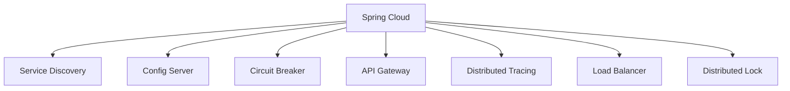

# ☁️ Spring Cloud Deep Dive: Microservices, Distributed Systems & Cloud Native

> **Hướng dẫn sâu về Spring Cloud, microservices patterns, distributed systems, và cloud-native development**

---

## 📋 Mục lục

1. [Spring Cloud Overview](#1-spring-cloud-overview)
2. [Service Discovery & Registration](#2-service-discovery--registration)
3. [Configuration Management](#3-configuration-management)
4. [Circuit Breaker & Resilience](#4-circuit-breaker--resilience)
5. [API Gateway](#5-api-gateway)
6. [Distributed Tracing](#6-distributed-tracing)
7. [Best Practices & Patterns](#7-best-practices--patterns)

---

## 1. Spring Cloud Overview

### 1.1 Lý do ra đời
- **Microservices Challenges**: Service discovery, configuration management, distributed tracing, circuit breaker
- **Distributed Systems Complexity**: Network failures, latency, data consistency
- **Cloud-Native Requirements**: Auto-scaling, self-healing, observability
- **Spring Boot Integration**: Seamless integration với Spring Boot ecosystem

### 1.2 Core Components


---

## 2. Service Discovery & Registration

### 2.1 Eureka Server
```java
// Eureka Server
@SpringBootApplication
@EnableEurekaServer
public class EurekaServerApplication {
    public static void main(String[] args) {
        SpringApplication.run(EurekaServerApplication.class, args);
    }
}

// application.yml
server:
  port: 8761

spring:
  application:
    name: eureka-server

eureka:
  instance:
    hostname: localhost
  client:
    register-with-eureka: false
    fetch-registry: false
    service-url:
      defaultZone: http://localhost:8761/eureka/
  server:
    enable-self-preservation: false
    eviction-interval-timer-in-ms: 1000
```

### 2.2 Eureka Client
```java
// Product Service
@SpringBootApplication
@EnableDiscoveryClient
public class ProductServiceApplication {
    public static void main(String[] args) {
        SpringApplication.run(ProductServiceApplication.class, args);
    }
}

// application.yml
spring:
  application:
    name: product-service

eureka:
  client:
    service-url:
      defaultZone: http://localhost:8761/eureka/
    register-with-eureka: true
    fetch-registry: true
  instance:
    prefer-ip-address: true
    instance-id: ${spring.application.name}:${random.value}
    health-check-url-path: /actuator/health
    status-page-url-path: /actuator/info

// Service Client
@Service
public class OrderService {
    
    @Autowired
    private RestTemplate restTemplate;
    
    @Autowired
    private LoadBalancerClient loadBalancer;
    
    public Product getProduct(Long productId) {
        // Using service name instead of hardcoded URL
        ServiceInstance instance = loadBalancer.choose("product-service");
        String url = String.format("http://%s:%d/api/products/%d", 
                                  instance.getHost(), instance.getPort(), productId);
        
        return restTemplate.getForObject(url, Product.class);
    }
}

// Load Balancer Configuration
@Configuration
public class LoadBalancerConfig {
    
    @Bean
    @LoadBalanced
    public RestTemplate restTemplate() {
        return new RestTemplate();
    }
}
```

### 2.3 Consul Integration
```java
// Consul Configuration
spring:
  cloud:
    consul:
      host: localhost
      port: 8500
      discovery:
        service-name: product-service
        instance-id: ${spring.application.name}:${random.value}
        health-check-path: /actuator/health
        health-check-interval: 15s
        prefer-ip-address: true

// Consul Client
@SpringBootApplication
@EnableDiscoveryClient
public class ProductServiceApplication {
    public static void main(String[] args) {
        SpringApplication.run(ProductServiceApplication.class, args);
    }
}
```

---

## 3. Configuration Management

### 3.1 Config Server
```java
// Config Server
@SpringBootApplication
@EnableConfigServer
public class ConfigServerApplication {
    public static void main(String[] args) {
        SpringApplication.run(ConfigServerApplication.class, args);
    }
}

// application.yml
server:
  port: 8888

spring:
  application:
    name: config-server
  cloud:
    config:
      server:
        git:
          uri: https://github.com/mycompany/config-repo
          default-label: main
          search-paths: '{application}'
        vault:
          host: localhost
          port: 8200
          scheme: http
          authentication: TOKEN
          token: my-token

// Config Client
@SpringBootApplication
@EnableConfigClient
public class ProductServiceApplication {
    public static void main(String[] args) {
        SpringApplication.run(ProductServiceApplication.class, args);
    }
}

// bootstrap.yml
spring:
  application:
    name: product-service
  cloud:
    config:
      uri: http://localhost:8888
      fail-fast: true
      retry:
        initial-interval: 1000
        max-interval: 2000
        max-attempts: 6

// Configuration Properties
@ConfigurationProperties(prefix = "app")
@Data
public class AppConfig {
    private String name;
    private String version;
    private DatabaseConfig database;
    private CacheConfig cache;
}

@Component
public class ProductService {
    
    @Autowired
    private AppConfig appConfig;
    
    public void someMethod() {
        log.info("Application: {} v{}", appConfig.getName(), appConfig.getVersion());
    }
}
```

### 3.2 Dynamic Configuration Refresh
```java
// Refresh Configuration
@RestController
@RefreshScope
public class ProductController {
    
    @Value("${app.feature.new-ui:false}")
    private boolean newUiEnabled;
    
    @GetMapping("/products")
    public List<Product> getProducts() {
        if (newUiEnabled) {
            return getProductsWithNewUI();
        } else {
            return getProductsWithOldUI();
        }
    }
}

// Configuration Change Event
@Component
public class ConfigurationChangeListener {
    
    @EventListener
    public void handleConfigurationChange(RefreshScopeRefreshedEvent event) {
        log.info("Configuration refreshed: {}", event.getSource());
        // Handle configuration change
    }
}
```

---

## 4. Circuit Breaker & Resilience

### 4.1 Resilience4j Integration
```java
// Circuit Breaker Configuration
resilience4j:
  circuitbreaker:
    instances:
      productService:
        sliding-window-size: 10
        minimum-number-of-calls: 5
        permitted-number-of-calls-in-half-open-state: 3
        automatic-transition-from-open-to-half-open-enabled: true
        wait-duration-in-open-state: 5s
        failure-rate-threshold: 50
        event-consumer-buffer-size: 10
  retry:
    instances:
      productService:
        max-attempts: 3
        wait-duration: 1s
        retry-exceptions:
          - java.io.IOException
          - java.util.concurrent.TimeoutException
  ratelimiter:
    instances:
      productService:
        limit-for-period: 10
        limit-refresh-period: 1s
        timeout-duration: 1s

// Circuit Breaker Service
@Service
public class ProductService {
    
    @CircuitBreaker(name = "productService", fallbackMethod = "getProductFallback")
    @Retry(name = "productService")
    @RateLimiter(name = "productService")
    public Product getProduct(Long productId) {
        // Call external service
        return externalProductClient.getProduct(productId);
    }
    
    public Product getProductFallback(Long productId, Exception e) {
        log.warn("Circuit breaker triggered for product: {}", productId, e);
        // Return cached data or default product
        return getCachedProduct(productId);
    }
    
    @Bulkhead(name = "productService", fallbackMethod = "getProductBulkheadFallback")
    public CompletableFuture<Product> getProductAsync(Long productId) {
        return CompletableFuture.supplyAsync(() -> {
            return externalProductClient.getProduct(productId);
        });
    }
    
    public CompletableFuture<Product> getProductBulkheadFallback(Long productId, Exception e) {
        log.warn("Bulkhead triggered for product: {}", productId, e);
        return CompletableFuture.completedFuture(getCachedProduct(productId));
    }
}

// Circuit Breaker Events
@Component
public class CircuitBreakerEventListener {
    
    @EventListener
    public void onCircuitBreakerEvent(CircuitBreakerOnStateTransitionEvent event) {
        log.info("Circuit breaker state changed: {} -> {}", 
                event.getStateTransition().getFromState(), 
                event.getStateTransition().getToState());
    }
    
    @EventListener
    public void onRetryEvent(RetryOnRetryEvent event) {
        log.warn("Retry attempt {} for method: {}", 
                event.getNumberOfRetryAttempts(), 
                event.getEventName());
    }
}
```

### 4.2 Hystrix (Legacy)
```java
// Hystrix Configuration
hystrix:
  command:
    default:
      execution:
        isolation:
          thread:
            timeout-in-milliseconds: 2000
        circuitBreaker:
          request-volume-threshold: 20
          error-threshold-percentage: 50
          sleep-window-in-milliseconds: 5000

// Hystrix Service
@Service
public class ProductService {
    
    @HystrixCommand(fallbackMethod = "getProductFallback",
                    commandKey = "getProduct",
                    groupKey = "productService",
                    threadPoolKey = "productServiceThreadPool")
    public Product getProduct(Long productId) {
        return externalProductClient.getProduct(productId);
    }
    
    public Product getProductFallback(Long productId) {
        log.warn("Hystrix fallback triggered for product: {}", productId);
        return getCachedProduct(productId);
    }
}
```

---

## 5. API Gateway

### 5.1 Spring Cloud Gateway
```java
// Gateway Application
@SpringBootApplication
@EnableDiscoveryClient
public class GatewayApplication {
    public static void main(String[] args) {
        SpringApplication.run(GatewayApplication.class, args);
    }
}

// application.yml
spring:
  application:
    name: api-gateway
  cloud:
    gateway:
      discovery:
        locator:
          enabled: true
          lower-case-service-id: true
      routes:
        - id: product-service
          uri: lb://product-service
          predicates:
            - Path=/api/products/**
          filters:
            - StripPrefix=1
            - name: CircuitBreaker
              args:
                name: productService
                fallbackUri: forward:/fallback/product-service
            - name: RateLimiter
              args:
                redis-rate-limiter.replenish-rate: 10
                redis-rate-limiter.burst-capacity: 20
            - name: RequestRateLimiter
              args:
                redis-rate-limiter.replenish-rate: 10
                redis-rate-limiter.burst-capacity: 20
        - id: order-service
          uri: lb://order-service
          predicates:
            - Path=/api/orders/**
          filters:
            - StripPrefix=1
            - name: CircuitBreaker
              args:
                name: orderService
                fallbackUri: forward:/fallback/order-service
        - id: user-service
          uri: lb://user-service
          predicates:
            - Path=/api/users/**
          filters:
            - StripPrefix=1
            - name: CircuitBreaker
              args:
                name: userService
                fallbackUri: forward:/fallback/user-service

// Gateway Controller
@RestController
public class FallbackController {
    
    @GetMapping("/fallback/product-service")
    public ResponseEntity<Map<String, Object>> productServiceFallback() {
        Map<String, Object> response = new HashMap<>();
        response.put("message", "Product service is temporarily unavailable");
        response.put("timestamp", LocalDateTime.now());
        return ResponseEntity.status(HttpStatus.SERVICE_UNAVAILABLE).body(response);
    }
    
    @GetMapping("/fallback/order-service")
    public ResponseEntity<Map<String, Object>> orderServiceFallback() {
        Map<String, Object> response = new HashMap<>();
        response.put("message", "Order service is temporarily unavailable");
        response.put("timestamp", LocalDateTime.now());
        return ResponseEntity.status(HttpStatus.SERVICE_UNAVAILABLE).body(response);
    }
}

// Custom Filter
@Component
public class AuthenticationFilter implements GlobalFilter, Ordered {
    
    @Override
    public Mono<Void> filter(ServerWebExchange exchange, GatewayFilterChain chain) {
        ServerHttpRequest request = exchange.getRequest();
        
        // Check for authentication header
        String authHeader = request.getHeaders().getFirst("Authorization");
        
        if (authHeader == null || !authHeader.startsWith("Bearer ")) {
            ServerHttpResponse response = exchange.getResponse();
            response.setStatusCode(HttpStatus.UNAUTHORIZED);
            return response.setComplete();
        }
        
        // Validate JWT token
        String token = authHeader.substring(7);
        if (!isValidToken(token)) {
            ServerHttpResponse response = exchange.getResponse();
            response.setStatusCode(HttpStatus.UNAUTHORIZED);
            return response.setComplete();
        }
        
        return chain.filter(exchange);
    }
    
    @Override
    public int getOrder() {
        return -100;
    }
    
    private boolean isValidToken(String token) {
        // Implement JWT validation logic
        return true;
    }
}
```

### 5.2 Zuul (Legacy)
```java
// Zuul Configuration
@SpringBootApplication
@EnableZuulProxy
@EnableDiscoveryClient
public class ZuulGatewayApplication {
    public static void main(String[] args) {
        SpringApplication.run(ZuulGatewayApplication.class, args);
    }
}

// application.yml
zuul:
  routes:
    product-service:
      path: /api/products/**
      service-id: product-service
      strip-prefix: true
    order-service:
      path: /api/orders/**
      service-id: order-service
      strip-prefix: true
  ignored-patterns: /actuator/**
  add-proxy-headers: true
  sensitive-headers: Cookie,Set-Cookie

// Custom Filter
@Component
public class AuthenticationFilter extends ZuulFilter {
    
    @Override
    public String filterType() {
        return "pre";
    }
    
    @Override
    public int filterOrder() {
        return 1;
    }
    
    @Override
    public boolean shouldFilter() {
        return true;
    }
    
    @Override
    public Object run() throws ZuulException {
        RequestContext ctx = RequestContext.getCurrentContext();
        HttpServletRequest request = ctx.getRequest();
        
        String authHeader = request.getHeader("Authorization");
        
        if (authHeader == null || !authHeader.startsWith("Bearer ")) {
            ctx.setResponseStatusCode(401);
            ctx.setResponseBody("Unauthorized");
            ctx.setSendZuulResponse(false);
            return null;
        }
        
        return null;
    }
}
```

---

## 6. Distributed Tracing

### 6.1 Sleuth & Zipkin
```java
// Sleuth Configuration
spring:
  sleuth:
    sampler:
      probability: 1.0
    propagation:
      type: B3
    messaging:
      rabbit:
        enabled: true
    web:
      client:
        enabled: true
    r2dbc:
      enabled: true

// Zipkin Configuration
management:
  zipkin:
    tracing:
      endpoint: http://localhost:9411/api/v2/spans
  tracing:
    sampling:
      probability: 1.0

// Custom Span
@Service
public class ProductService {
    
    @Autowired
    private Tracer tracer;
    
    public Product getProduct(Long productId) {
        Span span = tracer.nextSpan().name("get-product");
        
        try (SpanInScope ws = tracer.withSpanInScope(span.start())) {
            span.tag("product.id", productId.toString());
            
            // Business logic
            Product product = productRepository.findById(productId)
                    .orElseThrow(() -> new ProductNotFoundException(productId));
            
            span.tag("product.found", "true");
            return product;
            
        } catch (Exception e) {
            span.tag("error", e.getMessage());
            span.error(e);
            throw e;
        } finally {
            span.finish();
        }
    }
}

// Custom Trace Filter
@Component
public class CustomTraceFilter implements Filter {
    
    @Autowired
    private Tracer tracer;
    
    @Override
    public void doFilter(ServletRequest request, ServletResponse response, FilterChain chain)
            throws IOException, ServletException {
        
        HttpServletRequest httpRequest = (HttpServletRequest) request;
        
        Span span = tracer.nextSpan().name(httpRequest.getMethod() + " " + httpRequest.getRequestURI());
        
        try (SpanInScope ws = tracer.withSpanInScope(span.start())) {
            span.tag("http.method", httpRequest.getMethod());
            span.tag("http.url", httpRequest.getRequestURI());
            
            chain.doFilter(request, response);
            
            HttpServletResponse httpResponse = (HttpServletResponse) response;
            span.tag("http.status_code", String.valueOf(httpResponse.getStatus()));
            
        } catch (Exception e) {
            span.tag("error", e.getMessage());
            span.error(e);
            throw e;
        } finally {
            span.finish();
        }
    }
}
```

### 6.2 OpenTelemetry Integration
```java
// OpenTelemetry Configuration
@Configuration
public class OpenTelemetryConfig {
    
    @Bean
    public OpenTelemetry openTelemetry() {
        return OpenTelemetrySdk.builder()
                .setTracerProvider(SdkTracerProvider.builder()
                        .addSpanProcessor(BatchSpanProcessor.builder(
                                OtlpGrpcSpanExporter.builder()
                                        .setEndpoint("http://localhost:4317")
                                        .build())
                                .build())
                        .build())
                .setMeterProvider(SdkMeterProvider.builder()
                        .addMetricReader(PeriodicMetricReader.builder(
                                OtlpGrpcMetricExporter.builder()
                                        .setEndpoint("http://localhost:4317")
                                        .build())
                                .build())
                        .build())
                .build();
    }
}

// Custom Metrics
@Service
public class ProductService {
    
    private final Tracer tracer;
    private final Meter meter;
    private final Counter productRequestCounter;
    private final Timer productRequestTimer;
    
    public ProductService(OpenTelemetry openTelemetry) {
        this.tracer = openTelemetry.getTracer("product-service");
        this.meter = openTelemetry.getMeter("product-service");
        this.productRequestCounter = meter.counterBuilder("product.requests")
                .setDescription("Number of product requests")
                .build();
        this.productRequestTimer = meter.timerBuilder("product.request.duration")
                .setDescription("Product request duration")
                .build();
    }
    
    public Product getProduct(Long productId) {
        productRequestCounter.add(1);
        
        Timer.Sample sample = Timer.start();
        
        try {
            Span span = tracer.spanBuilder("get-product")
                    .setAttribute("product.id", productId)
                    .startSpan();
            
            try (var scope = span.makeCurrent()) {
                Product product = productRepository.findById(productId)
                        .orElseThrow(() -> new ProductNotFoundException(productId));
                
                span.setAttribute("product.found", true);
                return product;
                
            } finally {
                span.end();
            }
            
        } finally {
            sample.stop(productRequestTimer);
        }
    }
}
```

---

## 7. Best Practices & Patterns

### 7.1 Microservices Patterns
```java
// Saga Pattern for Distributed Transactions
@Service
public class OrderSagaService {
    
    @Autowired
    private OrderService orderService;
    
    @Autowired
    private PaymentService paymentService;
    
    @Autowired
    private InventoryService inventoryService;
    
    @Transactional
    public Order createOrder(OrderRequest request) {
        // Step 1: Create Order
        Order order = orderService.createOrder(request);
        
        try {
            // Step 2: Reserve Inventory
            inventoryService.reserveInventory(order.getProductId(), order.getQuantity());
            
            try {
                // Step 3: Process Payment
                PaymentResult payment = paymentService.processPayment(order);
                
                if (payment.isSuccess()) {
                    // Step 4: Confirm Order
                    orderService.confirmOrder(order.getId());
                    return order;
                } else {
                    // Compensate: Release Inventory
                    inventoryService.releaseInventory(order.getProductId(), order.getQuantity());
                    orderService.cancelOrder(order.getId());
                    throw new PaymentFailedException("Payment processing failed");
                }
                
            } catch (Exception e) {
                // Compensate: Release Inventory
                inventoryService.releaseInventory(order.getProductId(), order.getQuantity());
                orderService.cancelOrder(order.getId());
                throw e;
            }
            
        } catch (Exception e) {
            // Compensate: Cancel Order
            orderService.cancelOrder(order.getId());
            throw e;
        }
    }
}

// Event Sourcing Pattern
@Entity
public class OrderEvent {
    @Id
    private String eventId;
    private String orderId;
    private String eventType;
    private String eventData;
    private LocalDateTime timestamp;
    private Long version;
}

@Service
public class OrderEventStore {
    
    public void saveEvent(String orderId, String eventType, String eventData) {
        OrderEvent event = new OrderEvent();
        event.setEventId(UUID.randomUUID().toString());
        event.setOrderId(orderId);
        event.setEventType(eventType);
        event.setEventData(eventData);
        event.setTimestamp(LocalDateTime.now());
        event.setVersion(getNextVersion(orderId));
        
        eventRepository.save(event);
    }
    
    public List<OrderEvent> getEvents(String orderId) {
        return eventRepository.findByOrderIdOrderByVersion(orderId);
    }
    
    public Order reconstructOrder(String orderId) {
        List<OrderEvent> events = getEvents(orderId);
        Order order = new Order();
        
        for (OrderEvent event : events) {
            applyEvent(order, event);
        }
        
        return order;
    }
}
```

### 7.2 Security Patterns
```java
// JWT Authentication
@Configuration
@EnableWebSecurity
public class SecurityConfig {
    
    @Bean
    public SecurityFilterChain filterChain(HttpSecurity http) throws Exception {
        return http
                .authorizeHttpRequests(authz -> authz
                        .requestMatchers("/api/public/**").permitAll()
                        .requestMatchers("/api/products/**").hasRole("USER")
                        .requestMatchers("/api/admin/**").hasRole("ADMIN")
                        .anyRequest().authenticated()
                )
                .oauth2ResourceServer(oauth2 -> oauth2.jwt(Customizer.withDefaults()))
                .csrf(csrf -> csrf.disable())
                .sessionManagement(session -> session.sessionCreationPolicy(SessionCreationPolicy.STATELESS))
                .build();
    }
    
    @Bean
    public JwtDecoder jwtDecoder() {
        return NimbusJwtDecoder.withJwkSetUri("http://localhost:8080/.well-known/jwks.json").build();
    }
}

// Rate Limiting
@Component
public class RateLimitFilter implements GlobalFilter, Ordered {
    
    private final RedisTemplate<String, String> redisTemplate;
    
    public RateLimitFilter(RedisTemplate<String, String> redisTemplate) {
        this.redisTemplate = redisTemplate;
    }
    
    @Override
    public Mono<Void> filter(ServerWebExchange exchange, GatewayFilterChain chain) {
        String clientId = getClientId(exchange.getRequest());
        String key = "rate_limit:" + clientId;
        
        String current = redisTemplate.opsForValue().get(key);
        int currentCount = current == null ? 0 : Integer.parseInt(current);
        
        if (currentCount >= 100) { // 100 requests per minute
            ServerHttpResponse response = exchange.getResponse();
            response.setStatusCode(HttpStatus.TOO_MANY_REQUESTS);
            return response.setComplete();
        }
        
        redisTemplate.opsForValue().increment(key);
        redisTemplate.expire(key, Duration.ofMinutes(1));
        
        return chain.filter(exchange);
    }
    
    @Override
    public int getOrder() {
        return -100;
    }
    
    private String getClientId(ServerHttpRequest request) {
        // Extract client ID from request (IP, user ID, etc.)
        return request.getRemoteAddress().getAddress().getHostAddress();
    }
}
```

### 7.3 Monitoring & Observability
```java
// Custom Health Indicator
@Component
public class DatabaseHealthIndicator implements HealthIndicator {
    
    @Autowired
    private DataSource dataSource;
    
    @Override
    public Health health() {
        try (Connection connection = dataSource.getConnection()) {
            if (connection.isValid(1000)) {
                return Health.up()
                        .withDetail("database", "Available")
                        .withDetail("connection", "Valid")
                        .build();
            } else {
                return Health.down()
                        .withDetail("database", "Unavailable")
                        .withDetail("connection", "Invalid")
                        .build();
            }
        } catch (Exception e) {
            return Health.down()
                    .withDetail("database", "Error")
                    .withDetail("error", e.getMessage())
                    .build();
        }
    }
}

// Custom Metrics
@Component
public class CustomMetrics {
    
    private final MeterRegistry meterRegistry;
    private final Counter requestCounter;
    private final Timer requestTimer;
    private final Gauge activeConnections;
    
    public CustomMetrics(MeterRegistry meterRegistry) {
        this.meterRegistry = meterRegistry;
        this.requestCounter = Counter.builder("app.requests")
                .description("Number of requests")
                .register(meterRegistry);
        this.requestTimer = Timer.builder("app.request.duration")
                .description("Request duration")
                .register(meterRegistry);
        this.activeConnections = Gauge.builder("app.active.connections")
                .description("Active connections")
                .register(meterRegistry, this, CustomMetrics::getActiveConnections);
    }
    
    public void incrementRequestCount() {
        requestCounter.increment();
    }
    
    public Timer.Sample startTimer() {
        return Timer.start(meterRegistry);
    }
    
    private double getActiveConnections() {
        // Implement logic to get active connections
        return 0.0;
    }
}
```

---

## 🎯 Kết luận

### Key Benefits:
1. **Service Discovery**: Tự động register và discover services
2. **Configuration Management**: Centralized configuration với dynamic refresh
3. **Circuit Breaker**: Resilience và fault tolerance
4. **API Gateway**: Single entry point, routing, filtering
5. **Distributed Tracing**: End-to-end request tracking
6. **Load Balancing**: Automatic load balancing
7. **Security**: Centralized authentication và authorization

### Best Practices:
1. **Start Small**: Implement từng component một
2. **Monitor Everything**: Use Actuator, metrics, tracing
3. **Handle Failures**: Implement circuit breakers, fallbacks
4. **Security First**: Implement proper authentication, authorization
5. **Test Thoroughly**: Unit tests, integration tests, chaos testing
6. **Document Everything**: API documentation, architecture decisions
7. **Automate Everything**: CI/CD, infrastructure as code

### Tài liệu tham khảo:
- [Spring Cloud Documentation](https://spring.io/projects/spring-cloud)
- [Spring Cloud Netflix](https://spring.io/projects/spring-cloud-netflix)
- [Spring Cloud Gateway](https://spring.io/projects/spring-cloud-gateway)
- [Resilience4j](https://resilience4j.readme.io/)
- [Spring Cloud Sleuth](https://spring.io/projects/spring-cloud-sleuth)

---

**Spring Cloud giúp xây dựng microservices architecture mạnh mẽ, resilient, và scalable! 🚀** 