# Apache Kafka: Evolution, Architecture & Implementation Guide

## 📖 Table of Contents
- [Evolution & History](#evolution--history)
- [Why Kafka?](#why-kafka)
- [Architecture Overview](#architecture-overview)
- [Performance Comparison](#performance-comparison)
- [Implementation Guide](#implementation-guide)
- [Monitoring & Metrics](#monitoring--metrics)
- [Best Practices](#best-practices)
- [Real-world Use Cases](#real-world-use-cases)

## 🚀 Evolution & History

### Before Kafka: The Traditional Messaging Era

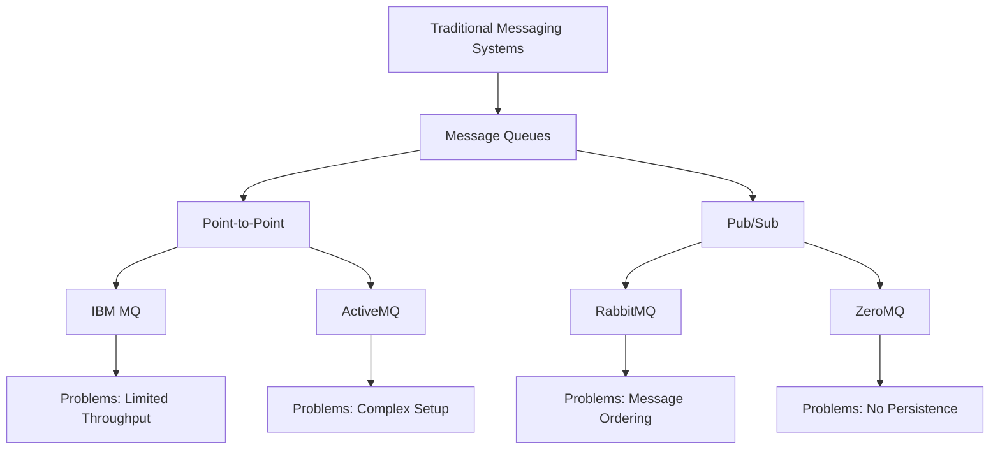

**Traditional messaging systems faced these challenges:**

1. **Limited Throughput**: Most systems could handle only thousands of messages per second
2. **Complex Setup**: Required extensive configuration and clustering
3. **Message Ordering**: Difficult to maintain order across multiple consumers
4. **No Persistence**: Messages lost if consumers were down
5. **Scalability Issues**: Horizontal scaling was complex and expensive

### The Birth of Kafka (2011)

Kafka was developed at LinkedIn to solve these specific problems:

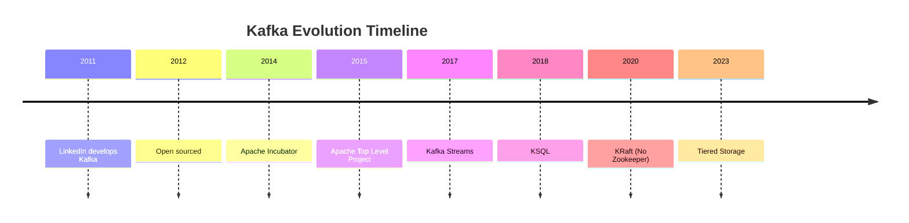

**LinkedIn's Requirements:**
- Handle 1+ million messages per second
- Store data for days/weeks
- Support multiple consumers
- Real-time stream processing
- Fault tolerance

## 🎯 Why Kafka?

### Problems Solved by Kafka

| Problem | Traditional Solution | Kafka Solution |
|---------|---------------------|----------------|
| **High Throughput** | Multiple queues, complex routing | Single topic, multiple partitions |
| **Data Persistence** | Database storage, slow retrieval | Distributed commit log |
| **Multiple Consumers** | Message copying, storage overhead | Consumer groups, offset management |
| **Real-time Processing** | Batch processing, delays | Stream processing, sub-second latency |
| **Scalability** | Vertical scaling, expensive | Horizontal scaling, commodity hardware |

### Performance Comparison

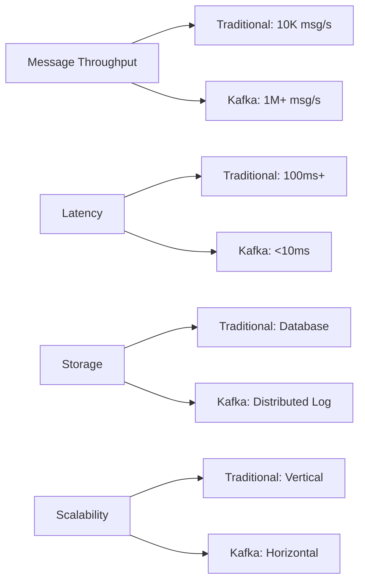

**Performance Metrics:**
- **Throughput**: 1M+ messages/second per cluster
- **Latency**: Sub-10ms end-to-end
- **Durability**: 99.999999% (6 nines)
- **Scalability**: Linear scaling with brokers

## 🏗️ Architecture Overview

### Core Components

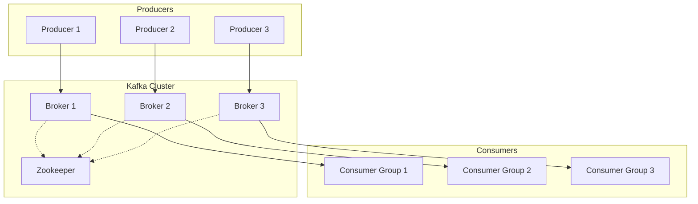

### Topic & Partition Structure

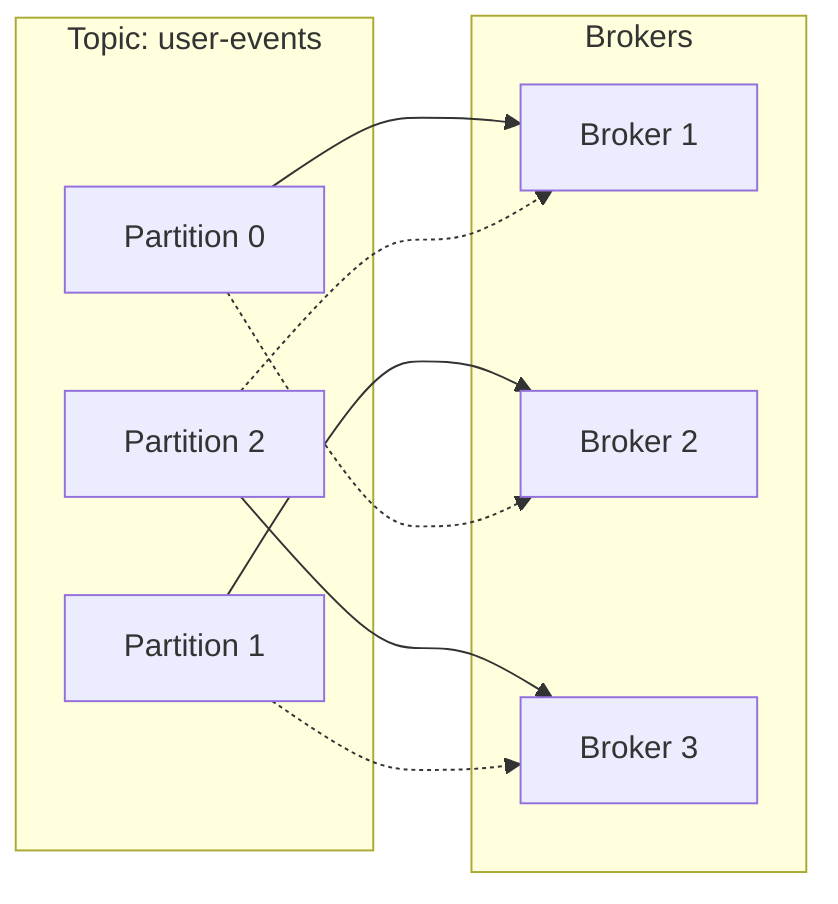

### Consumer Group Architecture

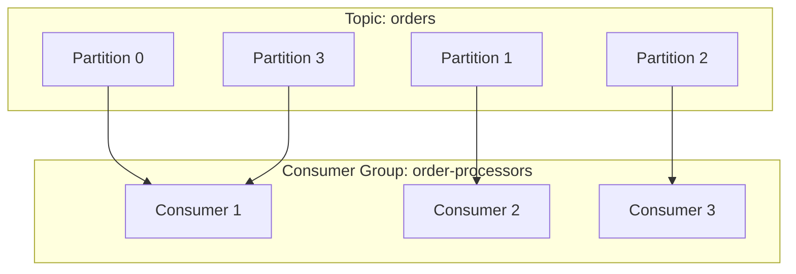

## ⚡ Performance Comparison

### Throughput Benchmarks

| System | Messages/sec | Latency | Storage | Scalability |
|--------|-------------|---------|---------|-------------|
| **RabbitMQ** | 50K | 100ms | Memory/Disk | Complex |
| **ActiveMQ** | 30K | 150ms | Database | Limited |
| **Redis Pub/Sub** | 100K | 1ms | Memory only | Vertical |
| **Apache Kafka** | 1M+ | <10ms | Distributed Log | Linear |

### Resource Usage Comparison

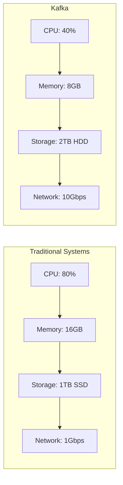

## 🛠️ Implementation Guide

### 1. Docker Setup

```yaml
# docker-compose.yml
version: '3.8'
services:
  zookeeper:
    image: confluentinc/cp-zookeeper:7.4.0
    environment:
      ZOOKEEPER_CLIENT_PORT: 2181
      ZOOKEEPER_TICK_TIME: 2000
    ports:
      - "2181:2181"

  kafka:
    image: confluentinc/cp-kafka:7.4.0
    depends_on:
      - zookeeper
    environment:
      KAFKA_BROKER_ID: 1
      KAFKA_ZOOKEEPER_CONNECT: zookeeper:2181
      KAFKA_ADVERTISED_LISTENERS: PLAINTEXT://localhost:9092
      KAFKA_OFFSETS_TOPIC_REPLICATION_FACTOR: 1
    ports:
      - "9092:9092"

  kafka-ui:
    image: provectuslabs/kafka-ui:latest
    depends_on:
      - kafka
    environment:
      KAFKA_CLUSTERS_0_NAME: local
      KAFKA_CLUSTERS_0_BOOTSTRAPSERVERS: kafka:9092
    ports:
      - "8081:8080"
```

### 2. Spring Boot Configuration

```java
@Configuration
public class KafkaConfig {
    
    @Bean
    public ProducerFactory<String, Object> producerFactory() {
        Map<String, Object> config = new HashMap<>();
        config.put(ProducerConfig.BOOTSTRAP_SERVERS_CONFIG, "localhost:9092");
        config.put(ProducerConfig.KEY_SERIALIZER_CLASS_CONFIG, StringSerializer.class);
        config.put(ProducerConfig.VALUE_SERIALIZER_CLASS_CONFIG, JsonSerializer.class);
        config.put(ProducerConfig.ACKS_CONFIG, "all");
        config.put(ProducerConfig.RETRIES_CONFIG, 3);
        return new DefaultKafkaProducerFactory<>(config);
    }
    
    @Bean
    public KafkaTemplate<String, Object> kafkaTemplate() {
        return new KafkaTemplate<>(producerFactory());
    }
}
```

### 3. Producer Implementation

```java
@Service
@Slf4j
public class KafkaProducerService {
    
    private final KafkaTemplate<String, Object> kafkaTemplate;
    
    public CompletableFuture<SendResult<String, Object>> sendMessage(
            String topic, String key, Object message) {
        
        log.info("Sending message to topic: {}, key: {}", topic, key);
        
        return kafkaTemplate.send(topic, key, message)
                .completable()
                .whenComplete((result, throwable) -> {
                    if (throwable != null) {
                        log.error("Failed to send message", throwable);
                    } else {
                        log.info("Message sent successfully to partition: {}, offset: {}", 
                                result.getRecordMetadata().partition(),
                                result.getRecordMetadata().offset());
                    }
                });
    }
}
```

### 4. Consumer Implementation

```java
@Service
@Slf4j
public class KafkaConsumerService {
    
    @KafkaListener(
        topics = "user-events",
        groupId = "user-service",
        containerFactory = "kafkaListenerContainerFactory"
    )
    public void consumeUserEvent(ConsumerRecord<String, Object> record) {
        log.info("Received message: topic={}, partition={}, offset={}, key={}",
                record.topic(), record.partition(), record.offset(), record.key());
        
        try {
            // Process the message
            processUserEvent(record.value());
            
            // Manual acknowledgment
            // ack.acknowledge();
            
        } catch (Exception e) {
            log.error("Error processing message", e);
            // Handle error (retry, dead letter queue, etc.)
        }
    }
    
    private void processUserEvent(Object event) {
        // Business logic here
        log.info("Processing user event: {}", event);
    }
}
```

### 5. Stream Processing

```java
@Configuration
public class KafkaStreamsConfig {
    
    @Bean
    public StreamsBuilderFactoryBean streamsBuilderFactoryBean() {
        Map<String, Object> config = new HashMap<>();
        config.put(StreamsConfig.BOOTSTRAP_SERVERS_CONFIG, "localhost:9092");
        config.put(StreamsConfig.APPLICATION_ID_CONFIG, "streams-app");
        config.put(StreamsConfig.DEFAULT_KEY_SERDE_CLASS_CONFIG, Serdes.String().getClass());
        config.put(StreamsConfig.DEFAULT_VALUE_SERDE_CLASS_CONFIG, Serdes.String().getClass());
        
        return new StreamsBuilderFactoryBean(config);
    }
}

@Component
public class UserEventProcessor {
    
    @Bean
    public KStream<String, String> processUserEvents(StreamsBuilder streamsBuilder) {
        return streamsBuilder
                .stream("user-events")
                .filter((key, value) -> value != null)
                .mapValues(value -> value.toString().toUpperCase())
                .to("processed-user-events");
    }
}
```

## 📊 Monitoring & Metrics

### Key Metrics to Monitor

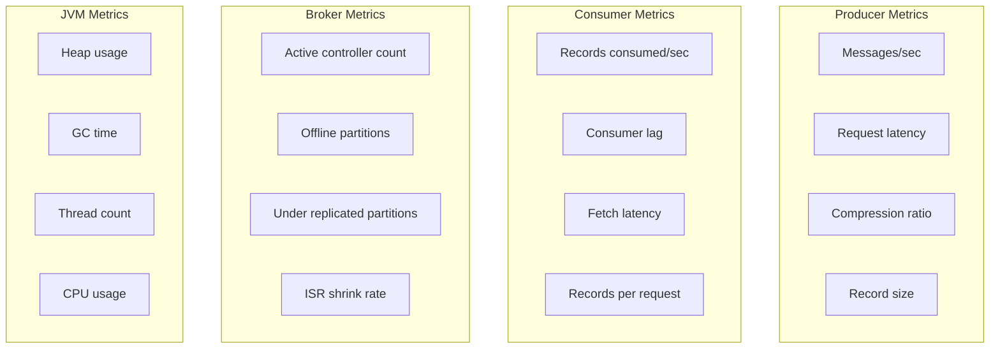

### Prometheus Configuration

```yaml
# prometheus.yml
scrape_configs:
  - job_name: 'kafka'
    static_configs:
      - targets: ['kafka:9101']
    metrics_path: '/metrics'
    
  - job_name: 'kafka-exporter'
    static_configs:
      - targets: ['kafka-exporter:9308']
```

### Grafana Dashboard Queries

```sql
-- Messages per second
rate(kafka_server_brokertopicmetrics_messagesin_total{topic="user-events"}[5m])

-- Consumer lag
kafka_consumer_group_max_lag{group="user-service"}

-- Request latency
histogram_quantile(0.95, rate(kafka_server_brokertopicmetrics_producerequestmetrics_requestlatencyavg_bucket[5m]))

-- Disk usage
kafka_log_logendoffset{topic="user-events"} - kafka_log_logstartoffset{topic="user-events"}
```

## 🎯 Best Practices

### 1. Topic Design

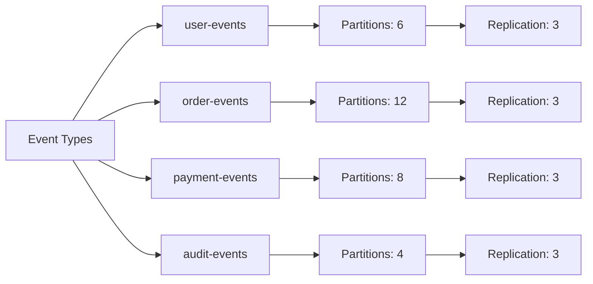

### 2. Partition Strategy

```java
@Component
public class CustomPartitioner implements Partitioner {
    
    @Override
    public int partition(String topic, Object key, byte[] keyBytes,
                        Object value, byte[] valueBytes, Cluster cluster) {
        
        List<PartitionInfo> partitions = cluster.partitionsForTopic(topic);
        int numPartitions = partitions.size();
        
        if (keyBytes == null) {
            return new Random().nextInt(numPartitions);
        }
        
        // Hash-based partitioning for consistent key distribution
        return Math.abs(Objects.hash(key)) % numPartitions;
    }
}
```

### 3. Consumer Group Design

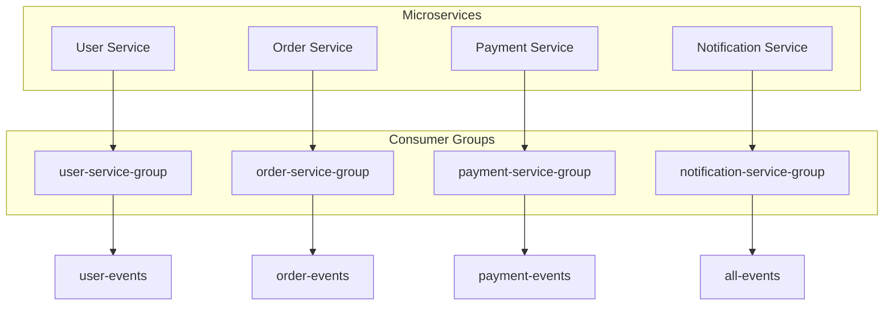

### 4. Error Handling

```java
@Component
public class KafkaErrorHandler implements ConsumerAwareErrorHandler {
    
    @Override
    public void handle(Exception thrownException, List<ConsumerRecord<?, ?>> records,
                       Consumer<?, ?> consumer, MessageListenerContainer container) {
        
        log.error("Error in consumer: {}", thrownException.getMessage());
        
        // Send to dead letter queue
        sendToDeadLetterQueue(records);
        
        // Retry logic
        if (shouldRetry(thrownException)) {
            // Implement retry mechanism
        } else {
            // Stop consumer to prevent infinite loop
            container.stop();
        }
    }
}
```

## 🌍 Real-world Use Cases

### 1. Event-Driven Architecture

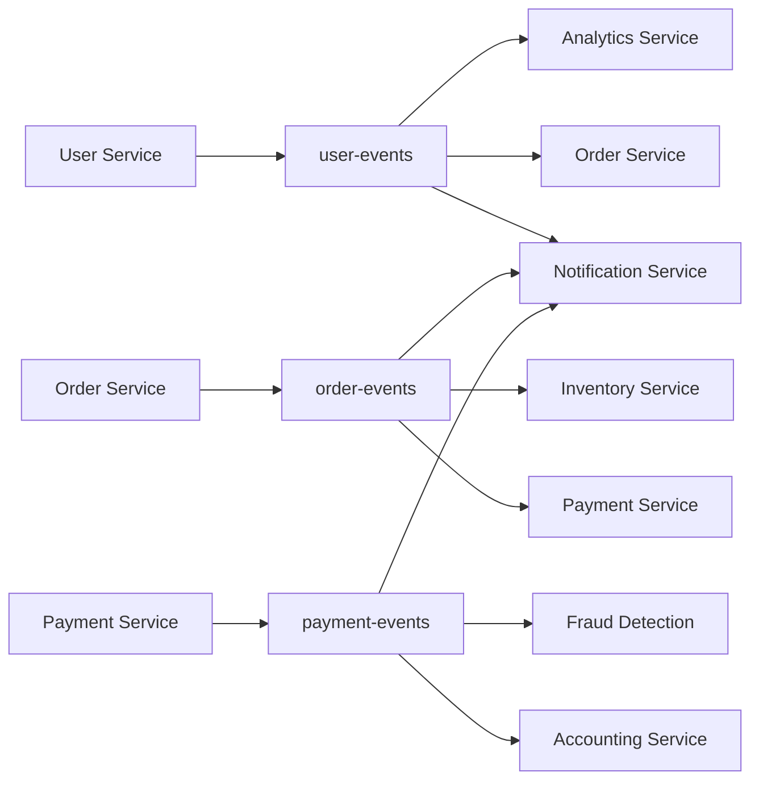

### 2. Data Pipeline

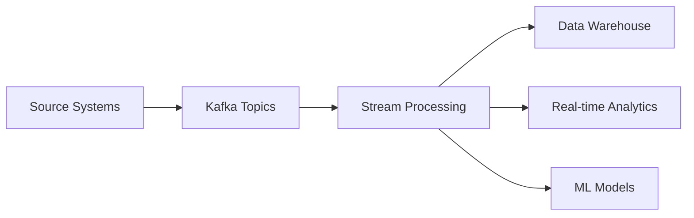

### 3. Log Aggregation

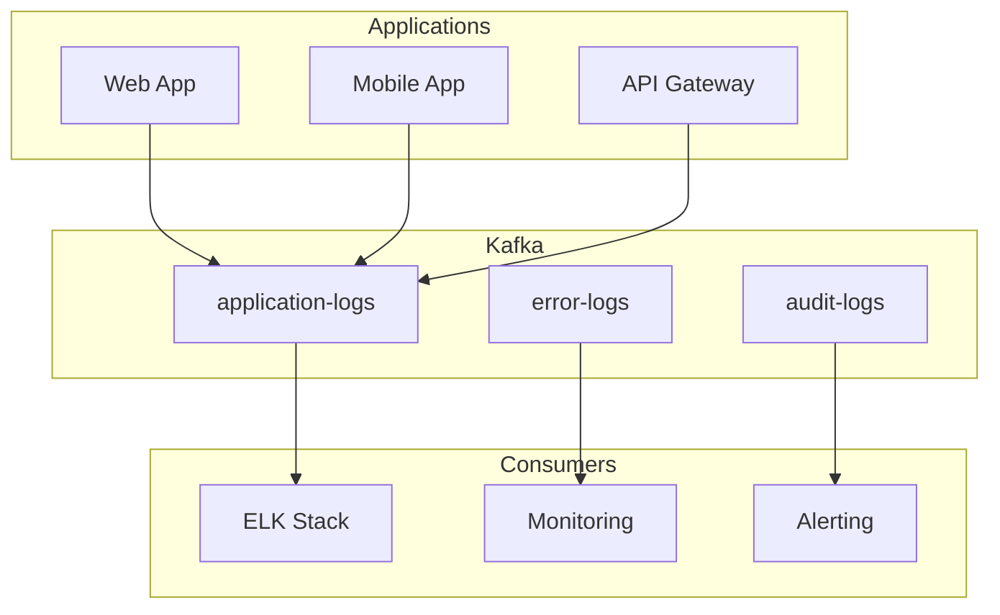

## 📈 Performance Tuning

### Producer Tuning

```properties
# High throughput
batch.size=16384
linger.ms=5
compression.type=lz4
buffer.memory=33554432

# High durability
acks=all
retries=3
enable.idempotence=true
```

### Consumer Tuning

```properties
# High throughput
fetch.min.bytes=1
fetch.max.wait.ms=500
max.partition.fetch.bytes=1048576

# Parallel processing
max.poll.records=500
max.poll.interval.ms=300000
```

### Broker Tuning

```properties
# Memory
log.segment.bytes=1073741824
log.retention.bytes=107374182400

# Network
num.network.threads=3
num.io.threads=8
socket.send.buffer.bytes=102400
socket.receive.buffer.bytes=102400
```

## 🔍 Troubleshooting

### Common Issues & Solutions

| Issue | Symptoms | Solution |
|-------|----------|----------|
| **High Consumer Lag** | Slow processing, delayed data | Increase partitions, optimize consumer |
| **Producer Timeout** | Failed sends, retries | Increase timeout, reduce batch size |
| **Memory Pressure** | OOM errors, slow performance | Tune heap, optimize GC |
| **Network Issues** | Connection failures | Check network, increase buffers |
| **Disk Space** | Broker failures | Increase retention, add storage |

### Health Check Script

```bash
#!/bin/bash

# Check broker health
echo "Checking Kafka brokers..."
kafka-broker-api-versions --bootstrap-server localhost:9092

# Check topic status
echo "Checking topics..."
kafka-topics --bootstrap-server localhost:9092 --list

# Check consumer groups
echo "Checking consumer groups..."
kafka-consumer-groups --bootstrap-server localhost:9092 --list

# Check lag
echo "Checking consumer lag..."
kafka-consumer-groups --bootstrap-server localhost:9092 --describe --group user-service
```

## 🎓 Conclusion

Apache Kafka has revolutionized how we handle real-time data streaming. Its evolution from traditional messaging systems addresses critical limitations in throughput, scalability, and reliability. With proper implementation and monitoring, Kafka can handle millions of messages per second while maintaining sub-10ms latency.

**Key Takeaways:**
- Kafka solves the limitations of traditional messaging systems
- Proper partitioning and consumer group design are crucial
- Monitoring and metrics are essential for production deployments
- Performance tuning requires understanding of your specific use case
- Error handling and fault tolerance should be built into your design

**Next Steps:**
1. Start with a simple producer-consumer setup
2. Add monitoring and alerting
3. Implement error handling and dead letter queues
4. Scale based on your performance requirements
5. Consider stream processing for real-time analytics

---

*This blog is part of a series on modern backend technologies. Stay tuned for the next installment on RabbitMQ!* 