# RabbitMQ: Message Broker Evolution & Implementation Guide

## 📖 Table of Contents
- [Evolution & History](#evolution--history)
- [Why RabbitMQ?](#why-rabbitmq)
- [Architecture Overview](#architecture-overview)
- [Performance Comparison](#performance-comparison)
- [Implementation Guide](#implementation-guide)
- [Monitoring & Metrics](#monitoring--metrics)
- [Best Practices](#best-practices)
- [Real-world Use Cases](#real-world-use-cases)

## 🚀 Evolution & History

### Before RabbitMQ: The Early Messaging Era

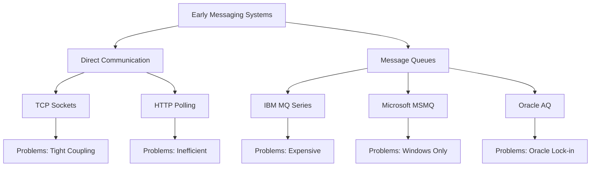

**Early messaging challenges:**

1. **Tight Coupling**: Direct point-to-point communication
2. **Platform Lock-in**: Vendor-specific solutions
3. **Complex Routing**: Difficult to implement complex message flows
4. **No Standards**: Each vendor had proprietary protocols
5. **Scalability Issues**: Limited horizontal scaling capabilities

### The Birth of AMQP & RabbitMQ

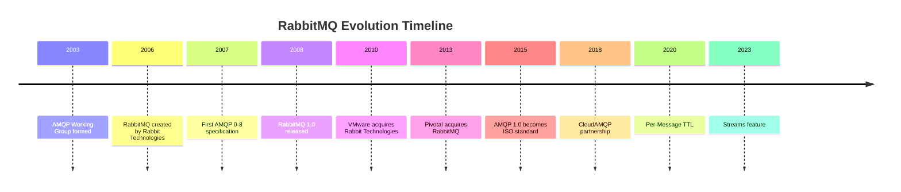

**AMQP (Advanced Message Queuing Protocol) Goals:**
- Open standard for messaging
- Platform and language agnostic
- Rich routing capabilities
- Enterprise-grade reliability
- Interoperability between systems

## 🎯 Why RabbitMQ?

### Problems Solved by RabbitMQ

| Problem | Traditional Solution | RabbitMQ Solution |
|---------|---------------------|-------------------|
| **Message Routing** | Complex custom logic | Exchange types (Direct, Topic, Fanout) |
| **Reliability** | Database persistence | Message acknowledgments, persistence |
| **Scalability** | Load balancers | Clustering, federation |
| **Protocol Support** | Vendor lock-in | AMQP, MQTT, STOMP, HTTP |
| **Message Patterns** | Custom implementation | Built-in patterns (RPC, Pub/Sub, Work Queues) |

### Performance Comparison

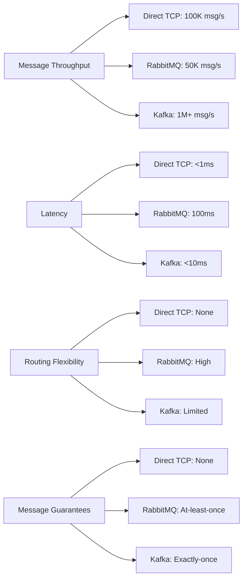

**RabbitMQ Strengths:**
- **Flexible Routing**: Multiple exchange types
- **Protocol Support**: AMQP, MQTT, STOMP, HTTP
- **Message Guarantees**: At-least-once delivery
- **Management UI**: Rich web interface
- **Plugin Ecosystem**: Extensible architecture

## 🏗️ Architecture Overview

### Core Components

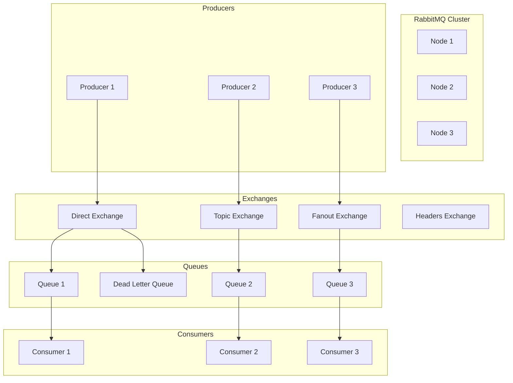

### Exchange Types

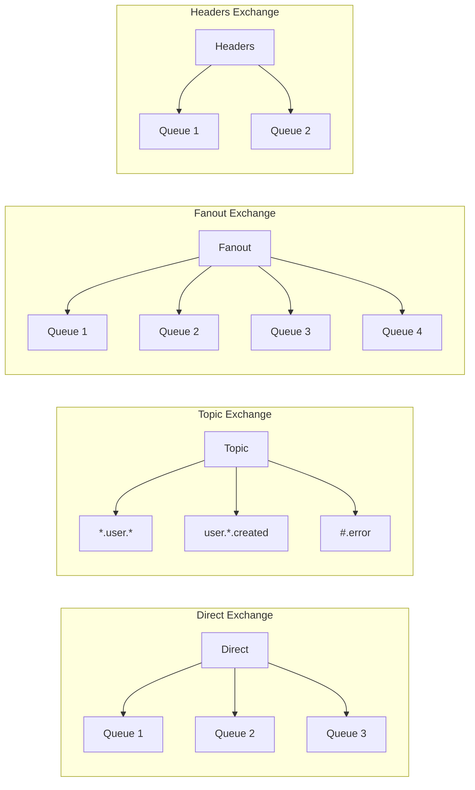

### Message Flow Architecture

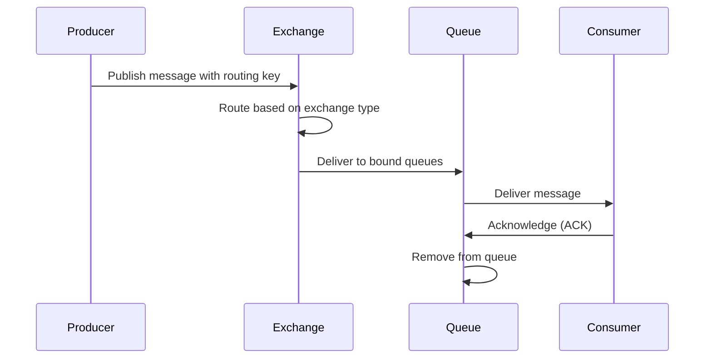

## ⚡ Performance Comparison

### Throughput Benchmarks

| System | Messages/sec | Latency | Memory Usage | CPU Usage |
|--------|-------------|---------|--------------|-----------|
| **Direct TCP** | 100K+ | <1ms | Low | Low |
| **RabbitMQ** | 50K | 100ms | Medium | Medium |
| **Apache Kafka** | 1M+ | <10ms | High | High |
| **Redis Pub/Sub** | 100K | 1ms | High | Low |
| **ActiveMQ** | 30K | 150ms | High | High |

### Resource Usage Comparison

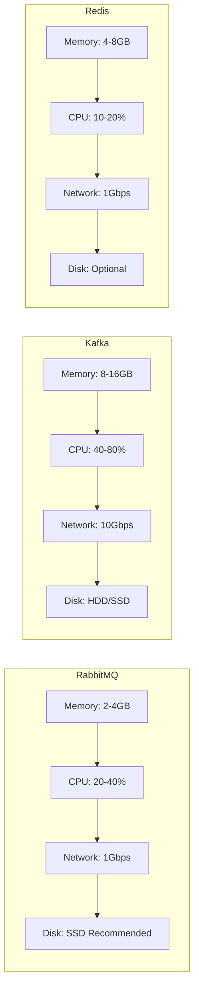

## 🛠️ Implementation Guide

### 1. Docker Setup

```yaml
# docker-compose.yml
version: '3.8'
services:
  rabbitmq:
    image: rabbitmq:3.12-management-alpine
    hostname: rabbitmq
    ports:
      - "5672:5672"      # AMQP
      - "15672:15672"    # Management UI
      - "15692:15692"    # Prometheus metrics
    environment:
      RABBITMQ_DEFAULT_USER: admin
      RABBITMQ_DEFAULT_PASS: admin123
      RABBITMQ_DEFAULT_VHOST: /
    volumes:
      - rabbitmq_data:/var/lib/rabbitmq
      - ./rabbitmq.conf:/etc/rabbitmq/rabbitmq.conf

volumes:
  rabbitmq_data:
```

### 2. Spring Boot Configuration

```java
@Configuration
public class RabbitMQConfig {
    
    @Bean
    public ConnectionFactory connectionFactory() {
        CachingConnectionFactory factory = new CachingConnectionFactory();
        factory.setHost("localhost");
        factory.setPort(5672);
        factory.setUsername("admin");
        factory.setPassword("admin123");
        factory.setVirtualHost("/");
        
        // Connection pooling
        factory.setChannelCacheSize(25);
        factory.setConnectionCacheSize(5);
        
        return factory;
    }
    
    @Bean
    public RabbitTemplate rabbitTemplate(ConnectionFactory connectionFactory) {
        RabbitTemplate template = new RabbitTemplate(connectionFactory);
        template.setMessageConverter(jsonMessageConverter());
        return template;
    }
    
    @Bean
    public MessageConverter jsonMessageConverter() {
        return new Jackson2JsonMessageConverter();
    }
}
```

### 3. Exchange & Queue Configuration

```java
@Configuration
public class RabbitMQExchangeConfig {
    
    // Direct Exchange
    @Bean
    public DirectExchange directExchange() {
        return new DirectExchange("direct.exchange");
    }
    
    // Topic Exchange
    @Bean
    public TopicExchange topicExchange() {
        return new TopicExchange("topic.exchange");
    }
    
    // Fanout Exchange
    @Bean
    public FanoutExchange fanoutExchange() {
        return new FanoutExchange("fanout.exchange");
    }
    
    // Queues
    @Bean
    public Queue userQueue() {
        return QueueBuilder.durable("user.queue")
                .withArgument("x-message-ttl", 60000) // 1 minute TTL
                .withArgument("x-dead-letter-exchange", "dlx.exchange")
                .build();
    }
    
    @Bean
    public Queue orderQueue() {
        return QueueBuilder.durable("order.queue")
                .withArgument("x-max-priority", 10) // Priority queue
                .build();
    }
    
    // Bindings
    @Bean
    public Binding userBinding(Queue userQueue, DirectExchange directExchange) {
        return BindingBuilder.bind(userQueue)
                .to(directExchange)
                .with("user.routing.key");
    }
    
    @Bean
    public Binding orderBinding(Queue orderQueue, TopicExchange topicExchange) {
        return BindingBuilder.bind(orderQueue)
                .to(topicExchange)
                .with("order.*.created");
    }
}
```

### 4. Producer Implementation

```java
@Service
@Slf4j
public class RabbitMQProducerService {
    
    private final RabbitTemplate rabbitTemplate;
    private final ObjectMapper objectMapper;
    
    public void sendDirectMessage(String routingKey, Object message) {
        log.info("Sending direct message to routing key: {}", routingKey);
        
        rabbitTemplate.convertAndSend("direct.exchange", routingKey, message);
    }
    
    public void sendTopicMessage(String routingKey, Object message) {
        log.info("Sending topic message to routing key: {}", routingKey);
        
        rabbitTemplate.convertAndSend("topic.exchange", routingKey, message);
    }
    
    public void sendFanoutMessage(Object message) {
        log.info("Sending fanout message");
        
        rabbitTemplate.convertAndSend("fanout.exchange", "", message);
    }
    
    public void sendWithPriority(Object message, int priority) {
        log.info("Sending message with priority: {}", priority);
        
        MessageProperties props = new MessageProperties();
        props.setPriority(priority);
        
        Message msg = new Message(
            objectMapper.writeValueAsBytes(message), 
            props
        );
        
        rabbitTemplate.send("direct.exchange", "priority.routing.key", msg);
    }
}
```

### 5. Consumer Implementation

```java
@Service
@Slf4j
public class RabbitMQConsumerService {
    
    @RabbitListener(queues = "user.queue")
    public void consumeUserMessage(Message message, Channel channel) {
        try {
            log.info("Received user message: {}", new String(message.getBody()));
            
            // Process the message
            processUserMessage(message);
            
            // Manual acknowledgment
            channel.basicAck(message.getMessageProperties().getDeliveryTag(), false);
            
        } catch (Exception e) {
            log.error("Error processing user message", e);
            
            try {
                // Negative acknowledgment - reject and requeue
                channel.basicNack(
                    message.getMessageProperties().getDeliveryTag(), 
                    false, 
                    true
                );
            } catch (IOException ex) {
                log.error("Error sending NACK", ex);
            }
        }
    }
    
    @RabbitListener(queues = "order.queue")
    public void consumeOrderMessage(OrderEvent orderEvent) {
        log.info("Processing order event: {}", orderEvent);
        
        // Business logic here
        processOrder(orderEvent);
    }
    
    private void processUserMessage(Message message) {
        // Business logic for user message processing
        log.info("Processing user message: {}", message);
    }
    
    private void processOrder(OrderEvent orderEvent) {
        // Business logic for order processing
        log.info("Processing order: {}", orderEvent.getOrderId());
    }
}
```

### 6. RPC Pattern Implementation

```java
@Service
public class RabbitMQRPCService {
    
    private final RabbitTemplate rabbitTemplate;
    
    @RabbitListener(queues = "rpc.queue")
    public String handleRPCRequest(String request) {
        log.info("Handling RPC request: {}", request);
        
        // Process the request
        String response = processRequest(request);
        
        return response;
    }
    
    public String sendRPCRequest(String request) {
        log.info("Sending RPC request: {}", request);
        
        return (String) rabbitTemplate.convertSendAndReceive("rpc.queue", request);
    }
    
    private String processRequest(String request) {
        // Business logic for request processing
        return "Response to: " + request;
    }
}
```

## 📊 Monitoring & Metrics

### Key Metrics to Monitor

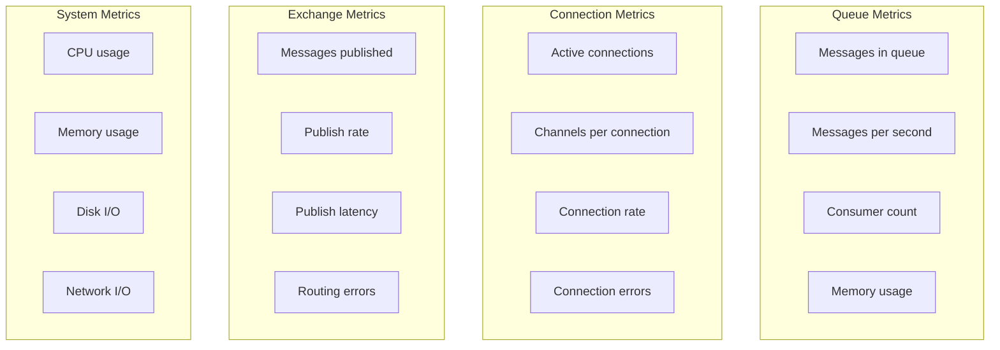

### Prometheus Configuration

```yaml
# prometheus.yml
scrape_configs:
  - job_name: 'rabbitmq'
    static_configs:
      - targets: ['rabbitmq:15692']
    metrics_path: '/metrics'
    scrape_interval: 15s
```

### Grafana Dashboard Queries

```sql
-- Messages in queue
rabbitmq_queue_messages{queue="user.queue"}

-- Message rate
rate(rabbitmq_queue_messages_published_total{queue="user.queue"}[5m])

-- Consumer count
rabbitmq_queue_consumers{queue="user.queue"}

-- Connection count
rabbitmq_connections

-- Channel count
rabbitmq_channels

-- Memory usage
rabbitmq_process_resident_memory_bytes
```

### Health Check Script

```bash
#!/bin/bash

# Check RabbitMQ status
echo "Checking RabbitMQ status..."
curl -u admin:admin123 http://localhost:15672/api/overview

# Check queues
echo "Checking queues..."
curl -u admin:admin123 http://localhost:15672/api/queues

# Check connections
echo "Checking connections..."
curl -u admin:admin123 http://localhost:15672/api/connections

# Check exchanges
echo "Checking exchanges..."
curl -u admin:admin123 http://localhost:15672/api/exchanges
```

## 🎯 Best Practices

### 1. Queue Design Patterns

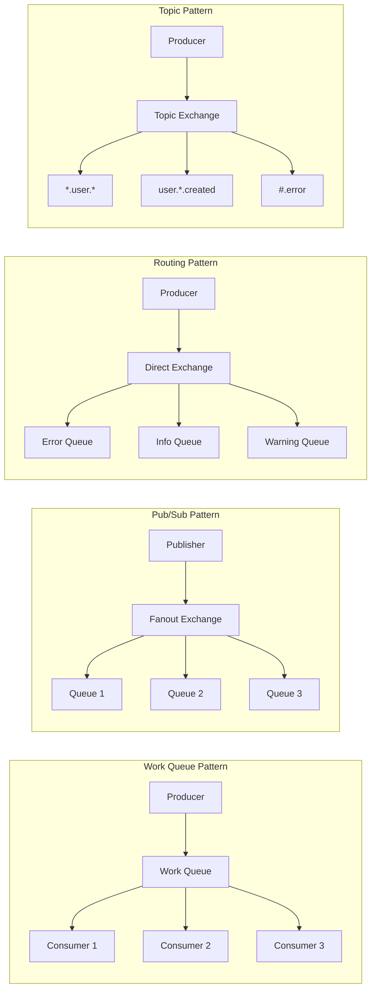

### 2. Dead Letter Queue Configuration

```java
@Configuration
public class DeadLetterConfig {
    
    @Bean
    public DirectExchange deadLetterExchange() {
        return new DirectExchange("dlx.exchange");
    }
    
    @Bean
    public Queue deadLetterQueue() {
        return QueueBuilder.durable("dlq.queue").build();
    }
    
    @Bean
    public Binding deadLetterBinding() {
        return BindingBuilder.bind(deadLetterQueue())
                .to(deadLetterExchange())
                .with("dead.letter");
    }
    
    @Bean
    public Queue mainQueue() {
        return QueueBuilder.durable("main.queue")
                .withArgument("x-dead-letter-exchange", "dlx.exchange")
                .withArgument("x-dead-letter-routing-key", "dead.letter")
                .withArgument("x-message-ttl", 30000) // 30 seconds
                .build();
    }
}
```

### 3. Connection Pooling

```java
@Configuration
public class ConnectionPoolConfig {
    
    @Bean
    public ConnectionFactory connectionFactory() {
        CachingConnectionFactory factory = new CachingConnectionFactory();
        factory.setHost("localhost");
        factory.setPort(5672);
        factory.setUsername("admin");
        factory.setPassword("admin123");
        
        // Connection pool settings
        factory.setConnectionCacheSize(10);
        factory.setChannelCacheSize(25);
        factory.setChannelCheckoutTimeout(30000);
        
        // Connection settings
        factory.setConnectionTimeout(30000);
        factory.setRequestedHeartBeat(60);
        
        return factory;
    }
}
```

### 4. Error Handling

```java
@Component
public class RabbitMQErrorHandler implements RabbitListenerErrorHandler {
    
    @Override
    public Object handleError(Message amqpMessage, 
                            org.springframework.messaging.Message<?> message,
                            ListenerExecutionFailedException exception) {
        
        log.error("Error processing message: {}", exception.getMessage());
        
        // Send to dead letter queue
        sendToDeadLetterQueue(amqpMessage);
        
        // Return null to prevent requeuing
        return null;
    }
    
    private void sendToDeadLetterQueue(Message message) {
        // Implementation for sending to DLQ
        log.info("Sending message to dead letter queue");
    }
}
```

## 🌍 Real-world Use Cases

### 1. Microservices Communication

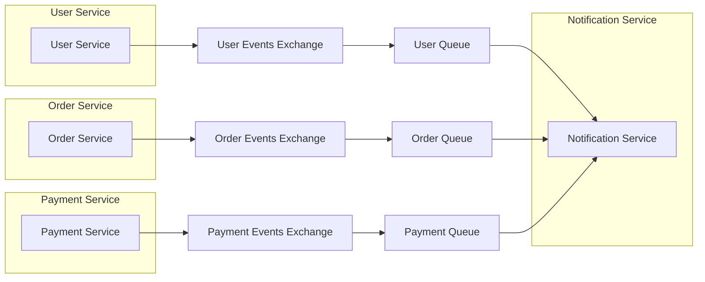

### 2. Task Distribution

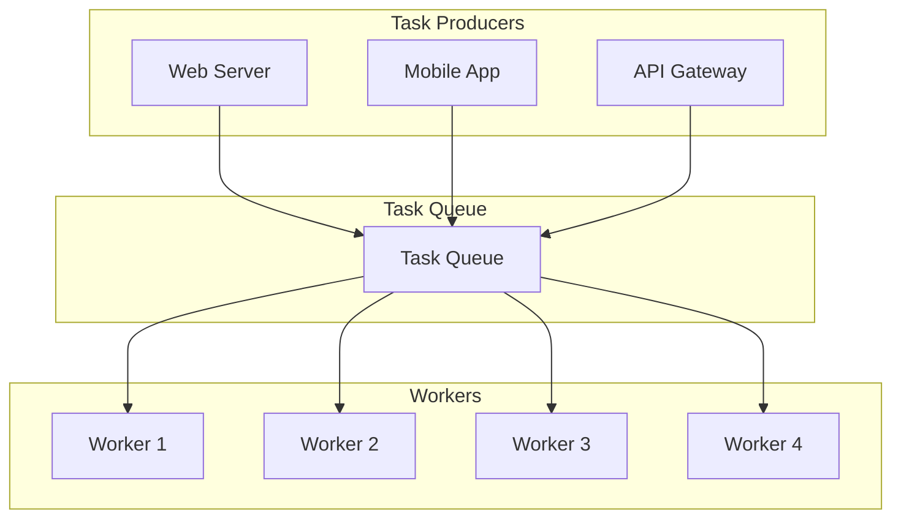

### 3. Event Sourcing

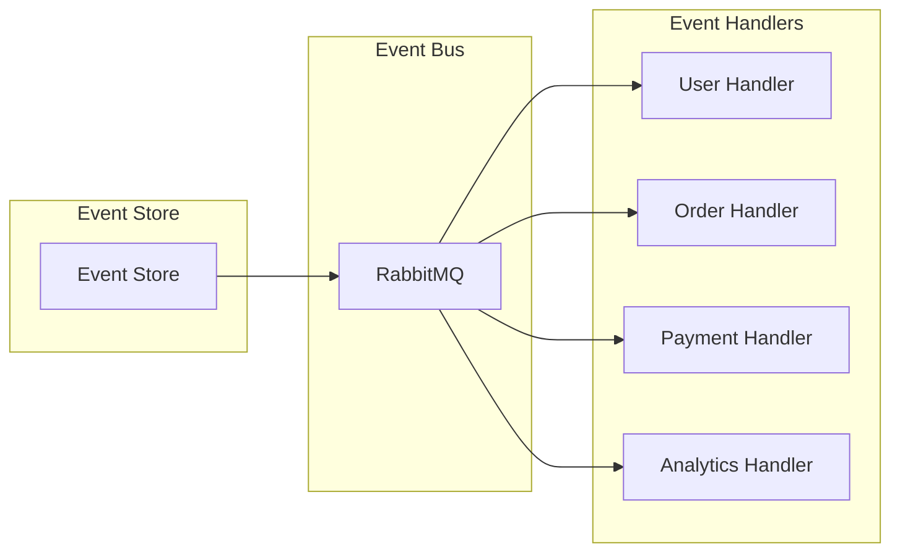

## 📈 Performance Tuning

### Producer Tuning

```properties
# High throughput
spring.rabbitmq.template.retry.enabled=true
spring.rabbitmq.template.retry.initial-interval=1000
spring.rabbitmq.template.retry.max-attempts=3
spring.rabbitmq.template.retry.multiplier=1.0

# Publisher confirms
spring.rabbitmq.publisher-confirm-type=correlated
spring.rabbitmq.publisher-returns=true
```

### Consumer Tuning

```properties
# Concurrency
spring.rabbitmq.listener.simple.concurrency=3
spring.rabbitmq.listener.simple.max-concurrency=10
spring.rabbitmq.listener.simple.prefetch=1

# Acknowledgment
spring.rabbitmq.listener.simple.acknowledge-mode=manual
spring.rabbitmq.listener.simple.retry.enabled=true
spring.rabbitmq.listener.simple.retry.initial-interval=1000
spring.rabbitmq.listener.simple.retry.max-attempts=3
```

### Broker Tuning

```properties
# Memory
vm_memory_high_watermark.relative=0.6
vm_memory_high_watermark_paging_ratio=0.5

# Disk
disk_free_limit.relative=2.0
disk_free_limit.absolute=2GB

# Network
tcp_listen_options.backlog=128
tcp_listen_options.nodelay=true
```

## 🔍 Troubleshooting

### Common Issues & Solutions

| Issue | Symptoms | Solution |
|-------|----------|----------|
| **High Memory Usage** | Slow performance, OOM errors | Increase memory, optimize queues |
| **Connection Failures** | Connection refused, timeouts | Check network, increase connection pool |
| **Message Loss** | Messages not delivered | Enable publisher confirms, use persistent messages |
| **Consumer Lag** | Slow processing, queue buildup | Increase consumers, optimize processing |
| **Network Issues** | Connection drops, latency | Check network, increase heartbeat |

### Diagnostic Commands

```bash
# Check queue status
rabbitmqctl list_queues name messages consumers

# Check connections
rabbitmqctl list_connections

# Check channels
rabbitmqctl list_channels

# Check exchanges
rabbitmqctl list_exchanges

# Check bindings
rabbitmqctl list_bindings

# Check memory usage
rabbitmqctl status
```

## 🎓 Conclusion

RabbitMQ provides a robust, flexible messaging solution that excels in complex routing scenarios and enterprise environments. Its support for multiple protocols, rich exchange types, and comprehensive management tools make it an excellent choice for microservices communication and event-driven architectures.

**Key Takeaways:**
- RabbitMQ excels in flexible message routing and complex patterns
- Proper exchange and queue design is crucial for performance
- Monitoring and error handling are essential for production use
- Connection pooling and acknowledgment strategies impact reliability
- Dead letter queues and retry mechanisms improve system resilience

**Next Steps:**
1. Start with simple direct exchanges and queues
2. Implement proper error handling and dead letter queues
3. Add monitoring and alerting
4. Scale based on your performance requirements
5. Consider clustering for high availability

---

*This blog is part of a series on modern backend technologies. Stay tuned for the next installment on MongoDB!* 