# Apache Cassandra: Distributed Database Evolution & Implementation Guide

## 📖 Table of Contents
- [Evolution & History](#evolution--history)
- [Why Cassandra?](#why-cassandra)
- [Architecture Overview](#architecture-overview)
- [Performance Comparison](#performance-comparison)
- [Implementation Guide](#implementation-guide)
- [Monitoring & Metrics](#monitoring--metrics)
- [Best Practices](#best-practices)
- [Real-world Use Cases](#real-world-use-cases)

## 🚀 Evolution & History

### Before Cassandra: The Traditional Database Era

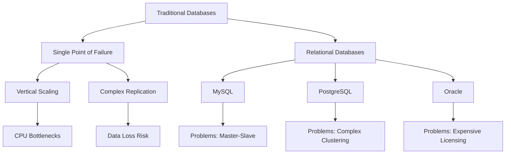

**Traditional database challenges:**

1. **Single Point of Failure**: Master-slave architecture
2. **Vertical Scaling Limits**: CPU and memory constraints
3. **Complex Replication**: Manual setup and maintenance
4. **Network Partitioning**: CAP theorem limitations
5. **Write Scalability**: Bottlenecks in write operations

### The Birth of Cassandra (2008)

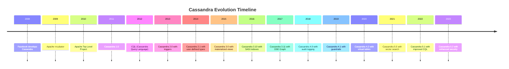

**Facebook's Requirements:**
- Handle 1+ million writes per second
- Multi-datacenter support
- Linear scalability
- No single point of failure
- High availability

## 🎯 Why Cassandra?

### Problems Solved by Cassandra

| Problem | Traditional Solution | Cassandra Solution |
|---------|---------------------|-------------------|
| **High Availability** | Master-slave replication | Multi-datacenter replication |
| **Horizontal Scaling** | Vertical scaling, sharding | Linear scaling with nodes |
| **Write Performance** | Write bottlenecks | Write-optimized design |
| **Fault Tolerance** | Complex failover | Automatic failover |
| **Geographic Distribution** | Manual replication | Built-in multi-DC support |

### Performance Comparison

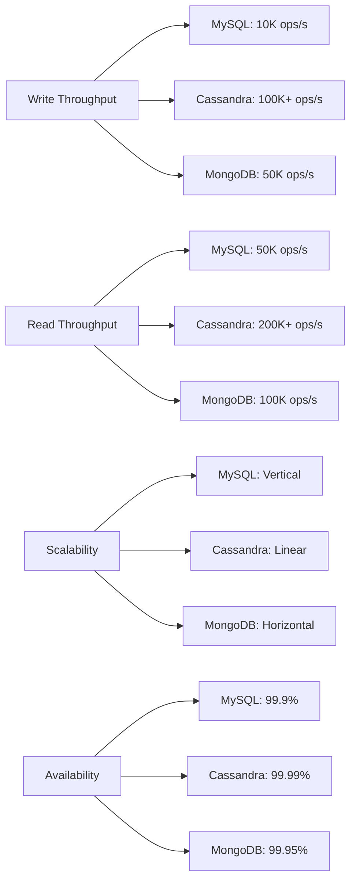

**Cassandra Strengths:**
- **Linear Scalability**: Add nodes to increase capacity
- **High Availability**: No single point of failure
- **Multi-Datacenter**: Built-in geographic distribution
- **Write Optimization**: Log-structured merge trees
- **Tunable Consistency**: Choose consistency level per operation

## 🏗️ Architecture Overview

### Core Components

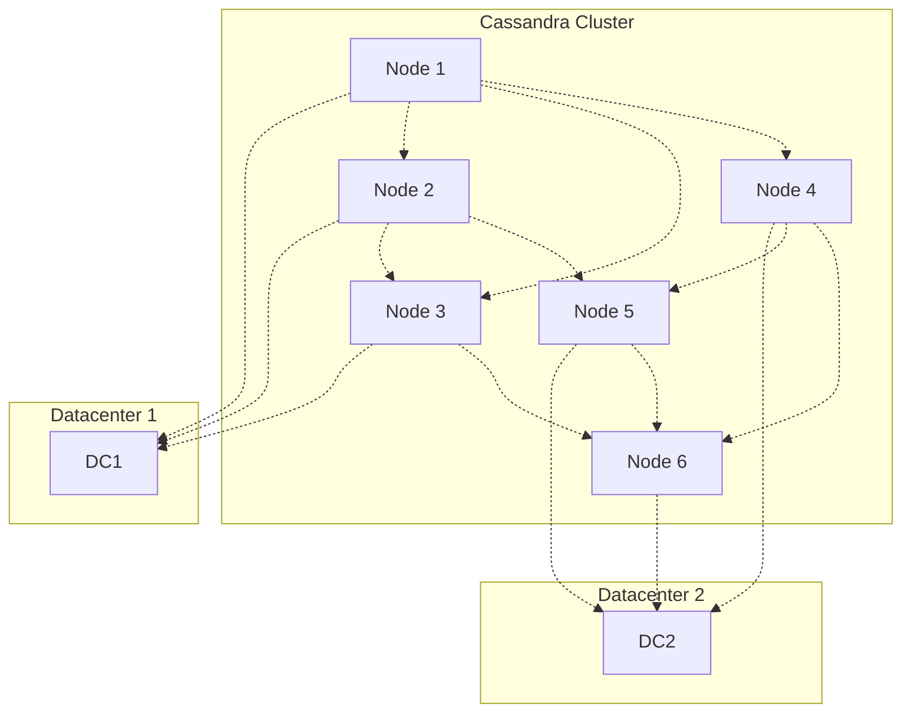

### Ring Architecture

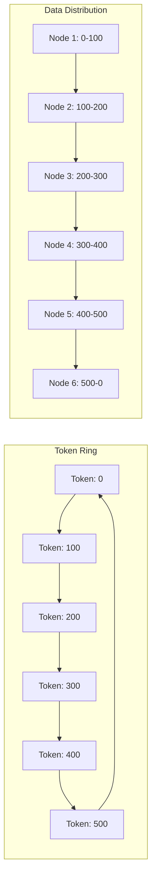

### Replication Strategy

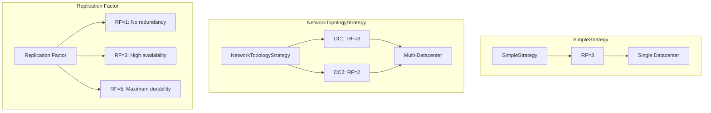

## ⚡ Performance Comparison

### Throughput Benchmarks

| Database | Write Ops/sec | Read Ops/sec | Storage | Memory |
|----------|---------------|--------------|---------|--------|
| **MySQL** | 10K | 50K | 100GB | 8GB |
| **PostgreSQL** | 8K | 40K | 100GB | 8GB |
| **MongoDB** | 50K | 100K | 100GB | 16GB |
| **Apache Cassandra** | 100K+ | 200K+ | 200GB | 16GB |
| **ScyllaDB** | 200K+ | 300K+ | 200GB | 32GB |

### Resource Usage Comparison

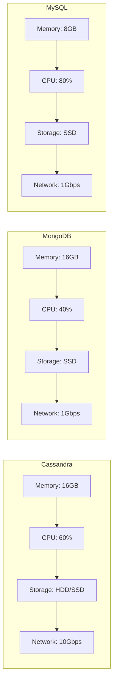

## 🛠️ Implementation Guide

### 1. Docker Setup

```yaml
# docker-compose.yml
version: '3.8'
services:
  cassandra:
    image: cassandra:5.0
    container_name: cassandra
    ports:
      - "9042:9042"      # CQL
      - "7000:7000"      # Inter-node
      - "7001:7001"      # SSL inter-node
      - "9160:9160"      # Thrift
    environment:
      CASSANDRA_CLUSTER_NAME: ProductCluster
      CASSANDRA_DC: datacenter1
      CASSANDRA_RACK: rack1
      CASSANDRA_ENDPOINT_SNITCH: SimpleSnitch
    volumes:
      - cassandra_data:/var/lib/cassandra
      - ./src/main/resources/db/cassandra/init.cql:/docker-entrypoint-initdb.d/init.cql:ro
    command: cassandra -f

volumes:
  cassandra_data:
```

### 2. Spring Boot Configuration

```java
@Configuration
@EnableCassandraRepositories(basePackages = "com.example.springboot.repository.cassandra")
public class CassandraConfig extends AbstractCassandraConfiguration {
    
    @Value("${spring.data.cassandra.contact-points}")
    private String contactPoints;
    
    @Value("${spring.data.cassandra.keyspace-name}")
    private String keyspaceName;
    
    @Value("${spring.data.cassandra.local-datacenter}")
    private String localDatacenter;
    
    @Value("${spring.data.cassandra.port}")
    private int port;
    
    @Override
    protected String getKeyspaceName() {
        return keyspaceName;
    }
    
    @Override
    protected String getLocalDataCenter() {
        return localDatacenter;
    }
    
    @Override
    protected int getPort() {
        return port;
    }
    
    @Override
    public SchemaAction getSchemaAction() {
        return SchemaAction.CREATE_IF_NOT_EXISTS;
    }
    
    @Override
    @Bean
    public CassandraCqlClusterFactoryBean cluster() {
        CassandraCqlClusterFactoryBean cluster = new CassandraCqlClusterFactoryBean();
        cluster.setContactPoints(contactPoints);
        cluster.setPort(port);
        cluster.setLocalDatacenter(localDatacenter);
        cluster.setKeyspaceCreations(getKeyspaceCreations());
        cluster.setKeyspaceDrops(getKeyspaceDrops());
        return cluster;
    }
    
    @Bean
    public CqlSession cqlSession() {
        return cluster().getObject().connect();
    }
    
    @Bean
    public CassandraConverter cassandraConverter() {
        CassandraMappingContext mappingContext = new CassandraMappingContext();
        mappingContext.setUserTypeResolver(new SimpleUserTypeResolver(cqlSession(), getKeyspaceName()));
        return new MappingCassandraConverter(mappingContext);
    }
    
    @Override
    protected String getContactPoints() {
        return contactPoints;
    }
}
```

### 3. Table Design

```java
@Table("users")
@Data
@NoArgsConstructor
@AllArgsConstructor
public class User {
    
    @PrimaryKey
    private UserKey key;
    
    @Column("email")
    private String email;
    
    @Column("first_name")
    private String firstName;
    
    @Column("last_name")
    private String lastName;
    
    @Column("role")
    private String role;
    
    @Column("created_at")
    private LocalDateTime createdAt;
    
    @Column("updated_at")
    private LocalDateTime updatedAt;
}

@PrimaryKeyClass
@Data
@NoArgsConstructor
@AllArgsConstructor
public class UserKey implements Serializable {
    
    @PrimaryKeyColumn(name = "user_id", type = PrimaryKeyType.PARTITIONED)
    private String userId;
    
    @PrimaryKeyColumn(name = "created_at", type = PrimaryKeyType.CLUSTERED, ordering = Ordering.DESCENDING)
    private LocalDateTime createdAt;
}

@Table("products")
@Data
@NoArgsConstructor
@AllArgsConstructor
public class Product {
    
    @PrimaryKey
    private ProductKey key;
    
    @Column("name")
    private String name;
    
    @Column("description")
    private String description;
    
    @Column("price")
    private BigDecimal price;
    
    @Column("category")
    private String category;
    
    @Column("stock")
    private Integer stock;
    
    @Column("tags")
    private Set<String> tags;
    
    @Column("attributes")
    private Map<String, String> attributes;
}

@PrimaryKeyClass
@Data
@NoArgsConstructor
@AllArgsConstructor
public class ProductKey implements Serializable {
    
    @PrimaryKeyColumn(name = "category", type = PrimaryKeyType.PARTITIONED)
    private String category;
    
    @PrimaryKeyColumn(name = "product_id", type = PrimaryKeyType.CLUSTERED)
    private String productId;
}

@Table("orders")
@Data
@NoArgsConstructor
@AllArgsConstructor
public class Order {
    
    @PrimaryKey
    private OrderKey key;
    
    @Column("user_id")
    private String userId;
    
    @Column("status")
    private String status;
    
    @Column("total_amount")
    private BigDecimal totalAmount;
    
    @Column("items")
    private List<OrderItem> items;
    
    @Column("shipping_address")
    private Address shippingAddress;
    
    @Column("payment_info")
    private PaymentInfo paymentInfo;
}

@PrimaryKeyClass
@Data
@NoArgsConstructor
@AllArgsConstructor
public class OrderKey implements Serializable {
    
    @PrimaryKeyColumn(name = "user_id", type = PrimaryKeyType.PARTITIONED)
    private String userId;
    
    @PrimaryKeyColumn(name = "order_date", type = PrimaryKeyType.CLUSTERED, ordering = Ordering.DESCENDING)
    private LocalDate orderDate;
    
    @PrimaryKeyColumn(name = "order_id", type = PrimaryKeyType.CLUSTERED)
    private String orderId;
}
```

### 4. Repository Implementation

```java
@Repository
public interface UserRepository extends CassandraRepository<User, UserKey> {
    
    // Find by partition key
    List<User> findByKeyUserId(String userId);
    
    // Find by partition key with clustering key range
    List<User> findByKeyUserIdAndKeyCreatedAtBetween(
        String userId, LocalDateTime start, LocalDateTime end);
    
    // Find by secondary index
    @Query("SELECT * FROM users WHERE email = ?0 ALLOW FILTERING")
    Optional<User> findByEmail(String email);
    
    // Find by role (requires secondary index)
    @Query("SELECT * FROM users WHERE role = ?0 ALLOW FILTERING")
    List<User> findByRole(String role);
    
    // Custom query with pagination
    @Query("SELECT * FROM users WHERE user_id = ?0 LIMIT ?1")
    List<User> findByUserIdWithLimit(String userId, int limit);
}

@Repository
public interface ProductRepository extends CassandraRepository<Product, ProductKey> {
    
    // Find by partition key
    List<Product> findByKeyCategory(String category);
    
    // Find by partition key and clustering key
    Optional<Product> findByKeyCategoryAndKeyProductId(String category, String productId);
    
    // Find by price range (requires secondary index)
    @Query("SELECT * FROM products WHERE category = ?0 AND price >= ?1 AND price <= ?2 ALLOW FILTERING")
    List<Product> findByCategoryAndPriceRange(String category, BigDecimal minPrice, BigDecimal maxPrice);
    
    // Find by tags (requires secondary index)
    @Query("SELECT * FROM products WHERE category = ?0 AND tags CONTAINS ?1 ALLOW FILTERING")
    List<Product> findByCategoryAndTag(String category, String tag);
}

@Repository
public interface OrderRepository extends CassandraRepository<Order, OrderKey> {
    
    // Find by partition key
    List<Order> findByKeyUserId(String userId);
    
    // Find by partition key and date range
    List<Order> findByKeyUserIdAndKeyOrderDateBetween(
        String userId, LocalDate startDate, LocalDate endDate);
    
    // Find by status (requires secondary index)
    @Query("SELECT * FROM orders WHERE user_id = ?0 AND status = ?1 ALLOW FILTERING")
    List<Order> findByUserIdAndStatus(String userId, String status);
}
```

### 5. Service Implementation

```java
@Service
@Slf4j
public class CassandraService {
    
    private final CassandraTemplate cassandraTemplate;
    private final UserRepository userRepository;
    private final ProductRepository productRepository;
    private final OrderRepository orderRepository;
    
    // User operations
    public User createUser(User user) {
        log.info("Creating user: {}", user.getKey().getUserId());
        
        UserKey key = new UserKey();
        key.setUserId(UUID.randomUUID().toString());
        key.setCreatedAt(LocalDateTime.now());
        user.setKey(key);
        user.setCreatedAt(LocalDateTime.now());
        user.setUpdatedAt(LocalDateTime.now());
        
        return userRepository.save(user);
    }
    
    public Optional<User> findUserById(String userId) {
        List<User> users = userRepository.findByKeyUserId(userId);
        return users.isEmpty() ? Optional.empty() : Optional.of(users.get(0));
    }
    
    public List<User> findUsersByDateRange(String userId, LocalDateTime start, LocalDateTime end) {
        return userRepository.findByKeyUserIdAndKeyCreatedAtBetween(userId, start, end);
    }
    
    public User updateUser(String userId, User user) {
        Optional<User> existingUser = findUserById(userId);
        if (existingUser.isPresent()) {
            User existing = existingUser.get();
            user.setKey(existing.getKey());
            user.setUpdatedAt(LocalDateTime.now());
            return userRepository.save(user);
        }
        throw new ResourceNotFoundException("User not found with id: " + userId);
    }
    
    // Product operations
    public Product createProduct(Product product) {
        log.info("Creating product: {}", product.getKey().getProductId());
        
        ProductKey key = new ProductKey();
        key.setCategory(product.getCategory());
        key.setProductId(UUID.randomUUID().toString());
        product.setKey(key);
        
        return productRepository.save(product);
    }
    
    public List<Product> findProductsByCategory(String category) {
        return productRepository.findByKeyCategory(category);
    }
    
    public Optional<Product> findProductById(String category, String productId) {
        return productRepository.findByKeyCategoryAndKeyProductId(category, productId);
    }
    
    // Order operations
    public Order createOrder(Order order) {
        log.info("Creating order for user: {}", order.getKey().getUserId());
        
        OrderKey key = new OrderKey();
        key.setUserId(order.getUserId());
        key.setOrderDate(LocalDate.now());
        key.setOrderId(UUID.randomUUID().toString());
        order.setKey(key);
        
        return orderRepository.save(order);
    }
    
    public List<Order> findOrdersByUser(String userId) {
        return orderRepository.findByKeyUserId(userId);
    }
    
    public List<Order> findOrdersByUserAndDateRange(String userId, LocalDate startDate, LocalDate endDate) {
        return orderRepository.findByKeyUserIdAndKeyOrderDateBetween(userId, startDate, endDate);
    }
    
    // Complex queries using CassandraTemplate
    public List<User> findUsersWithHighValueOrders(BigDecimal minOrderValue) {
        String cql = "SELECT DISTINCT user_id FROM orders WHERE total_amount >= ? ALLOW FILTERING";
        List<Row> rows = cassandraTemplate.select(cql, Row.class, minOrderValue);
        
        List<String> userIds = rows.stream()
                .map(row -> row.getString("user_id"))
                .distinct()
                .collect(Collectors.toList());
        
        return userIds.stream()
                .map(this::findUserById)
                .filter(Optional::isPresent)
                .map(Optional::get)
                .collect(Collectors.toList());
    }
    
    // Batch operations
    public void batchInsertProducts(List<Product> products) {
        BatchStatement batch = BatchStatement.newInstance(BatchType.LOGGED);
        
        for (Product product : products) {
            String cql = "INSERT INTO products (category, product_id, name, description, price, stock) VALUES (?, ?, ?, ?, ?, ?)";
            batch = batch.add(SimpleStatement.newInstance(cql, 
                product.getKey().getCategory(),
                product.getKey().getProductId(),
                product.getName(),
                product.getDescription(),
                product.getPrice(),
                product.getStock()));
        }
        
        cassandraTemplate.getCqlOperations().execute(batch);
    }
}
```

### 6. Index Management

```java
@Component
public class CassandraIndexManager {
    
    private final CqlSession cqlSession;
    
    public void createIndexes() {
        // Create secondary indexes
        createSecondaryIndexes();
        
        // Create SASI indexes for text search
        createSASIIndexes();
        
        // Create materialized views
        createMaterializedViews();
    }
    
    private void createSecondaryIndexes() {
        // Index on user email
        cqlSession.execute("CREATE INDEX IF NOT EXISTS ON users (email)");
        
        // Index on user role
        cqlSession.execute("CREATE INDEX IF NOT EXISTS ON users (role)");
        
        // Index on product price
        cqlSession.execute("CREATE INDEX IF NOT EXISTS ON products (price)");
        
        // Index on order status
        cqlSession.execute("CREATE INDEX IF NOT EXISTS ON orders (status)");
    }
    
    private void createSASIIndexes() {
        // SASI index for product name search
        cqlSession.execute("CREATE CUSTOM INDEX IF NOT EXISTS ON products (name) USING 'org.apache.cassandra.index.sasi.SASIIndex'");
        
        // SASI index for product description search
        cqlSession.execute("CREATE CUSTOM INDEX IF NOT EXISTS ON products (description) USING 'org.apache.cassandra.index.sasi.SASIIndex'");
    }
    
    private void createMaterializedViews() {
        // Materialized view for products by price
        cqlSession.execute("""
            CREATE MATERIALIZED VIEW IF NOT EXISTS products_by_price AS
            SELECT category, price, product_id, name, description, stock
            FROM products
            WHERE category IS NOT NULL AND price IS NOT NULL AND product_id IS NOT NULL
            PRIMARY KEY ((category, price), product_id)
            """);
        
        // Materialized view for orders by status
        cqlSession.execute("""
            CREATE MATERIALIZED VIEW IF NOT EXISTS orders_by_status AS
            SELECT user_id, status, order_date, order_id, total_amount, items
            FROM orders
            WHERE user_id IS NOT NULL AND status IS NOT NULL AND order_date IS NOT NULL AND order_id IS NOT NULL
            PRIMARY KEY ((user_id, status), order_date, order_id)
            """);
    }
    
    public void dropIndexes() {
        cqlSession.execute("DROP INDEX IF EXISTS users_email_idx");
        cqlSession.execute("DROP INDEX IF EXISTS users_role_idx");
        cqlSession.execute("DROP INDEX IF EXISTS products_price_idx");
        cqlSession.execute("DROP INDEX IF EXISTS orders_status_idx");
    }
}
```

## 📊 Monitoring & Metrics

### Key Metrics to Monitor

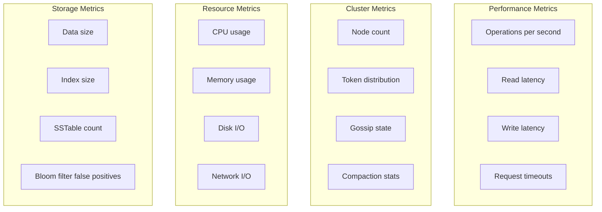

### Prometheus Configuration

```yaml
# prometheus.yml
scrape_configs:
  - job_name: 'cassandra'
    static_configs:
      - targets: ['cassandra:9500']
    metrics_path: '/metrics'
    scrape_interval: 15s
```

### Grafana Dashboard Queries

```sql
-- Operations per second
rate(cassandra_client_request_total[5m])

-- Read latency
histogram_quantile(0.95, rate(cassandra_client_request_duration_seconds_bucket[5m]))

-- Write latency
histogram_quantile(0.95, rate(cassandra_client_request_duration_seconds_bucket{operation="write"}[5m]))

-- Node count
cassandra_cluster_node_count

-- Memory usage
cassandra_memory_heap_used_bytes

-- Disk usage
cassandra_storage_load_bytes
```

### Health Check Script

```bash
#!/bin/bash

# Check Cassandra status
echo "Checking Cassandra status..."
cqlsh -e "SELECT release_version FROM system.local"

# Check cluster status
echo "Checking cluster status..."
nodetool status

# Check keyspace status
echo "Checking keyspace status..."
cqlsh -e "DESCRIBE KEYSPACES"

# Check table status
echo "Checking table status..."
cqlsh -e "DESCRIBE TABLES"

# Check compaction status
echo "Checking compaction status..."
nodetool compactionstats

# Check gossip info
echo "Checking gossip info..."
nodetool gossipinfo
```

## 🎯 Best Practices

### 1. Data Modeling Patterns

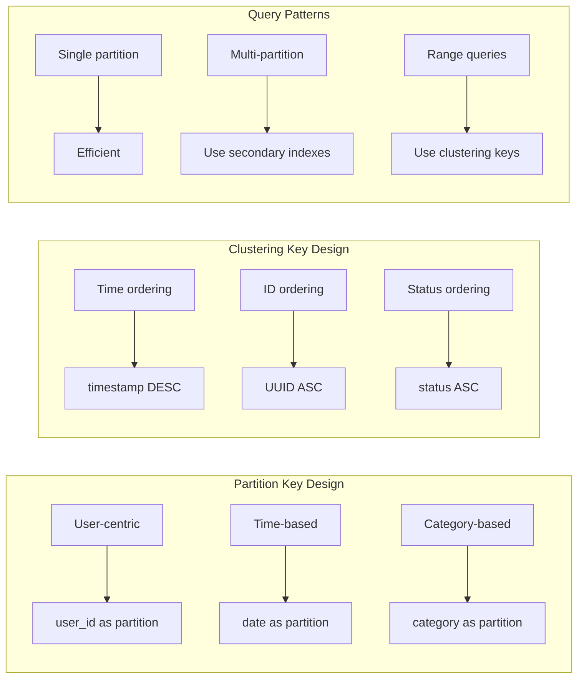

### 2. Consistency Level Configuration

```java
@Configuration
public class CassandraConsistencyConfig {
    
    @Bean
    public CassandraTemplate cassandraTemplate(CqlSession session, CassandraConverter converter) {
        CassandraTemplate template = new CassandraTemplate(session, converter);
        
        // Set default consistency levels
        template.setConsistencyLevel(ConsistencyLevel.LOCAL_QUORUM);
        template.setSerialConsistencyLevel(ConsistencyLevel.LOCAL_SERIAL);
        
        return template;
    }
    
    @Bean
    public QueryOptions queryOptions() {
        return QueryOptions.builder()
                .consistencyLevel(ConsistencyLevel.LOCAL_QUORUM)
                .serialConsistencyLevel(ConsistencyLevel.LOCAL_SERIAL)
                .pageSize(1000)
                .build();
    }
}
```

### 3. Connection Pooling

```java
@Configuration
public class CassandraConnectionConfig {
    
    @Bean
    public CqlSession cqlSession() {
        return CqlSession.builder()
                .addContactPoint(InetSocketAddress.createUnresolved("localhost", 9042))
                .withLocalDatacenter("datacenter1")
                .withKeyspace("productdb")
                .withAuthCredentials("cassandra", "cassandra")
                .withConfigLoader(DriverConfigLoader.fromClasspath("application.conf"))
                .build();
    }
}

# application.conf
datastax-java-driver {
  basic {
    contact-points = ["localhost:9042"]
    load-balancing-policy {
      class = DefaultLoadBalancingPolicy
      local-datacenter = datacenter1
    }
  }
  
  advanced {
    connection {
      pool {
        local.size = 4
        remote.size = 2
      }
    }
    
    request {
      timeout = 10 seconds
      consistency = LOCAL_QUORUM
      serial-consistency = LOCAL_SERIAL
    }
  }
}
```

### 4. Error Handling

```java
@Component
public class CassandraErrorHandler {
    
    private static final Logger log = LoggerFactory.getLogger(CassandraErrorHandler.class);
    
    public <T> T handleCassandraException(Supplier<T> operation, String operationName) {
        try {
            return operation.get();
        } catch (QueryValidationException e) {
            log.error("Query validation error during {}: {}", operationName, e.getMessage());
            throw new ServiceException("Invalid query", e);
        } catch (UnavailableException e) {
            log.error("Cassandra unavailable during {}: {}", operationName, e.getMessage());
            throw new ServiceException("Database unavailable", e);
        } catch (WriteTimeoutException e) {
            log.error("Write timeout during {}: {}", operationName, e.getMessage());
            throw new ServiceException("Write timeout", e);
        } catch (ReadTimeoutException e) {
            log.error("Read timeout during {}: {}", operationName, e.getMessage());
            throw new ServiceException("Read timeout", e);
        } catch (CassandraException e) {
            log.error("Cassandra error during {}: {}", operationName, e.getMessage());
            throw new ServiceException("Database error", e);
        }
    }
    
    public void handleCassandraException(Runnable operation, String operationName) {
        handleCassandraException(() -> {
            operation.run();
            return null;
        }, operationName);
    }
}
```

## 🌍 Real-world Use Cases

### 1. Time Series Data

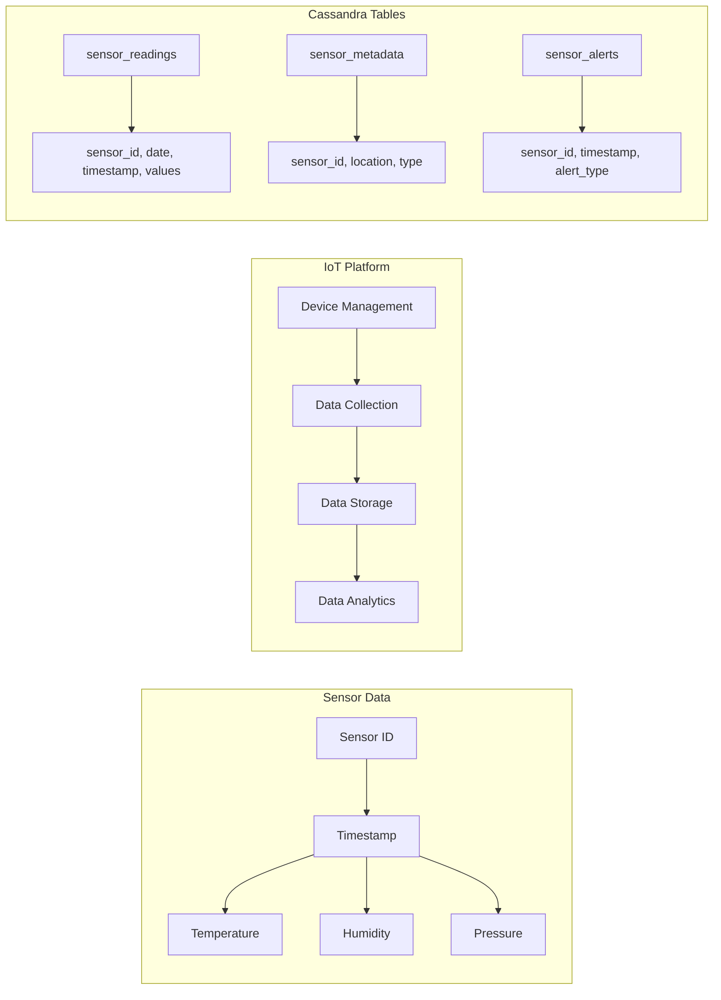

### 2. Event Sourcing

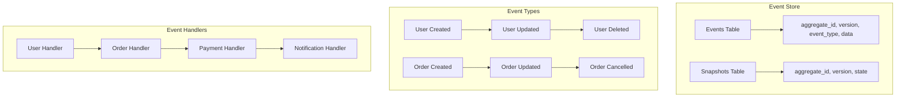

### 3. Log Analytics

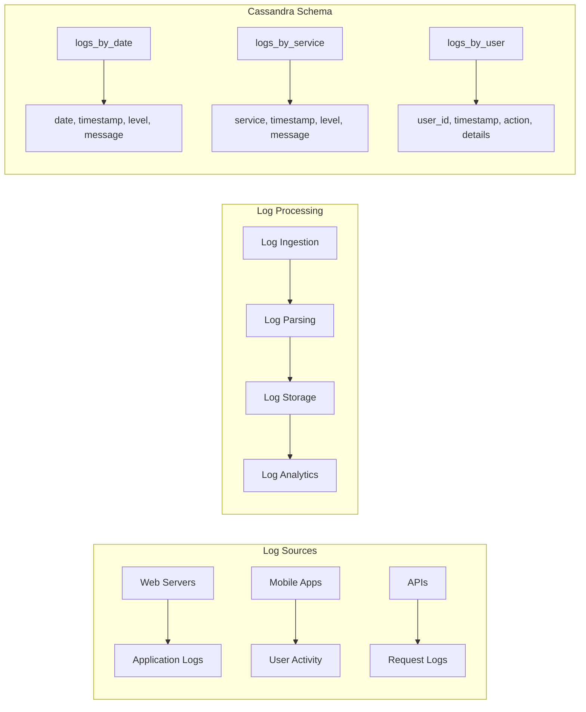

## 📈 Performance Tuning

### Query Optimization

```java
@Service
public class CassandraQueryOptimizationService {
    
    private final CassandraTemplate cassandraTemplate;
    
    // Use prepared statements
    public List<User> findUsersByRole(String role) {
        String cql = "SELECT * FROM users WHERE role = ? ALLOW FILTERING";
        return cassandraTemplate.select(cql, User.class, role);
    }
    
    // Use pagination
    public List<Product> findProductsByCategoryWithPagination(String category, int pageSize, String pagingState) {
        String cql = "SELECT * FROM products WHERE category = ?";
        SimpleStatement statement = SimpleStatement.newInstance(cql, category);
        
        if (pagingState != null) {
            statement = statement.setPagingState(PagingState.fromString(pagingState));
        }
        
        statement = statement.setPageSize(pageSize);
        
        ResultSet resultSet = cassandraTemplate.getCqlOperations().queryForResultSet(statement);
        List<Product> products = new ArrayList<>();
        
        for (Row row : resultSet) {
            products.add(mapRowToProduct(row));
        }
        
        return products;
    }
    
    // Use batch operations
    public void batchInsertOrders(List<Order> orders) {
        BatchStatement batch = BatchStatement.newInstance(BatchType.LOGGED);
        
        for (Order order : orders) {
            String cql = "INSERT INTO orders (user_id, order_date, order_id, status, total_amount) VALUES (?, ?, ?, ?, ?)";
            batch = batch.add(SimpleStatement.newInstance(cql, 
                order.getKey().getUserId(),
                order.getKey().getOrderDate(),
                order.getKey().getOrderId(),
                order.getStatus(),
                order.getTotalAmount()));
        }
        
        cassandraTemplate.getCqlOperations().execute(batch);
    }
    
    // Use materialized views
    public List<Product> findProductsByPriceRange(String category, BigDecimal minPrice, BigDecimal maxPrice) {
        String cql = "SELECT * FROM products_by_price WHERE category = ? AND price >= ? AND price <= ?";
        return cassandraTemplate.select(cql, Product.class, category, minPrice, maxPrice);
    }
}
```

### Cluster Optimization

```properties
# cassandra.yaml
# Memory settings
memtable_allocation_type: heap_buffers
memtable_heap_space_in_mb: 2048
memtable_offheap_space_in_mb: 2048

# Compaction settings
compaction_throughput_mb_per_sec: 16
concurrent_compactors: 4

# Network settings
listen_address: localhost
rpc_address: localhost
rpc_port: 9160

# Performance settings
concurrent_reads: 32
concurrent_writes: 32
concurrent_counter_writes: 32

# JVM settings
# -Xms4G
# -Xmx4G
# -XX:+UseG1GC
# -XX:MaxGCPauseMillis=200
```

## 🔍 Troubleshooting

### Common Issues & Solutions

| Issue | Symptoms | Solution |
|-------|----------|----------|
| **High Read Latency** | Slow queries, timeouts | Create proper indexes, optimize queries |
| **High Write Latency** | Write timeouts, compaction issues | Tune memtable settings, optimize compaction |
| **Node Failures** | Unavailable exceptions | Check network, increase replication factor |
| **Disk Space** | Write failures, compaction stalls | Add storage, tune compaction |
| **Memory Pressure** | OOM errors, slow performance | Increase heap, optimize memtable settings |

### Diagnostic Commands

```bash
# Check cluster status
nodetool status

# Check node info
nodetool info

# Check table statistics
nodetool tablestats keyspace.table

# Check compaction status
nodetool compactionstats

# Check gossip info
nodetool gossipinfo

# Check ring status
nodetool ring

# Check repair status
nodetool repair --status

# Check backup status
nodetool snapshot --list
```

## 🎓 Conclusion

Apache Cassandra has revolutionized distributed database technology by providing linear scalability, high availability, and fault tolerance. Its evolution from traditional databases addresses critical limitations in horizontal scaling, geographic distribution, and write performance.

**Key Takeaways:**
- Cassandra excels in horizontal scaling and high availability
- Proper data modeling is crucial for performance
- Consistency levels should be chosen based on requirements
- Monitoring and optimization are essential for production use
- Batch operations and materialized views improve performance

**Next Steps:**
1. Start with simple table designs
2. Implement proper partitioning strategy
3. Add monitoring and alerting
4. Optimize queries based on access patterns
5. Consider multi-datacenter deployment

---

*This blog is part of a series on modern backend technologies. Stay tuned for the next installment on Neo4j!* 